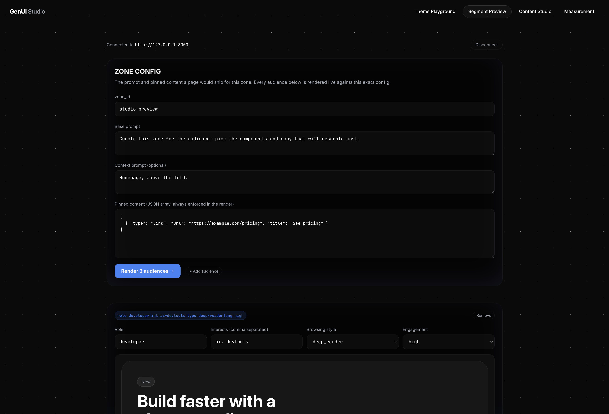
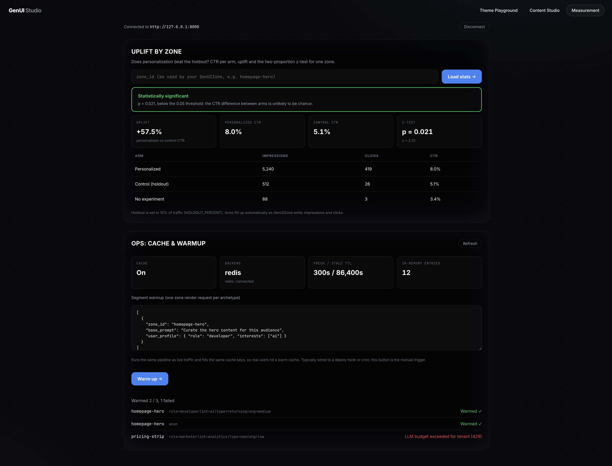

<div align="center">

# GenUI Framework

**Generative User Interfaces for Intelligent Web Applications**<br />
_Complete customization engine for building AI-powered, profile-aware, and dynamically generated UI components_

[](LICENSE) [](https://www.typescriptlang.org/) [](https://www.python.org/downloads/) [](https://react.dev/)
[](https://doi.org/10.5281/zenodo.18237228)

<div align="center">
  <br />
  
  <br /><br /><br />
</div>

[Overview](#-overview) • [Quick Start](#-quick-start) • [Components](#-components) • [Custom Components](#-custom-components--your-design-system-as-llm-vocabulary) • [Theming](#-theming) • [Segment Cache](#-segment-cache--llm-as-an-offline-ranker) • [Guarantees](#️-output-guarantees) • [Auth & Profiles](#-auth-server-side-profiles--audit) • [Streaming](#️-streaming--ssr-safety) • [Uplift](#-measuring-uplift--impressions-clicks--holdout) • [API Reference](#-backend-api-reference) • [Architecture](#️-architecture)

</div>

---

## 🌟 Overview

GenUI System is a complete customization engine for building **Generative User Interfaces:** dynamic, AI-driven UI components that adapt to user profiles, behavior, and context. The system combines a React frontend framework with a Python backend to deliver personalized content in real-time.

<div align="center">

#### **Profile-Aware** | **Real-Time Generation** | **RAG-Enhanced** | **Premium Components**

</div>

---

## Key Features

<table>
<tr>
<td width="50%" valign="top">

### 🎨 **Frontend Framework**

- **GenUIZone**: Declarative zones with 25+ configurable props
- **Custom Components**: register _your_ design system — the LLM generates it ([guide](#-custom-components--your-design-system-as-llm-vocabulary))
- **Premium Components**: Glassmorphism bento grids, 8 button variants, charts, styled text
- **Progressive Render**: components stream in as the model generates them (SSE)
- **Behavior Tracking & Events**: clicks, scrolls, impressions — uplift measured automatically, with a privacy filter (PII redaction, `data-genui-private`, DNT/consent) on by default
- **Theme System**: CSS-variable based customization
- **Container-Responsive**: zones adapt to their own width via container queries — a sidebar embed lays out like a sidebar, not like the page
- **Pinned Content**: guaranteed display, enforced server-side
- **SSR-Safe**: importable in Next.js / Remix / Astro; the server renders the loading skeleton (no CLS)
- **Integration-Ready**: dual ESM/CJS packaging, reactive props with fetch abort, charts in a lazy chunk
- **Accessible**: keyboard-navigable tabs/carousel, `prefers-reduced-motion` respected

</td>
<td width="50%" valign="top">

### 🧠 **Backend Intelligence**

- **Segment Cache**: the LLM runs once per user _segment_, not per request — orders of magnitude cheaper ([how](#-segment-cache--llm-as-an-offline-ranker))
- **Output Guarantees**: schema validation + URL whitelist + numeric grounding + per-tenant content policy — the system guarantees, not the prompt ([how](#️-output-guarantees))
- **Auth & Multi-tenancy**: API keys, per-tenant isolation, rate limiting
- **Server-Side Profiles**: source of truth with GDPR erasure; IndexedDB is just a cache
- **Holdout & Uplift**: control group + z-test significance — prove personalization works
- **Audit Log**: what was shown to whom, append-only
- **Provider-Agnostic LLM**: OpenAI, Anthropic, Gemini, any OpenAI-compatible API — by configuration
- **RAG Integration**: Qdrant vector store with semantic search
- **Observability**: honest health/readiness, Prometheus `/metrics`, audit sink with rotation, OpenTelemetry tracing

</td>
</tr>
</table>

---

## 🎛️ GenUI Studio

**GenUI Studio** is the companion web app for building with the framework: a single SPA (`studio/`, React + Vite) with four tools. Run it locally with `cd studio && npm run dev`.

<div align="center">
  <br />
  
  <br /><br />
</div>

### 🎨 Theme Playground

Configure the entire `--genui-*` token dictionary in real time and watch **every real framework component** (not mockups) update live: hero banners, tabs, pricing, stats, testimonials, bento, charts, and both `with-image` / `text-only` variants. Toggle light/dark, tune radius scale, blur, spacing, accent, brand surfaces, heading weight, and font. Export the result as a `GenUITheme` object, CSS variables, JSON, or copy a **shareable link** that encodes the theme in the URL.

<div align="center">
  <br />
  
  <br /><br />
</div>

### 👥 Segment Preview

Watch GenUI do the thing it exists for: the LLM curating a zone per audience, live. Compose up to four audiences (role, interests, browsing style, engagement: the exact factors that form a segment key) and one ad-hoc zone config (prompts plus pinned content), then render them side by side against your real `/zone/render` with `cache_strategy: "live"` (admin only, never written to the cache real users are served). Each column shows the segment key the audience falls into, the cache state, and everything the guarantee chain removed before serving (`meta.sanitization`: stripped URLs, dropped components, ungrounded numbers, policy violations). A backend with no LLM engine configured degrades to a clearly labelled pinned-only fallback instead of a cryptic error.

<div align="center">
  <br />
  
  <br /><br />
</div>

### 📚 Content Studio

Manage the RAG knowledge base that feeds the AI: connect to your backend (URL + admin key, stored only in the browser session), **drag-and-drop documents** (PDF, DOCX, HTML, TXT, MD, images), browse the indexed knowledge base with chunk counts, and **test retrieval queries** to see exactly which passages the AI would surface, with similarity scores.

<div align="center">
  <br />
  
  <br /><br />
</div>

### 📈 Measurement

The proof that personalization pays, on one page. Enter a `zone_id` and the dashboard reads `GET /events/stats`: CTR per experiment arm (personalized, control holdout, no experiment), the uplift percentage, and the outcome of the two proportion z-test. The verdict is deliberately honest: below 100 impressions per arm the page reports the result as **preliminary noise**, never as "significant", and with a single arm it says uplift is not measurable yet instead of inventing a number. An ops panel on the same page shows the segment cache state (`GET /zone/cache/stats`) and triggers segment warmup (`POST /zone/warmup`) with one zone render request per archetype, filling the same cache keys live traffic reads.

<div align="center">
  <br />
  
  <br /><br />
</div>

> **Note:** the Segment Preview, the Content Studio and the Measurement dashboard require a reachable backend and an admin key, so for now they run **locally only** (`npm run dev`). On the public GitHub Pages build they show an "available locally" notice and their code is tree shaken out of the bundle. A hosted version arrives with proper user auth on the roadmap.

---

# 📖 Usage Guide

## 🚀 Quick Start

Five steps from zero to a personalized zone on your page. **Prerequisites:** Python 3.10+, Node 18+, Docker (for Qdrant/Redis), and an OpenAI API key (or Anthropic/Gemini — see step 3).

### Step 1 — Clone and start the infrastructure

```bash
git clone https://github.com/thevladdo/genui-framework.git
cd genui-framework/backend

# Starts Qdrant (vector store for RAG) and Redis (render cache + profiles).
# Both are optional — without them the backend falls back to in-memory
# storage, fine for a first try, lost on restart.
docker-compose up -d
```

### Step 2 — Install the backend

```bash
# Still in genui-framework/backend
pip install -r requirements.txt

# For development (running the test suite):
pip install -r requirements-dev.txt
```

### Step 3 — Configure

```bash
cp .env.example .env
```

Open `.env` and set **two** things to start — your LLM key and the dev flag:

```env
LLM_PROVIDER=openai            # openai | anthropic | gemini
OPENAI_API_KEY=sk-...          # required

# Local development without API keys. Without keys the API FAILS CLOSED
# (403 on every request) unless this is set. Never set it in production.
GENUI_DEV_OPEN=1
```

Everything else has sensible defaults. The values you'll likely touch later:

```env
# Cache shared across processes (docker-compose already runs Redis)
REDIS_URL=redis://localhost:6379/0

# Production: API keys ("key:tenant") — and remove GENUI_DEV_OPEN
CLIENT_API_KEYS=pk_live_abc:myapp     # browser-side key
ADMIN_API_KEYS=sk_live_xyz:myapp      # server-to-server key
# Per-tenant secret for signed user identity (X-User-Token, see Auth section)
USER_TOKEN_SECRETS=change-me-long-random:myapp

# Measure personalization uplift (10% of users see the generic version)
HOLDOUT_PERCENT=10

# Other providers instead of OpenAI:
# LLM_PROVIDER=anthropic + ANTHROPIC_API_KEY=...   (pip install anthropic)
# LLM_PROVIDER=gemini    + GOOGLE_API_KEY=...      (no extra package)
```

### Step 4 — Start and verify the backend

```bash
uvicorn api.main:app --reload --port 8000
```

Verify it's alive:

```bash
curl http://localhost:8000/health
# -> {"status": "healthy", ..., "qdrant_connected": true}
# "degraded" just means Qdrant isn't running — zones still work, without RAG.
```

Optional sanity check — render a zone from the terminal:

```bash
curl -X POST http://localhost:8000/api/v1/zone/render \
  -H "Content-Type: application/json" \
  -d '{"zone_id": "test", "base_prompt": "Show three example cards about space exploration"}'
```

You should get JSON with `components` and a `meta.cache` block. Run it twice: the second call returns `"status": "fresh"` — that's the cache working (no LLM call, no cost).

### Step 5 — Frontend (React)

> ⚠️ The npm package is not yet published. Install locally via `npm link`:

```bash
cd ../frontend
npm install
npm run build
npm link

# In YOUR app's directory:
npm link genui-framework
```

In your app's entry file (e.g. `main.tsx`):

```tsx
import "genui-framework/dist/styles.css";
```

The package ships dual **ESM + CJS** builds behind an `exports` map: both `import` and `require('genui-framework')` resolve correctly (Vite, webpack, Jest, Next.js pages router). The stylesheet is declared in `sideEffects`, so bundlers never tree-shake your CSS import away.

Then drop a zone anywhere:

```tsx
import { GenUIZone } from "genui-framework";

<GenUIZone
  apiUrl="http://localhost:8000"
  zoneId="homepage-recommendations"
  basePrompt="Show recommended articles"
  preferredComponentType="bento"
  maxItems={6}
  debug // shows reasoning, segment, cache status — remove in production
/>;
```

Open the page: you'll see a loading skeleton, then the generated cards. The `debug` panel underneath tells you _why_ you're seeing what you're seeing.

### Running the tests

```bash
cd backend
python3 -m unittest discover -s tests   # or: pytest tests/

cd frontend
npm test   # vitest: packaging (require/import), SSR skeleton, reactive props, privacy filter
```

#### Golden harness — regression signal for prompt/model/engine changes

Uplift measurement (see [Measuring Uplift](#-measuring-uplift--impressions-clicks--holdout)) tells you which variant earns more _after_ shipping. The golden harness answers the question that comes _before_ shipping: after changing a zone prompt, the model, or the BYOK engine, does the output still honor its structural contract on known inputs?

`backend/tests/test_golden_zone.py` replays recorded LLM responses through the full real pipeline (validation → URL whitelist → numeric grounding → content policy → pinned enforcement) and asserts the invariants of each fixture in `backend/tests/golden/`: only allowed component types, pinned content present, no URL outside the input whitelist, no displayed number outside the input grounding, layout coherence. It checks form and invariants, never exact prose. It runs in the default suite: deterministic, no key, no network, no cost. The recorded responses are deliberately adversarial (invented URLs, an invented price, a missing pinned item, an incoherent layout, an unknown type), so the suite goes red if any link of the guarantee chain stops working.

**Adding a fixture**: drop a JSON file in `backend/tests/golden/` with `request` (the `ZoneRenderRequest` fields), `retrieved` (recorded RAG results), `invariants.allowed_types` (optional, defaults to all built-in types) and `llm_response` (the recorded model envelope). No code changes needed; the harness picks it up automatically.

**Live mode (vet a BYOK engine)**: point the harness at the engine configured in your environment (`LLM_PROVIDER`, provider keys, `OPENAI_BASE_URL` for vLLM/local endpoints) and check the same invariants on fresh output before promoting a change:

```bash
cd backend
GENUI_GOLDEN_LIVE=1 ./venv/bin/python -m unittest tests.test_golden_zone -v
# add GENUI_GOLDEN_RECORD=1 to also regenerate each fixture's recorded llm_response
```

Live mode is optional and opt-in: the default suite never needs it.

---

## 🎯 Core Components

### GenUIZone — AI-Powered Content Zones

The `GenUIZone` component automatically fetches personalized content from the backend based on:

- **User Profile**: Stored preferences, interests, demographics
- **Behavior Data**: Click patterns, scroll depth, navigation history
- **Developer Prompts**: Base prompts + context prompts for fine control
- **Pinned Content**: Guaranteed content that always displays

#### Basic Usage

```tsx
import { GenUIZone } from "genui-framework";

<GenUIZone
  apiUrl="http://localhost:8000"
  zoneId="homepage-recommendations"
  basePrompt="Show recommended articles"
  preferredComponentType="bento"
  maxItems={6}
/>;
```

#### Full Props Reference

```tsx
interface GenUIZoneProps {
  // === Required ===
  apiUrl: string; // Backend API URL
  zoneId: string; // Unique zone identifier

  // === Auth ===
  apiKey?: string; // Client API key (X-API-Key); required when CLIENT_API_KEYS is configured
  userToken?: string; // Signed user identity (X-User-Token); required with userId when USER_TOKEN_SECRETS is configured

  // === Prompt Engineering ===
  basePrompt?: string; // What the zone should display
  contextPrompt?: string; // Additional context for AI (page location, user segment, etc.)

  // === Content Control ===
  pinnedContent?: PinnedContent[]; // Content that MUST be displayed (enforced server-side)
  customComponents?: GenUICustomComponentDef[]; // Your design-system components (name + JSON schema)
  preferredComponentType?: "bento" | "chart" | "text" | "buttons" | string; // built-in or custom name
  maxItems?: number; // Max items to generate (default: 6)

  // === User Context ===
  userId?: string; // Stable user ID: enables server-side profile, holdout & audit trail
  currentPage?: string; // Current page path
  pageMetadata?: Record<string, unknown>; // Custom page context (page-level, not per-user!)

  // === Behavior ===
  loadOnMount?: boolean; // Auto-load on mount (default: true)
  refreshInterval?: number; // Auto-refresh in ms (0 = disabled)
  cacheStrategy?: "segment" | "live"; // 'segment' (default): per-segment cached renders; 'live': always call the LLM (admin keys only)
  streaming?: boolean; // Progressive render via SSE (components appear as generated)
  trackEvents?: boolean; // Auto impression/click events for uplift measurement (default: true)

  // === Theming ===
  theme?: GenUITheme; // Theme overrides
  className?: string; // CSS class
  style?: React.CSSProperties; // Inline styles

  // === Custom Render States ===
  loadingComponent?: React.ReactNode;
  errorComponent?: React.ReactNode | ((error: Error) => React.ReactNode);
  emptyComponent?: React.ReactNode; // Shown when AI returns empty
  showLoadingSkeleton?: boolean;

  // === Callbacks ===
  onRender?: (components: GenUIComponent[]) => void;
  onError?: (error: Error) => void;

  // === Debug ===
  debug?: boolean; // Shows reasoning, confidence, profile factors
}
```

**Props are reactive**: changing any request-shaping prop (`zoneId`, `userId`, `basePrompt`, `pinnedContent`, ...) on a mounted zone refetches automatically, aborting the inflight request (last issued wins) — a zone reused across SPA routes never shows the previous route's content. Props are compared **by value**, so passing fresh inline literals (`pinnedContent={[...]}`) on every render does not retrigger fetches.

---

### Pinned Content — Guaranteed Display

Pinned content ensures certain items **always** appear in the zone, regardless of what the AI generates. The AI will include these items alongside its personalized selections.

```tsx
interface PinnedContent {
  type: "link" | "article" | "document" | "custom";
  title: string;
  url?: string;
  description?: string;
  id?: string;
  metadata?: Record<string, unknown>;
}
```

#### Example: Pinned Sponsor Content

```tsx
<GenUIZone
  zoneId="news-feed"
  apiUrl="http://localhost:8000"
  pinnedContent={[
    {
      type: "article",
      title: "Sustainability Report 2024",
      url: "/reports/sustainability-2024",
      description: "Our commitment to the environment",
      metadata: { category: "sustainability", sponsor: true },
    },
    {
      type: "link",
      title: "Investor Relations",
      url: "/investors",
      description: "Financial information and reports",
    },
  ]}
  preferredComponentType="bento"
  maxItems={6} // AI will fill remaining slots with personalized content
/>
```

---

### Context Prompts — Fine-Grained AI Control

Use `contextPrompt` to give the AI detailed instructions about the zone's purpose, available content, and selection criteria.

#### Example: Article Selection with Available Content List

```tsx
const articlesContext = useMemo(() => {
  return articles
    .map(
      (a, i) =>
        `ID ${i}: "${a.title}" (Link: ${a.link}, Img: ${a.src}, Tag: ${a.tag[0]})`,
    )
    .join("; ");
}, [articles]);

const contextPrompt = `
  You are an intelligent content curator for a corporate website.
  
  AVAILABLE CONTENT (Use ONLY these items):
  [${articlesContext}]
  
  SELECTION RULES:
  1. Select ${maxItems} items that best match the user's profile and interests.
  2. If user has interest in "sustainability", prioritize content tagged with that topic.
  3. If user role is "investor", prioritize financial and business content.
  4. For new users with no profile, show a diverse mix.
  
  OUTPUT REQUIREMENTS:
  - Return a 'bento' component with cards.
  - Each card MUST use the exact image, title, badge, and link from the input list.
  - Do NOT invent new content.
`;

<GenUIZone
  zoneId="homepage-for-you"
  apiUrl="http://localhost:8000"
  basePrompt="Display personalized article recommendations"
  contextPrompt={contextPrompt}
  preferredComponentType="bento"
  maxItems={6}
/>;
```

---

### Page Metadata — Contextual Awareness

Pass `pageMetadata` to give the AI awareness of the current page context:

```tsx
<GenUIZone
  zoneId="related-content"
  apiUrl="http://localhost:8000"
  currentPage="/products/electric-cars"
  pageMetadata={{
    pageType: "product",
    productCategory: "transportation",
    productId: "ETR-500",
    userSegment: "business",
    region: "europe",
  }}
  basePrompt="Show related products and content"
/>
```

---

### Fallback Content — Client-Side Fallbacks

When the AI returns empty results (e.g., backend unavailable, no matching content), use `emptyComponent` and `errorComponent` to display fallback content:

```tsx
import { GenUIZone, BentoComponent, GenUISection } from "genui-framework";

const fallbackBentoData = {
  cards: articles.slice(0, 6).map((a) => ({
    title: a.title,
    description: a.tag?.[0] || "",
    link: a.link || "#",
    image: a.src,
    badge: a.tag?.[0],
  })),
  columns: 3,
};

const FallbackBento = () => (
  <GenUISection className="genui-layout-complex">
    <BentoComponent data={fallbackBentoData} />
  </GenUISection>
);

<GenUIZone
  zoneId="recommendations"
  apiUrl="http://localhost:8000"
  emptyComponent={<FallbackBento />}
  errorComponent={() => <FallbackBento />}
/>;
```

---

## 🪝 Hooks

### useGenUI — Conversational AI Interface

For chat-based interactions with automatic behavior tracking and profile learning:

```tsx
import { useGenUI } from "genui-framework";

function ChatBot() {
  const {
    query, // Send message to AI
    isLoading, // Loading state
    error, // Last error
    profile, // Current user profile
    updateProfile, // Manual profile update
    clearProfile, // Reset profile
    history, // Conversation history
    clearHistory, // Clear conversation
    behaviorTracker, // Access behavior tracker
    trackInteraction, // Track custom events
    trackNavigation, // Track page navigation
  } = useGenUI({
    apiUrl: "http://localhost:8000",
    userId: getUserId(),
    enablePersistence: true,
    enableBehaviorTracking: true,
    privacy: "balanced", // capture contract — see "Behavior Tracking & Privacy"
    consent: cmpConsent, // optional CMP hook: false = never track
    behaviorTrackingOptions: {
      trackClicks: true,
      trackScroll: true,
      trackPageVisits: true,
      trackHover: true,
      hoverThreshold: 500, // ms before hover counts
      scrollDebounce: 100, // ms debounce
      maxEventsPerType: 100, // Memory limit
      enableHeatmapZones: true,
    },
    onProfileUpdate: (profile) => console.log("Profile updated:", profile),
    onError: (error) => console.error("GenUI error:", error),
  });

  const handleSend = async (message: string) => {
    try {
      const response = await query(message);
      // response.text - AI text response
      // response.components - Generated UI components
      // response.sources - Source citations
      // response.suggestedActions - Follow-up suggestions
      // response.profileUpdates - Profile learning data
      // response.meta - Confidence, sentiment, interaction type
    } catch (err) {
      // Handle error
    }
  };

  return <ChatUI onSend={handleSend} history={history} loading={isLoading} />;
}
```

### useZone — Zone-Level Control

For low-level zone control when you need more customization:

```tsx
import { useZone } from "genui-framework";

const {
  components, // Rendered GenUI components
  isLoading, // Loading state
  error, // Error state
  meta, // Render metadata
  pinnedContentIncluded, // Which pinned items were included
  render, // Manually trigger render
  refresh, // Force re-render (clears first)
} = useZone({
  apiUrl: "http://localhost:8000",
  zoneId: "my-zone",
  basePrompt: "Show content",
  loadOnMount: true,
  refreshInterval: 30000, // Auto-refresh every 30s
});

// Access metadata
console.log(meta?.confidence); // 0.87
console.log(meta?.reasoning); // "Selected based on user interests..."
console.log(meta?.profileFactors); // ["interests.technology", "demographic.role"]
console.log(meta?.personalizationApplied); // true
console.log(meta?.renderId); // "a1b2c3d4e5f6" — identity of the generated variant
console.log(meta?.cache); // { status: "fresh", segment: "role=developer|eng=high", ageSeconds: 42 }
console.log(meta?.experiment); // { arm: "personalized", holdoutPercent: 10 } — when holdout is on
```

---

## 🎨 Components

### BentoComponent — Glassmorphism Grid

A premium card grid with hover animations and responsive layouts:

```tsx
import { BentoComponent } from "genui-framework";

<BentoComponent
  data={{
    cards: [
      {
        title: "Feature One",
        description: "Optional description text",
        image: "/images/feature1.jpg",
        badge: "New", // Top-left badge
        link: "/features/one",
        action: {
          // Optional action button. When present it becomes the card's
          // interactive element and the card-level link wrapper is skipped
          // (nested anchors are invalid HTML and break SSR).
          label: "Learn More",
          url: "/features/one",
        },
      },
      // ... more cards
    ],
    columns: 3, // 2, 3, or 4
    gap: 16, // Gap in pixels
  }}
/>;
```

### ButtonsComponent — Animated Buttons

8 premium button variants with animated arrows:

```tsx
import { ButtonsComponent } from "genui-framework";

<ButtonsComponent
  data={{
    buttons: [
      {
        label: "Get Started",
        url: "/start",
        style: "shine", // Animated gradient sweep
        showArrow: true, // Arrow shows on all buttons by default
        arrowPlacement: "right", // "left" or "right"
        size: "lg", // "sm" | "md" | "lg"
        borderRadius: "8px", // Custom override
        backgroundColor: "#3b82f6", // Custom override
        textColor: "#ffffff", // Custom override
      },
      {
        label: "Learn More",
        style: "outline",
        showArrow: false, // Explicitly hide arrow
      },
      {
        label: "Contact",
        style: "gooey", // Blob morph on hover
      },
      {
        label: "Explore",
        style: "ringHover", // Ring outline on hover
      },
      {
        label: "Details",
        style: "expandIcon", // Arrow reveals on hover
      },
    ],
    direction: "horizontal", // or "vertical"
    align: "center", // "start" | "center" | "end"
    gap: 12, // Custom gap in pixels
  }}
/>;
```

#### Button Variants

| Variant      | Description                              |
| ------------ | ---------------------------------------- |
| `primary`    | Solid accent color with brightness hover |
| `secondary`  | Semi-transparent with backdrop blur      |
| `outline`    | Transparent with border, fills on hover  |
| `ghost`      | Minimal, text only                       |
| `shine`      | Animated gradient that sweeps across     |
| `gooey`      | Blob morphing effect on hover            |
| `expandIcon` | Arrow icon reveals on hover              |
| `ringHover`  | Ring outline appears on hover            |

### ChartComponent — Data Visualization

```tsx
import { ChartComponent } from "genui-framework";

<ChartComponent
  data={{
    chartType: "bar", // "bar" | "line" | "pie" | "area" | "donut"
    title: "Monthly Sales",
    data: [
      { label: "Jan", value: 100, color: "#3b82f6" },
      { label: "Feb", value: 150 },
      { label: "Mar", value: 200 },
    ],
    xAxis: "Month",
    yAxis: "Sales ($)",
    showLegend: true,
    showGrid: true,
    height: 300,
  }}
/>;
```

> **Bundle note**: the chart engine (recharts, ~230 KB gzip) lives in a **lazy chunk** loaded the first time a chart actually renders — consumers that never show charts never download it. `<ChartComponent />` keeps working as before (the Suspense boundary is built in); a skeleton shows while the chunk loads.

### TextComponent — Styled Text

```tsx
import { TextComponent } from "genui-framework";

<TextComponent
  data={{
    content: "This is **markdown** supported text with _emphasis_.",
    style: "normal", // "normal" | "emphasis" | "note" | "heading"
  }}
/>;
```

---

### Enterprise Section Components

Ten section-level components for editorial, e-commerce, insurance, SaaS, agency/studio and corporate portals — same token system, same validation pipeline, all **image-optional by design**: every image-bearing variant declares `layout: "with-image" | "text-only"` (or a hero `variant`), the backend schema enforces coherence (`with-image` without an `image_url` is rejected), and the text-only shape is a _designed_ alternative (accent gradients, emphasized typography), never a card with a hole.

| Type                   | Use case                                                       | Image-optional           |
| ---------------------- | -------------------------------------------------------------- | ------------------------ |
| `tabs_feature`         | plan comparison, SaaS highlights, product categories           | per-tab `content.layout` |
| `steps_section`        | onboarding, how-it-works, purchase flow (autoplay + progress)  | section `layout`         |
| `stats_banner`         | numeric metrics ("10M users") — populate from RAG facts        | text-only by design      |
| `testimonial_carousel` | quotes with avatar → initials fallback                         | avatar optional          |
| `pricing_cards`        | plan grid; `variant: "detailed"` adds a comparison table       | text-only by design      |
| `content_grid`         | blog/news cards                                                | per-item `layout`        |
| `hero_banner`          | hero: `split` (requires image) · `centered` · `minimal`        | variant chain fallback   |
| `case_studies`         | studio/agency projects: summary + grounded metrics (count-up)  | image + metrics optional |
| `quote`                | a single large editorial quote / manifesto                     | logo + avatar optional   |
| `logo_wall`            | clients / technologies / partners; hover reveal on overall cta | logos drop if imageless  |

```json
{
  "type": "hero_banner",
  "data": {
    "variant": "centered",
    "headline": "Coverage that adapts",
    "subheadline": "Personalized in real time.",
    "primary_cta": { "label": "Get a quote", "url": "/quote" }
  }
}
```

### Semantic tokens & light mode

New components consume **level-2 semantic tokens** — rebrand by overriding just these: `--genui-surface-1/2/3`, `--genui-border-subtle/strong`, `--genui-text-primary/secondary/tertiary/on-accent`, `--genui-radius-sm/md/lg/full`, `--genui-shadow-sm/md/lg`. Dark is the default; switch any subtree with `[data-theme="light"]` (or re-assert `[data-theme="dark"]` when nesting).

---

## 🧩 Custom Components — Your Design System as LLM Vocabulary

The four built-in types cover generic zones, but the real power is letting the LLM generate **your** components. Registration has two halves:

```tsx
// 1. Render side: name -> React component
import { registerGenUIComponent } from "genui-framework";

registerGenUIComponent("hero_banner", ({ data }) => (
  <HeroBanner
    headline={data.headline}
    subtitle={data.subtitle}
    ctaLabel={data.cta_label}
    ctaUrl={data.cta_url}
  />
));

// 2. Generation side: name -> JSON Schema + description (per zone)
<GenUIZone
  zoneId="homepage-hero"
  apiUrl="..."
  preferredComponentType="hero_banner"
  customComponents={[
    {
      name: "hero_banner",
      description:
        "Full-width hero with headline, subtitle and one CTA. Use as the first component of landing zones.",
      dataSchema: {
        type: "object",
        required: ["headline"],
        properties: {
          headline: { type: "string", maxLength: 80 },
          subtitle: { type: "string" },
          cta_label: { type: "string" },
          cta_url: { type: "string" },
        },
      },
    },
  ]}
/>;
```

What the framework guarantees for custom components:

- The JSON Schema is shown to the LLM (name, description, schema, optional `example`), so the model knows when and how to use the component.
- Generated data is **validated against the schema** server-side (jsonschema); invalid components are dropped and reported in `meta.sanitization`.
- The **URL whitelist applies recursively**: URL-named fields (`url`, `link`, `href`, `src`, `image`, `*_url`, …), absolute URLs and markdown links anywhere in the payload are checked; dangerous schemes are always stripped.
- Custom definitions are part of the **zone cache key**: changing a schema invalidates cached renders automatically.
- The registered React component receives `data` exactly as validated (no key renaming).

Backend embedders can register types globally instead of per request:

```python
from schemas import register_component_type

register_component_type(
    "hero_banner",
    data_schema={...},
    description="Full-width hero with headline and CTA",
)
```

> Custom names: 2-32 chars, lowercase `[a-z0-9_-]`, starting with a letter. Built-in names cannot be overridden.

---

## 🎭 Theming

### GenUITheme Properties

```tsx
interface GenUITheme {
  borderRadius?: string; // Default: '30px'
  primaryColor?: string; // Default: '#fafafa'
  secondaryColor?: string; // Default: '#b2b2b2'
  backgroundColor?: string; // Default: 'transparent'
  textColor?: string;
  accentColor?: string; // Used for buttons, highlights
  fontFamily?: string;
  fontSize?: string;
}
```

### Applying Themes

Two equivalent ways — pass `theme` **directly to the zone**, or wrap a group of zones in a `GenUISection`:

```tsx
import { GenUISection, GenUIZone } from 'genui-framework';

const theme = {
  borderRadius: '16px',
  accentColor: '#3b82f6',
  primaryColor: '#1e1e1e',
  textColor: '#ffffff',
  fontFamily: "'Inter', sans-serif",
};

// Per zone:
<GenUIZone theme={theme} apiUrl="..." zoneId="..." />

// Or shared across several zones:
<GenUISection theme={theme}>
  <GenUIZone apiUrl="..." zoneId="hero" />
  <GenUIZone apiUrl="..." zoneId="footer" />
</GenUISection>
```

Only the properties you set are emitted; everything else inherits — from an enclosing `GenUISection`, then from the framework defaults in `genui.css` (a dark glassmorphism theme). Sections nest cleanly: an inner zone without a theme inherits the outer section's, it does not reset to defaults.

> **Dark by default.** Out of the box the components render on a dark glass theme (light text, dark cards). On a light page background, set `primaryColor`/`textColor` to suit — or override the CSS variables below globally.

### CSS Variables

The framework's defaults live in `:root` (override them globally to retheme everything):

```css
:root {
  --genui-border-radius: 24px;
  --genui-primary-color: #0a0a0c;
  --genui-secondary-color: #6b7280;
  --genui-accent-color: #3b82f6;
  --genui-text-primary: #ffffff;
  --genui-text-secondary: rgba(255, 255, 255, 0.8);
  --genui-glass-blur: 12px;
  --genui-glass-border: 1px solid rgba(255, 255, 255, 0.1);
}
```

---

## ⚡ Segment Cache — LLM as an Offline Ranker

By default, zone renders are **not** generated per user per request. Users are collapsed into a small number of deterministic **segments** (role, top interests, browsing style, engagement), and each `(zone config, segment)` pair is rendered once and cached with **stale-while-revalidate** semantics:

| Cache state                              | Behavior                                                                                                                                                                                                     |
| ---------------------------------------- | ------------------------------------------------------------------------------------------------------------------------------------------------------------------------------------------------------------ |
| **fresh** (age ≤ `ZONE_CACHE_FRESH_TTL`) | Served from cache, no LLM call                                                                                                                                                                               |
| **stale** (age ≤ `ZONE_CACHE_STALE_TTL`) | Served instantly from cache, re-rendered in background (single-flight)                                                                                                                                       |
| **miss**                                 | Rendered live (cold start), then cached for the whole segment. Single-flight too: concurrent requests for the same key coalesce on one generation (`status: "coalesced"`) instead of each paying an LLM call |

Anonymous users with no profile signals share a single `anon` segment — typically the most-hit cache entry. Changing any zone configuration (prompts, pinned content, constraints) automatically invalidates its cache entries.

**Shared renders see the segment archetype, never the raw profile.** The LLM input of a cached render is derived from the cache key itself: role, top interests, browsing style and engagement as short validated tags (slugified, length- and count-capped). Free-length client fields — low-confidence guesses, navigation paths, arbitrary profile text — never reach a render that other users will be served, so the first requester of a segment cannot poison what the whole segment sees for the TTL window. Fine-grained individual personalization belongs to the non-shared path: `cacheStrategy="live"` renders per request from the full (server-authoritative) profile, and is reserved to admin keys (see [Cost controls](#-cost-controls)).

Use Redis for a shared, persistent cache across processes (`REDIS_URL=redis://localhost:6379/0`, included in `docker-compose.yml`); without it, an in-memory fallback is used. The cache always fails open: a cache outage degrades to live rendering. In production Redis is a required dependency — see [Production run](#-production-run--multiple-workers--redis).

For genuinely dynamic zones, opt out per zone. `cacheStrategy="live"` requires an **admin key** (server-side rendering proxy, internal dashboard): a public `pk_` key cannot select it, because "one LLM call per request" is a spending decision that belongs to the operator, not to whoever holds the key shipped with the page. Client keys sending `"live"` receive a 403.

```tsx
<GenUIZone zoneId="live-dashboard" apiUrl="..." cacheStrategy="live" />
```

### Pre-warming segments

Render known archetypes offline (deploy hook, cron) so live traffic only sees cache hits:

```http
POST /api/v1/zone/warmup
Content-Type: application/json

{
  "zones": [
    { "zone_id": "homepage-for-you", "base_prompt": "...", "user_profile": null },
    {
      "zone_id": "homepage-for-you",
      "base_prompt": "...",
      "user_profile": {
        "preferences": { "role": { "value": "developer", "confidence": 1.0 } },
        "interests": { "ai": { "value": true, "confidence": 1.0 } }
      }
    }
  ]
}
```

Each response's `meta.cache` reports `status` (`fresh` | `stale` | `miss` | `coalesced` | `bypass`), the `segment` key, and `age_seconds` — visible in the `debug` panel of `GenUIZone`. Cache stats are exposed at `GET /api/v1/zone/cache/stats`.

---

## 🗂️ Zone Config Registry — Config as Data

The principle: **anything that must be approved, versioned, or edited by non-developers — marketing editing prompts, legal sign-off, versioning, per-tenant overrides — must be data, not code.** A prompt legal has to sign off cannot live in a JSX prop.

By default the zone configuration (prompts, pinned content, rendering constraints) travels as props from the host page — fine for a developer-owned integration, but structurally invisible to any governance workflow: there is nothing server-side to approve, version, or edit. The **zone config registry** inverts that. It is a server-side store keyed by `(tenant, zone_id)` holding the governed config block:

```python
from api.deps import get_zone_config_store

await get_zone_config_store().upsert("acme", "homepage-hero", {
    "base_prompt": "Show our enterprise plans",
    "context_prompt": "Homepage hero for signed-in agents",
    "pinned_content": [{"type": "link", "url": "https://…", "title": "Compliance note"}],
    "preferred_component_type": "bento",
    "max_items": 4,
})  # -> {"version": 1, "status": "approved", "config": {...}, "updated_at": ...}
```

Resolution rules:

- **Registry wins, wholesale.** When an _approved_ entry exists, every render of that zone (sync, streaming, batch, warmup) serves exactly the registry config; host props for the governed fields are ignored, **not merged** — a field-level merge would let the page inject prompt text around what was approved.
- **Host props are the explicit fallback.** No entry (or a draft-only one) = props behave exactly as before. Existing integrations don't change; migration is per-zone: create an entry when a zone needs governance, delete it to hand control back to the host code.
- **Per-tenant.** Tenants under the same deployment (e.g. `agente` / `assicurato`) have fully independent entries; the tenant always comes from the API key, never from the body.
- **Versioned, with status.** Every write increments `version`; renders only ever serve `status: "approved"`. Drafts are stored but invisible to traffic — the hook for the approval workflow and Studio preview.
- **Cache-coherent.** The resolved config feeds the cache key, so approving a new version invalidates cached renders exactly like a prop change does.

Page context (`current_page`, `page_metadata`) and `custom_components` stay request props: the former is per-request by nature, the latter are bound to React components that only exist in the host bundle. Entries are managed from Python today (`zones.ZoneConfigStore`); CRUD/approval endpoints and the Studio editor are the next phases of `roadmap/strategiche/01`.

---

## 🏭 Production Run — Multiple Workers + Redis

`uvicorn --reload` with no `REDIS_URL` is a **dev** setup. At production volume you run several worker processes, and everything that must be consistent _across_ processes lives in Redis:

```bash
REDIS_URL=redis://localhost:6379/0   # docker-compose already runs Redis
uvicorn api.main:app --host 0.0.0.0 --port 8000 --workers 4
```

**Why Redis is required with more than one worker.** Profiles, rate-limit counters, uplift metrics and the single-flight render lock are cross-process state. Without Redis each worker keeps a private in-memory copy: a user's profile flip-flops depending on which worker serves the request and vanishes on restart, the effective rate limit becomes `limit × workers`, impressions/clicks under-count (the uplift numbers become wrong), and every worker re-renders the same stale segment — the exact LLM cost the cache exists to avoid.

**Degradation semantics (what a Redis blip does).** Store operations never fail closed: on a Redis error the store serves from a bounded in-memory fallback and the process retries the connection with exponential backoff (1s doubling up to 30s), returning to Redis as soon as it answers. A blip degrades the process _briefly and visibly_ — never permanently and never with a 500:

- `GET /health` reports `"redis": "connected" | "reconnecting" | "disabled"` and the overall status turns `degraded` while Redis is unreachable — or not configured outside explicit dev mode (`GENUI_DEV_OPEN=1`).
- Socket timeouts are capped (~2s), so a hung Redis costs one slow operation, not a hung request.
- The in-memory fallbacks are bounded (2000 entries for renders and profiles, oldest evicted): a long outage on a multi-worker deployment means _reduced consistency_, not memory exhaustion — but it is a shock absorber for blips, **not an operating mode**. Fix the Redis, don't run on the fallback.

---

## 🚚 Deploying for a Customer

GenUI ships on-prem: **one deployment per customer** — backend, Redis and Qdrant on their VM, with their own LLM key (BYOK) and their own tenants (e.g. insurance: `agente` vs `assicurato`). The `deploy/` folder makes that reproducible:

```bash
cd deploy
cp customer.env.example customer.env   # their engine, their tenants, their limits
docker compose up -d --build
./smoke.sh                             # health, fail-closed auth, per-tenant scoping
```

- [`deploy/README.md`](deploy/README.md) — the bring-up, how tenants are declared (three env vars, everything per-tenant follows from the API key), the engine/embedding BYOK matrix, operating notes.
- [`deploy/TENANT-ISOLATION.md`](deploy/TENANT-ISOLATION.md) — what the tenant boundary guarantees inside one deployment, with the enforcing code reference for every data type. This is the document a customer's security team reviews.
- [`deploy/OUTPUT-GUARANTEES.md`](deploy/OUTPUT-GUARANTEES.md) — what the generated UI can never contain (invented links, invented numbers, banned terms, broken schemas), enforced vs best-effort stated honestly, with code references and tests. This is the document a customer's legal/compliance team attaches to the contract.

---

## 💸 Cost Controls

With BYOK the LLM bill is on **your** key, and the client `pk_` key is public (it ships with the page). The principle: **a public credential must never convert traffic into LLM spend without a limit.** Cost is controlled where it is born (cache misses and live renders), not downstream:

- **`cacheStrategy="live"` is admin-only.** A request body field must not let any visitor force one LLM call per page load. Client keys sending `"live"` get a 403; the segment cache serves them instead.
- **Cold misses are single-flight.** When a popular segment expires, concurrent requests coalesce on one generation (the same lock that guards stale refreshes). The extra requests wait briefly and are served the winner's render (`meta.cache.status: "coalesced"`).
- **Batches are capped and charged for what they spend.** `/zone/batch-render` accepts at most `ZONE_BATCH_MAX` zones (413 above) and a batch of N zones consumes N rate-limit slots, not 1.
- **Per-tenant LLM budget.** `LLM_BUDGET_PER_HOUR` caps how many LLM generations one tenant can trigger per hour, across all workers (same shared Redis store as the rate limit). Over the cap: cached renders keep being served (stale entries simply stop refreshing), new generations return 429. Admin-triggered renders (warmup, admin `"live"`) are exempt, so pre-warming after a deploy never competes with the abuse cap.
- **Provider timeout.** `LLM_TIMEOUT_SECONDS` bounds every LLM and embedding call; a slow or cold provider endpoint fails the request instead of holding it (and a worker slot) open for the SDK default of 10 minutes.

| Knob                    | Default   | Meaning                                                           |
| ----------------------- | --------- | ----------------------------------------------------------------- |
| `LLM_BUDGET_PER_HOUR`   | `0` (off) | Max LLM generations per tenant per hour; set it in production     |
| `ZONE_BATCH_MAX`        | `10`      | Max zones per batch-render request                                |
| `LLM_TIMEOUT_SECONDS`   | `60`      | Per-call provider timeout (LLM + embeddings); empty = SDK default |
| `RATE_LIMIT_PER_MINUTE` | `120`     | Requests per client key per minute (batches count as N)           |

Sizing `LLM_BUDGET_PER_HOUR`: at steady state generations are rare (misses on new segments plus one refresh per cached key per `ZONE_CACHE_FRESH_TTL` window). Count your zones times your active segments, add headroom for a cold start, and remember the budget is per tenant, not per key. The rate limit protects request volume; the budget protects the LLM wallet. They are independent caps and the stricter one wins.

> The quota exists because "no client `live`" alone is not enough: `page_metadata` is client-controlled and part of the cache key, so a hostile visitor can rotate a nonce to force a miss on every request. The budget caps what any such trick can spend, no matter how the generation was triggered.

---

## 🛡️ Output Guarantees

What reaches the frontend is guaranteed by the system, not by prompt obedience:

1. **Provider-native structured output** — the ZoneAgent constrains generation with `response_format` (JSON schema derived from the component schemas, falling back to JSON mode).
2. **Schema validation** — every generated component is validated against Pydantic schemas (`backend/schemas/`) server-side. Invalid components are dropped individually and reported in `meta.sanitization.dropped_components`; one malformed component never breaks the zone.
3. **URL whitelist (hard rule)** — a generated URL survives **only if it existed in the input**: pinned content, developer prompts, RAG documents, or page context. Invented links/images are stripped (`meta.sanitization.removed_urls`), buttons left without a valid URL are dropped, markdown links collapse to plain text — in components _and_ in the `/query` chat prose. Dangerous schemes (`javascript:`, `data:`, …) are always blocked, even with the whitelist disabled (`URL_WHITELIST_ENABLED=false`).
4. **Numeric grounding (hard rule)** — a number displayed _as_ the content — a `stats_banner` value, a `pricing_cards` price, a `chart` data point — survives **only if its digits trace to a number present in the input** (verbatim modulo formatting: `1,200`, `1200` and `1200.0` all match). Ungrounded stats/plans are removed (`meta.sanitization.removed_numbers`); one ungrounded chart point drops the whole chart. Scope honesty: this guarantees the digits existed in your input, not the semantics of the sentence around them, and numbers inside prose are deliberately not touched. `NUMERIC_GROUNDING_ENABLED=false` opts out.
5. **Per-tenant content policy** — banned terms configured in `CONTENT_POLICY` (JSON, per tenant + `"*"`) never reach the page: a component containing one is dropped, chat text is redacted, hits are reported in `meta.sanitization.policy_violations`. Term matching is lexical (word-boundary, case-insensitive) — tone constraints remain prompt-level best-effort, and we say so.
6. **Pinned content enforcement** — pinned items are verified on the _actual output_ (by URL/title) after generation; missing ones are appended automatically. `pinned_content_included` is computed, not model-claimed.
7. **Frontend defense in depth** — rendered `href`/`src` pass through `sanitizeUrl()` regardless of origin.
8. **Versioned contract, graceful skew** — every response carries `contract_version` (exposed as `meta.contractVersion`). When an already-deployed frontend bundle meets a newer backend, unknown component types are **skipped silently in production** (a `console.warn` for developers, an inline error box only in dev builds) — a backend deploy never prints internal errors into the end user's page.

> Because URLs and numbers must exist in the input, enumerate your content in `contextPrompt` (or `pinnedContent` / RAG) — content the model cannot reference, it cannot link or claim.

The full chain (`validate → URL guard → numeric grounding → content policy → pinned`) runs on **every** serving path — sync, SSE streaming, and `/query` — and always _before_ a render is cached. On the React side, `useZone` and `useGenUI` expose the report as `meta.sanitization` (`removedUrls`, `droppedComponents`, `removedNumbers`, `policyViolations`), so a host can observe enforcement without parsing wire data. [`deploy/OUTPUT-GUARANTEES.md`](deploy/OUTPUT-GUARANTEES.md) states each guarantee with its enforcing code reference, its test, and its honest limits — written to be attached to a contract.

---

## 🔐 Auth, Server-Side Profiles & Audit

### API keys & multi-tenancy

Two key classes, configured as comma-separated `key` or `key:tenant` entries:

```env
CLIENT_API_KEYS=pk_live_abc123:acme,pk_live_def456:globex   # shipped to the browser
ADMIN_API_KEYS=sk_live_xyz789:acme                          # server-to-server only
```

- **Client keys** identify the calling app/tenant, gate rate limits, and scope cached renders and stored profiles per tenant. Pass them via the `apiKey` prop (sent as `X-API-Key`; `Authorization: Bearer` also works). They live in the browser: they identify the _app_, never the _person_.
- **Admin keys** protect `/documents*`, `/zone/warmup`, and `/zone/cache/stats`.
- **Fail-closed by default**: with no keys configured the API **refuses every request (403)** and the error explains what to configure. The only way to run open is the explicit dev flag `GENUI_DEV_OPEN=1` — never set it in production.
- Rate limiting: `RATE_LIMIT_PER_MINUTE` per client key (default 120, `0` disables). A batch-render of N zones counts as N requests, and per-tenant LLM spend has its own cap: see [Cost controls](#-cost-controls).

```tsx
<GenUIZone
  apiUrl="..."
  apiKey="pk_live_abc123"
  userId={user.id}
  userToken={user.genuiToken} // signed identity, see next section
  zoneId="home"
/>
```

### Signed user identity (X-User-Token)

A client key alone must never authorize access to a _specific user's_ data — anyone can read it from the browser and swap the `user_id`. Every route that binds a request to a `user_id` (`GET/DELETE /profile/{user_id}`, `POST /profile/sync`, `/zone/render*` and `/query` when they carry a `user_id`) requires proof of identity:

- the caller presents a **signed user token** in the `X-User-Token` header whose subject matches the requested `user_id`, **or**
- the caller uses an **admin key** (server-to-server).

The token is an HMAC-SHA256 assertion over `{user_id, tenant, exp}`, minted by **your backend** — the party that actually knows who is logged in — with a per-tenant secret:

```env
# "secret:tenant" entries, same format as the API keys.
# Multiple entries per tenant are allowed (secret rotation).
USER_TOKEN_SECRETS=change-me-long-random:acme
```

```python
# In YOUR backend, after your own session/login check:
from auth.identity import sign_user_token
token = sign_user_token("change-me-long-random", user_id, "acme")  # default TTL 1h
# hand `token` to the browser; the frontend sends it as X-User-Token
```

On the React side, pass it as the `userToken` prop (on `GenUIZone`, `useZone`, or `useGenUI`) next to `userId` — the library adds the `X-User-Token` header to every render/stream/query call; omit it and no header is sent.

The identity contract, in one table:

| Configuration                                | Per-user routes                                                                                                      |
| -------------------------------------------- | -------------------------------------------------------------------------------------------------------------------- |
| `USER_TOKEN_SECRETS` set for the tenant      | Enforced: valid token with matching subject, or admin key (`GENUI_DEV_OPEN` does **not** bypass a configured secret) |
| No secret for the tenant, `GENUI_DEV_OPEN=1` | Open (explicit dev mode — old behavior)                                                                              |
| No secret for the tenant, no dev flag        | **403, fail-closed** — the error names the env var to set                                                            |

Shared-secret HMAC is deliberate: for a self-hosted OSS deployment the same operator controls both the host app and the GenUI backend, so asymmetric signing adds key-distribution complexity without adding trust. If your identities come from a third-party IdP, verifying its **JWTs (JWKS)** instead of the HMAC token is the documented upgrade path — the guard (`auth/identity.py:authorize_user_access`) is the single place to swap the verifier.

Anonymous personalization is unaffected: requests without a `user_id` never need a token. Tenant isolation is also unchanged — the tenant always comes from the API key, never from the request body.

### Server-side profiles (source of truth)

When `userId` is provided, the **server-side profile store** (Redis, or in-memory in dev) is authoritative:

- An existing server profile **overrides** the client-supplied one.
- With no server profile yet, the client (IndexedDB) copy seeds the store — IndexedDB is thereby demoted to a cache.
- Agent-extracted profile updates are merged server-side (higher confidence wins) on every `/query`.
- Endpoints: `GET /api/v1/profile/{user_id}`, `POST /api/v1/profile/sync`, and `DELETE /api/v1/profile/{user_id}` (GDPR erasure, audit-logged). All require the signed `X-User-Token` matching the `user_id` (or an admin key) — see [Signed user identity](#signed-user-identity-x-user-token).
- Retention: `PROFILE_TTL_SECONDS` (e.g. `7776000` = auto-expire after 90 days of inactivity).

### Audit log — what was shown to whom

Every zone render, query, profile sync, and profile deletion emits an append-only JSON event (`AUDIT_LOG_PATH` file, or the `genui.audit` logger): tenant, user, zone, segment, cache state, and the exact titles/links displayed. In regulated sectors this answers "why did user X see content Y on date Z?". API keys appear only as fingerprints, never raw.

```json
{
  "ts": "2026-06-10T10:30:00+0000",
  "event": "zone_render",
  "tenant": "acme",
  "user_id": "u42",
  "zone_id": "homepage-for-you",
  "cache": { "status": "fresh", "segment": "role=developer|eng=high" },
  "shown_titles": ["API Docs", "Case Study"],
  "shown_links": ["/docs/api", "/cases/1"]
}
```

---

## ⚡️ Streaming & SSR-Safety

### Progressive render (SSE)

With `streaming` enabled, components appear one by one as the model generates them, instead of waiting for the full response:

```tsx
<GenUIZone zoneId="live-feed" apiUrl="..." cacheStrategy="live" streaming />
```

Under the hood the zone consumes `POST /api/v1/zone/render/stream` (Server-Sent Events): each `component` event is **already validated and URL-sanitized** before being emitted; the final `complete` event carries the authoritative response (including pinned-content enforcement) and replaces the streamed state. Cache hits stream their components in a single burst, so `streaming` is most useful for `cacheStrategy="live"` zones (admin keys only, see [Cost controls](#-cost-controls)). Holdout, audit log, caching, single-flight and the LLM budget behave exactly like the non-streaming endpoint.

### SSR-safety

The library can be imported and rendered in server environments (Next.js, Remix, Astro): CSS is shipped as a separate file (no style injection at import time), IndexedDB persistence degrades to a no-op without a browser, and the BehaviorTracker won't attach listeners without a DOM.

**What the server actually renders**: zone data is fetched client-side (in effects), so `renderToString` emits the **loading skeleton** — stable markup with the zone's real footprint, no layout shift, and the client's first paint matches it exactly (no hydration mismatch). With `loadOnMount={false}` the server renders nothing. This is the client-boundary contract: personalized content never appears in server HTML by design (it depends on the visitor); in the React App Router, put the zone in a `'use client'` component. A first-class SSR adapter (zone data fetched server-side) is on the roadmap as a separate package.

---

## 📈 Measuring Uplift — Impressions, Clicks & Holdout

Personalization is only worth its cost if it beats your static page. The framework closes the loop natively:

### Automatic event tracking

With `trackEvents` (default `true`), every `GenUIZone`:

- emits an **impression** when the zone enters the viewport (once per generated variant), and
- captures **clicks** on any link inside the zone (title + URL),

sending them to `POST /api/v1/events` tagged with the variant identity (`render_id`), the experiment arm, and the segment. Custom events (e.g. conversions) can be sent with `sendGenUIEvents()`.

### Holdout (control group)

```env
HOLDOUT_PERCENT=10        # 10% of identified users get the generic render
HOLDOUT_SALT=genui-exp-1  # change to start a new experiment (reshuffles arms)
```

Assignment is a **sticky hash** of `user_id`: the same user always lands in the same arm, across sessions and servers. Control users are served the _non-personalized_ render (profile and behavior stripped — they share the generic cached variant); anonymous users are excluded (`arm: "none"`) since without a stable identity the comparison would be contaminated. The arm is exposed in `meta.experiment.arm`, so the frontend can also choose to render its own static fallback for control users.

### Reading the result

```http
GET /api/v1/events/stats?zone_id=homepage-for-you   (admin key)
```

```json
{
  "zone_id": "homepage-for-you",
  "arms": {
    "personalized": { "impression": 5400, "click": 540, "ctr": 0.1 },
    "control": { "impression": 600, "click": 30, "ctr": 0.05 }
  },
  "uplift_percent": 100.0,
  "significance": {
    "method": "two-proportion z-test (two-tailed)",
    "z_score": 3.94,
    "p_value": 0.00008,
    "significant_95": true,
    "sample_warning": false
  },
  "holdout_percent": 10
}
```

`uplift_percent` is the headline number; `significance` tells you whether to believe it — a two-proportion z-test between arms (`significant_95: true` means p < 0.05; `sample_warning` flags arms under 100 impressions, where any conclusion is preliminary). Raw events also land in the audit log for offline slicing (per segment, per item, per time window).

### Observability

Everything a regulated operator must observe (service health, traffic, LLM spend, "who saw what") is queryable through four surfaces: health endpoints, `/metrics`, the audit sink and OpenTelemetry tracing. This section is the production configuration reference for the SRE and the DPO.

#### Health endpoints

| Endpoint      | Auth | Purpose                                                                                                                                                                                                                                                 |
| ------------- | ---- | ------------------------------------------------------------------------------------------------------------------------------------------------------------------------------------------------------------------------------------------------------- |
| `GET /health` | none | Aggregate dependency health for dashboards and uptime monitors. Always `200`; the body says `healthy` or `degraded`.                                                                                                                                    |
| `GET /ready`  | none | Readiness for load balancers. `503` only when the process cannot serve at all (LLM provider unconfigured). A degraded dependency keeps `200`: pulling every replica out of rotation for a shared dependency blip would turn degradation into an outage. |
| `GET /live`   | none | Process liveness: `200` while the event loop answers. Restart the process if this stops responding.                                                                                                                                                     |

```json
{
  "status": "degraded",
  "version": "1.0.0",
  "qdrant_connected": true,
  "redis": "reconnecting",
  "llm": "configured"
}
```

The checks are real: `redis` is probed on the same connection handle the stores use (`connected` | `reconnecting` | `disabled`, see [Production run](#-production-run--multiple-workers--redis)), `qdrant_connected` requires the collection to actually answer, and `llm` verifies that the configured provider has a key or a usable endpoint (config check, no network call: provider reachability shows up as error counters in `/metrics`). Health responses carry statuses only. Collection internals (point counts, index state) moved behind the admin key: `GET /api/v1/documents/stats`.

Alert on `status: "degraded"` (scrape `/health` with the blackbox exporter or your uptime monitor); route traffic on `/ready`; restart on `/live`.

#### Metrics (`GET /metrics`, admin key)

Prometheus text format. Requires an admin key because tenant names and traffic volumes are operator data:

```yaml
scrape_configs:
  - job_name: genui
    metrics_path: /metrics
    authorization: { credentials: "sk_your_admin_key" }
    static_configs: [{ targets: ["genui-backend:8000"] }]
```

| Metric                                          | Labels                 | Meaning                                                                                                                  |
| ----------------------------------------------- | ---------------------- | ------------------------------------------------------------------------------------------------------------------------ |
| `genui_http_requests_total`                     | `method, path, status` | Requests per route template (unmatched paths collapse into `path="unmatched"`)                                           |
| `genui_http_request_seconds_sum/_count`         | `method, path`         | Request latency (average via `rate(sum)/rate(count)`)                                                                    |
| `genui_zone_renders_total`                      | `tenant, cache`        | Served renders per cache outcome: `fresh`, `stale`, `miss`, `coalesced`, `bypass`                                        |
| `genui_llm_generations_total`                   | `tenant, op, outcome`  | LLM generations (`op`: `zone` or `query`; `outcome`: `ok` or `error`). This is the spend meter for the tenant's BYOK key |
| `genui_llm_generation_seconds_sum/_count`       | `tenant, op`           | Generation latency                                                                                                       |
| `genui_redis_connected`, `genui_llm_configured` |                        | Dependency gauges computed at scrape time                                                                                |

The counters live in Redis (same shared handle as the stores), so every worker increments the same values and any worker serves a truthful scrape; during a Redis blip counts fall back to process memory and merge into the next scrape. The queries an SRE actually runs:

```promql
# Cache hit rate (the economic promise of the segment cache)
sum(rate(genui_zone_renders_total{cache=~"fresh|stale"}[5m]))
  / sum(rate(genui_zone_renders_total[5m]))

# LLM error rate per tenant
sum by (tenant) (rate(genui_llm_generations_total{outcome="error"}[5m]))
  / sum by (tenant) (rate(genui_llm_generations_total[5m]))

# HTTP 5xx ratio
sum(rate(genui_http_requests_total{status=~"5.."}[5m]))
  / sum(rate(genui_http_requests_total[5m]))
```

#### Audit in production

The audit trail answers the DPO question: "what did user X see on day Z?". Every line is JSON with `ts`, `event`, `tenant`, `user_id`, the API key fingerprint (never the raw key) and what was shown (`render_id`, component types, titles, links). Two sinks:

- **Logger sink (production default, `AUDIT_LOG_PATH` unset)**: lines are emitted on the `genui.audit` logger. Ship them with the host's log pipeline (journald, promtail/Loki, Filebeat, CloudWatch agent) by filtering on the logger name. This is the multi-worker configuration: every replica feeds the same pipeline, lines survive redeploys, and retention/indexing is the pipeline's job. A local JSONL file on N replicas cannot answer the DPO question: it fragments across ephemeral disks and disappears on redeploy.
- **File sink (`AUDIT_LOG_PATH=./audit.jsonl`)**: single-process runs only. Rotation is built in: `AUDIT_LOG_MAX_BYTES` (default 50 MB) and `AUDIT_LOG_BACKUP_COUNT` (default 5), so the file can no longer grow until the disk fills. Rotation is per-process: with multiple workers, use the logger sink or one file per worker.

Answering the DPO from the file sink (from a log pipeline, the same filters apply to the indexed fields):

```bash
jq -c 'select(.user_id == "user-42" and (.ts | startswith("2026-07-14")))
       | {ts, event, zone_id, render_id, shown_titles, shown_links}' audit.jsonl*
```

#### Tracing

Set `TRACING_ENABLED=true` for OpenTelemetry tracing: FastAPI request spans, `genui.zone.render` (zone, tenant, segment, cache status, experiment arm), `genui.query` (tenant) and `genui.llm.*` client spans (provider, model) on every agent call, zones and chat alike. Point `OTLP_ENDPOINT` at a collector (Jaeger, Grafana Tempo, ...) or omit it for console output. The `opentelemetry-*` packages are optional: without them every span is a no-op.

---

## 🔧 Behavior Tracking & Privacy

The framework tracks user behavior (on by default) and sends it to the backend for personalization. An integrator cannot audit every DOM node of their pages, so the tracker ships with a **safe default**: `privacy: 'balanced'`. The full capture contract per level — written so your DPO can sign off on it:

| Signal                                                    | `strict`     | `balanced` (default) | `off`                |
| --------------------------------------------------------- | ------------ | -------------------- | -------------------- |
| Click coordinates, element tag/id/class, heatmap zones    | ✅           | ✅                   | ✅                   |
| Scroll depth & direction                                  | ✅           | ✅                   | ✅                   |
| Hover (tag, id, duration)                                 | ✅           | ✅                   | ✅                   |
| Navigation paths                                          | PII-redacted | PII-redacted         | raw                  |
| Page titles & referrer                                    | ❌           | PII-redacted         | raw                  |
| Clicked element text (max 50 chars)                       | ❌           | PII-redacted         | raw                  |
| Link `href`s                                              | ❌           | PII-redacted         | raw                  |
| `trackInteraction` metadata strings (any nesting)         | ❌           | PII-redacted         | raw                  |
| `<input>`/`<textarea>`/`<select>`/contenteditable content | ❌ never     | ❌ never             | ❌ never             |
| Elements under `data-genui-private`                       | ❌ never     | ❌ never             | ❌ never             |
| Elements under `data-genui-redact`                        | shape only   | shape only           | shape only           |
| Honors `navigator.doNotTrack` / Global Privacy Control    | ✅           | ✅                   | ❌ (explicit choice) |

**PII redaction** replaces emails, IBANs, Italian codici fiscali and runs of 8+ digits (cards, phone numbers, account numbers, birth dates) with `[redacted]` — _before_ truncation, so a cut-off token can never leak. Free-text street addresses are **not** reliably detectable by regex: wrap address blocks in `data-genui-private` instead.

> **Behavior change (2026-07)**: the tracker previously captured clicked text, titles and paths raw. It now defaults to `balanced` and honors DNT/GPC. Raw capture requires an explicit `privacy: 'off'`. `enableBehaviorTracking` still defaults to `true`. See [CHANGELOG](./CHANGELOG.md).

### Marking sensitive DOM

```html
<!-- never recorded at all: no click, no hover, no text, subtree included -->
<section data-genui-private>… quote details, medical history …</section>

<!-- recorded as shape (element id + click happened), never its content -->
<div data-genui-redact id="quote-summary">…</div>
```

### Privacy level & consent

```tsx
useGenUI({
  apiUrl: "http://localhost:8000",
  privacy: "strict", // 'strict' | 'balanced' (default) | 'off'
  consent: cmpConsent, // your CMP hook (EU regime)
});
```

- `consent: false` — the tracker never starts, at any level. Keep it `false` until your consent banner resolves.
- `consent: true` — explicit grant from your consent flow; overrides the ambient DNT/GPC signal.
- `consent` unset — no consent gating; DNT/GPC still honored unless `privacy: 'off'`.

Fine-grained tracker overrides live in `behaviorTrackingOptions` (they win over the top-level shortcuts). Zone impression/click events (`/events`, uplift measurement) capture only the framework's own generated content, never host page data. The auto-captured `current_page` sent by zones follows the same privacy level; an explicit `currentPage` prop is your own choice and is sent as-is.

### Manual Tracking

```tsx
const { trackInteraction, trackNavigation } = useGenUI({ ... });

// Track custom element interaction
<button
  onClick={() => {
    trackInteraction('cta-signup', 'button', 'click', {
      source: 'header',
      campaign: 'summer-sale'
    });
  }}
>
  Sign Up
</button>

// Track SPA navigation
function navigateTo(path: string) {
  trackNavigation(path, document.title);
  router.push(path);
}
```

---

## 🌐 Backend API Reference

### Knowledge Base (RAG) — Tenant-Isolated

The knowledge base feeds the AI real content to curate (and its URLs feed the whitelist). **Every operation is scoped to the tenant of the API key**: tenant A can never retrieve, list, or delete tenant B's documents. Documents indexed before tenant isolation belong to the `default` tenant. All endpoints require an **admin key**.

| Endpoint                            | What it does                                                                                                                                                                                    |
| ----------------------------------- | ----------------------------------------------------------------------------------------------------------------------------------------------------------------------------------------------- |
| `POST /api/v1/documents/upload`     | Upload a **file** (PDF, DOCX, HTML, TXT, MD — max 10 MB, multipart): text extracted server-side, semantically chunked, indexed. Images (PNG/JPG/WEBP/TIFF) too with a capable extractor backend |
| `POST /api/v1/documents`            | Upload raw text (JSON: `content` + `metadata`)                                                                                                                                                  |
| `GET /api/v1/documents`             | List the tenant's documents with chunk counts                                                                                                                                                   |
| `POST /api/v1/documents/search`     | Preview what the AI would retrieve for a query (passages + similarity scores) — content debugging                                                                                               |
| `DELETE /api/v1/documents/{source}` | Delete a document (tenant-scoped, audit-logged)                                                                                                                                                 |
| `GET /api/v1/documents/stats`       | Collection stats incl. the tenant's chunk count                                                                                                                                                 |

```bash
# Upload a PDF (url becomes linkable by the AI via the whitelist)
curl -X POST http://localhost:8000/api/v1/documents/upload \
  -H "X-API-Key: sk_live_xyz789" \
  -F "file=@./sustainability-report.pdf" \
  -F "title=Sustainability Report 2026" \
  -F "url=/reports/sustainability-2026"

# What would the AI see for this query?
curl -X POST http://localhost:8000/api/v1/documents/search \
  -H "X-API-Key: sk_live_xyz789" -H "Content-Type: application/json" \
  -d '{"query": "renewable energy initiatives", "top_k": 5}'
```

#### Extraction backends — quality is configuration

```env
EXTRACTOR_BACKEND=local      # default: pypdf/docx/bs4 — zero dependencies, data stays in-house
# EXTRACTOR_BACKEND=docling  # local upgrade, no GPU: better tables/layout + images (pip install docling)
# EXTRACTOR_BACKEND=glmocr   # state-of-the-art incl. scanned docs (pip install glmocr)
# GLMOCR_BASE_URL=...        # self-hosted GLM-OCR (vLLM/Ollama, ~2-4GB VRAM): data stays in-house
# GLMOCR_API_KEY=...         # Z.ai cloud API: documents LEAVE your infra — opt-in consciously
```

Routing is per-format: plain text always decodes locally; a backend only handles the formats it excels at (Docling: PDF/DOCX/HTML/images; GLM-OCR: PDF/images) and everything else falls through to the local parsers. Runtime failures of a backend **fall back to local** with a warning; a configured backend with a missing package fails loudly (501) — that's a deployment mistake, not something to hide. The audit log records which extractor produced each document.

> Note: scanned PDFs need `docling` or `glmocr` — the local backend cannot OCR.

#### Bring your own embedding — your documents embed where you choose

Extraction keeping data in-house would mean little if every chunk then left for a third-party embedding API. Embeddings are pluggable exactly like the LLM client — and by default they **follow the LLM's OpenAI settings**, so a deployment pointing `OPENAI_BASE_URL` at an in-house endpoint keeps embeddings in-house too:

```env
EMBEDDING_MODEL=text-embedding-3-small
# EMBEDDING_PROVIDER=openai   # openai (any OpenAI-compatible endpoint) | gemini
# EMBEDDING_API_KEY=          # defaults to OPENAI_API_KEY (GOOGLE_API_KEY for gemini)
# EMBEDDING_BASE_URL=         # vLLM / Ollama / TEI / RunPod; defaults to OPENAI_BASE_URL
# EMBEDDING_DIMENSIONS=       # vector size; unset = derived from the model
```

Where your data lives, in three rules:

1. **Everything local stays local.** `EMBEDDING_BASE_URL` (or the inherited `OPENAI_BASE_URL`) pointed at your own OpenAI-compatible endpoint means no chunk and no search query ever leaves your infrastructure — the same promise as the self-hosted extraction backends, kept end-to-end.
2. **Misconfiguration fails loudly.** No embedding config → an operator-readable error (HTTP 503) telling you exactly what to set. There is **no silent fallback** to `api.openai.com`, and no mute "render without RAG" hiding a dead knowledge base.
3. **The vector size follows the model.** The Qdrant collection dimension derives from the embedding model (known models resolve instantly; unknown ones are probed once, or declare `EMBEDDING_DIMENSIONS`). Switching models over an existing collection raises a clear mismatch error instead of corrupting the index — re-index into a new `QDRANT_COLLECTION` to migrate.

### POST /api/v1/query — Chat Interface

```http
POST /api/v1/query
Content-Type: application/json

{
  "query": "What products do you recommend?",
  "user_profile": {
    "preferences": { "role": { "value": "investor", "confidence": 0.9 } },
    "interests": { "sustainability": { "value": true, "confidence": 0.8 } },
    "demographic": { "region": { "value": "europe", "confidence": 0.7 } }
  },
  "conversation_history": [
    { "role": "user", "content": "Hello" },
    { "role": "assistant", "content": "Hi! How can I help?" }
  ],
  "behavior_data": {
    "clickCount": 15,
    "maxScrollDepth": 85,
    "userType": "deep_reader",
    "navigationPath": ["/", "/products", "/products/trains"]
  }
}
```

**Response:**

```json
{
  "text": "Based on your interest in sustainability, I recommend...",
  "components": [
    {
      "type": "bento",
      "data": { "cards": [...], "columns": 3 }
    }
  ],
  "sources": [
    { "title": "Sustainability Report", "url": "/reports/sustainability" }
  ],
  "suggested_actions": ["View all products", "Contact sales"],
  "profile_updates": {
    "should_update": true,
    "updates": [
      { "field": "interests.products", "value": "trains", "confidence": 0.75 }
    ]
  },
  "meta": {
    "confidence": 0.92,
    "interaction_type": "question",
    "topics": ["products", "recommendations"],
    "sentiment": "positive"
  }
}
```

### POST /api/v1/zone/render — Zone Rendering

```http
POST /api/v1/zone/render
Content-Type: application/json

{
  "zone_id": "homepage-recommendations",
  "base_prompt": "Show recommended articles for the user",
  "context_prompt": "User is on the homepage, interested in technology and sustainability",
  "pinned_content": [
    { "type": "article", "title": "Annual Report", "url": "/reports/annual" }
  ],
  "preferred_component_type": "bento",
  "max_items": 6,
  "max_components": 2,
  "user_profile": { ... },
  "behavior_data": { ... },
  "current_page": "/",
  "page_metadata": { "section": "hero", "campaign": "summer-2024" },
  "cache_strategy": "segment"
}
```

**Response:**

```json
{
  "zone_id": "homepage-recommendations",
  "components": [
    {
      "type": "bento",
      "data": {
        "cards": [
          { "title": "Annual Report", "link": "/reports/annual", ... },
          { "title": "Green Initiative", "link": "/sustainability", ... }
        ],
        "columns": 3
      }
    }
  ],
  "pinned_content_included": ["/reports/annual"],
  "personalization_applied": true,
  "meta": {
    "confidence": 0.87,
    "reasoning": "Selected sustainability and tech content based on user profile",
    "profile_factors": ["interests.sustainability", "interests.technology"],
    "cache": {
      "status": "fresh",
      "strategy": "segment",
      "segment": "int=sustainability+technology",
      "age_seconds": 42.3
    }
  },
  "rendered_at": "2024-01-15T10:30:00Z"
}
```

---

# 🏗️ Architecture

## Project Structure

```
genui-framework/
├── backend/                              # Python FastAPI backend
│   ├── agents/                           # AI agent implementations
│   │   ├── zone_agent.py                 # Zone rendering (validation, URL + numeric guard,
│   │   │                                 # content policy, pinned enforcement, streaming)
│   │   ├── response_agent.py             # Chat responses (model-invoked RAG tool, isolated)
│   │   ├── profile_agent.py              # Profile learning & extraction
│   │   ├── behave_agent.py               # Behavior analysis
│   │   └── orchestrator.py               # Multi-agent coordination (chat)
│   ├── api/                              # REST API endpoints
│   │   ├── main.py                       # FastAPI app, query/documents/profile, health/metrics
│   │   ├── zone_router.py                # Zone render + stream + warmup + cache stats
│   │   ├── events_router.py              # UI event ingestion + uplift stats
│   │   └── deps.py                       # Shared service singletons
│   ├── auth/                             # API keys, tenants, dependencies
│   │   └── identity.py                   # Signed user identity (HMAC X-User-Token), fail-closed
│   ├── llm/                              # Provider abstraction (BYOK) + tool-calling loop
│   │   └── embeddings.py                 # Pluggable embeddings (EMBEDDING_PROVIDER / BASE_URL)
│   ├── schemas/                          # Component schemas (Pydantic) + custom type registry
│   ├── segmentation/                     # Deterministic profile -> segment + archetype
│   ├── profiles/                         # Server-side profile store + merge logic
│   ├── experiments/                      # Holdout arm assignment
│   ├── metrics/                          # Impression/click counters, z-test, ops.py (HTTP metrics)
│   ├── rag/                              # Qdrant vector store + chunking
│   ├── utils/                            # zone_cache (SWR), redis_conn (reconnect), url_guard,
│   │                                     # numeric_guard, content_policy, audit, rate_limit,
│   │                                     # json_stream (SSE parser), tracing
│   ├── config/settings.py                # All env-driven configuration
│   ├── tests/                            # 363 unit tests (unittest-compatible; opt-in live LLM)
│   ├── Dockerfile                        # Container image
│   └── docker-compose.yml                # Qdrant + Redis
│
├── frontend/                             # React component library (npm package)
│   ├── src/
│   │   ├── components/                   # GenUIZone, GenUISection, ComponentRenderer +
│   │   │                                 # Bento/Buttons/Chart/Text + 7 section components
│   │   │                                 # (Tabs, Steps, Stats, Testimonial, Pricing, Grid, Hero)
│   │   ├── hooks/                        # useZone (cache/streaming/events), useGenUI (chat)
│   │   ├── registry.ts                   # registerGenUIComponent (custom design systems)
│   │   ├── styles/genui.css              # Themeable tokens, light/dark, reduced-motion
│   │   ├── types/                        # TypeScript definitions
│   │   └── utils/                        # indexeddb (SSR-safe), behaviorTracker, privacy,
│   │                                     # sanitizeUrl, genuiEvents, sse
│   ├── tests/                            # vitest (packaging, SSR, reactivity, privacy)
│   ├── dist/                             # Dual ESM/CJS output (+ styles.css)
│   └── rollup.config.js
│
├── deploy/                               # docker-compose, customer.env, OUTPUT-GUARANTEES.md,
│                                         # TENANT-ISOLATION.md, smoke.sh
├── studio/                               # Vite SPA: Theme Playground, Content Studio, Measure
└── CHANGELOG.md
```

## Data Flow

```
┌─────────────────────────────────────────────────────────────────────────┐
│                              FRONTEND (React)                           │
├─────────────────────────────────────────────────────────────────────────┤
│                                                                         │
│  ┌─────────────┐    ┌─────────────┐    ┌─────────────────┐              │
│  │ GenUIZone   │    │  useGenUI   │    │ BehaviorTracker │              │
│  │ (zones)     │    │  (chat)     │    │ (analytics)     │              │
│  └──────┬──────┘    └──────┬──────┘    └────────┬────────┘              │
│         │                  │                    │                       │
│         │    ┌─────────────┴─────────────┐      │                       │
│         │    │      IndexedDB            │      │                       │
│         │    │  - User Profile           │◄─────┘                       │
│         │    │  - Conversation History   │                              │
│         │    └─────────────┬─────────────┘                              │
│         │                  │                                            │
│         └────────┬─────────┘                                            │
│                  │                                                      │
│                  ▼                                                      │
│   HTTP POST /api/v1/zone/render  or  /api/v1/query                      │
│   { zone_id, prompts, user_profile, behavior_data, pinned_content }     │
│                                                                         │
└─────────────────────────────────────────────────────────────────────────┘
                                       │
                                       ▼
┌─────────────────────────────────────────────────────────────────────────┐
│                              BACKEND (FastAPI)                          │
├─────────────────────────────────────────────────────────────────────────┤
│                                                                         │
│  ┌──────────────┐                                                       │
│  │    Router    │                                                       │
│  │  zone_router │                                                       │
│  └──────┬───────┘                                                       │
│         │                                                               │
│         ▼                                                               │
│  ┌─────────────────────────────────────────────────────────────┐        │
│  │                        AGENT SYSTEM                         │        │
│  │                                                             │        │
│  │  ┌──────────────┐  ┌──────────────┐  ┌──────────────┐       │        │
│  │  │ ZoneAgent    │  │ResponseAgent │  │ ProfileAgent │       │        │
│  │  │ (zone render)│  │ (chat)       │  │ (learning)   │       │        │
│  │  └──────┬───────┘  └──────────────┘  └──────────────┘       │        │
│  │         │                                                   │        │
│  │         ▼                                                   │        │
│  │  ┌──────────────┐  ┌──────────────┐                         │        │
│  │  │ RAG System   │  │   LLM API    │                         │        │
│  │  │ (Qdrant)     │  │   (BYOK)     │                         │        │
│  │  └──────────────┘  └──────────────┘                         │        │
│  │                                                             │        │
│  └─────────────────────────────────────────────────────────────┘        │
│                                                                         │
└─────────────────────────────────────────────────────────────────────────┘
                                       │
                                       ▼
                    JSON Response: { components, meta, ... }
```

### Zone render pipeline (what actually happens on `/zone/render`)

1. **Auth, identity & rate limit** — the API key resolves the tenant and applies the rate limit. On routes carrying a `user_id`, when `USER_TOKEN_SECRETS` is set for the tenant a signed `X-User-Token` is required (fail-closed; open dev mode only under `GENUI_DEV_OPEN=1`).
2. **Profile resolution** — with a `user_id`, the server-side profile overrides the client copy (or gets seeded by it).
3. **Holdout assignment** — with `HOLDOUT_PERCENT` set, a sticky hash sends X% of users to the control arm (signals stripped).
4. **Segmentation** — profile + behavior collapse into a deterministic segment key (`role=developer|int=ai|eng=high`).
5. **Cache lookup** — fresh hit: served, no LLM. Stale: served + refreshed in background (single-flight). Miss: continue under a cold-miss single-flight lock, subject to the per-tenant LLM budget.
6. **Generation** — provider-agnostic LLM call (BYOK) with structured output and a timeout. Cached (segment) renders see the segment **archetype**, never the raw profile, so no single user can poison a segment; only admin-forced `live` renders see the full profile.
7. **Guarantees** — per-component schema validation, URL whitelist, numeric grounding, per-tenant content policy, pinned-content enforcement (identical on the sync and SSE paths).
8. **Cache write, audit & metrics** — the render is cached for the whole segment, audit-logged (what was shown, to whom, why), and counted by the `/metrics` middleware.

The **chat pipeline** (`/query`) is separate and isolated: Response/Profile/Behave agents run in parallel per request with no state shared across users or tenants; the model can invoke a tenant-scoped `search_documents` RAG tool; the same guarantee chain applies to its output.

## Agent Responsibilities

| Agent             | File                | Purpose                                                                                                          |
| ----------------- | ------------------- | ---------------------------------------------------------------------------------------------------------------- |
| **ZoneAgent**     | `zone_agent.py`     | Zone rendering: prompts + profile + RAG → validated, sanitized components (provider-agnostic, streaming-capable) |
| **ResponseAgent** | `response_agent.py` | Chat responses with optional UI components (provider-agnostic, model-invoked RAG search tool)                    |
| **ProfileAgent**  | `profile_agent.py`  | Extracts user preferences from conversations                                                                     |
| **BehaveAgent**   | `behave_agent.py`   | Analyzes behavior patterns for UI adjustments                                                                    |
| **Orchestrator**  | `orchestrator.py`   | Runs Response/Profile/Behave agents in parallel for `/query`                                                     |

## Frontend Module Summary

| Module          | Purpose                     | Key Exports                                                                                                                                                                                              |
| --------------- | --------------------------- | -------------------------------------------------------------------------------------------------------------------------------------------------------------------------------------------------------- |
| **components/** | React UI components         | `GenUIZone`, `GenUISection`, `ComponentRenderer`, `BentoComponent`, `ButtonsComponent`, `ChartComponent`, `TextComponent`, + 7 section components (Tabs, Steps, Stats, Testimonial, Pricing, Grid, Hero) |
| **hooks/**      | React hooks for state & API | `useGenUI`, `useZone`                                                                                                                                                                                    |
| **types/**      | TypeScript definitions      | `GenUITheme`, `BentoCard`, `ButtonDef`, `ButtonVariant`, `UserProfile`, `GenUIResponse`, etc.                                                                                                            |
| **utils/**      | Utilities                   | `BehaviorTracker` (with privacy filter), `sanitizeUrl`, impression/click events, profile/history persistence                                                                                             |
| **styles/**     | CSS                         | Glassmorphism theme, animations, responsive layouts                                                                                                                                                      |

---

## 🔌 One provider abstraction for every agent

All agents — ZoneAgent and the chat pipeline (ResponseAgent, ProfileAgent, BehaveAgent) — talk to the internal provider abstraction (`backend/llm/`), never to a vendor SDK directly. `LLM_PROVIDER` selects OpenAI, Anthropic, or any OpenAI-compatible endpoint (Gemini, Azure, vLLM, RunPod, local) — bring your own key and engine.

The same holds for **embeddings**: the RAG pipeline (chunker, vector store) talks to an `EmbeddingClient` selected by `EMBEDDING_PROVIDER` / `EMBEDDING_BASE_URL` (see [Bring your own embedding](#bring-your-own-embedding--your-documents-embed-where-you-choose)). Generation and embedding are both plugs, not wiring: an operator who says "everything runs in my infrastructure" gets exactly that.

Chat isolation guarantees:

- **Stateless by construction**: no conversational state lives on the agents; everything the model sees (profile, history, retrieved context) belongs to the single request. Two sequential `/query` calls can never share context — across users or tenants.
- **Tenant-scoped retrieval**: the model can invoke a `search_documents` tool; each invocation is an async call carrying the requesting tenant, and every URL it surfaces joins the same whitelist that strips invented links.

---

## 📄 License

This project is licensed under the Apache 2.0 License.
See the [LICENSE](LICENSE) file for details.

---

<div align="center">

**GenUI System**
_Intelligent interfaces that adapt to every user_

Built with ❤️ for the personalized web

</div>
