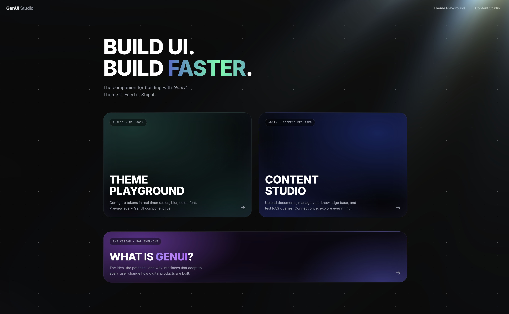
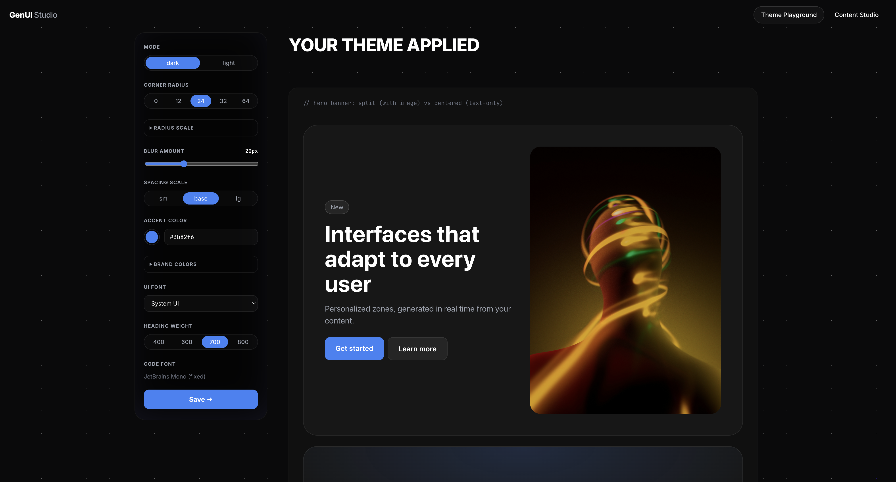
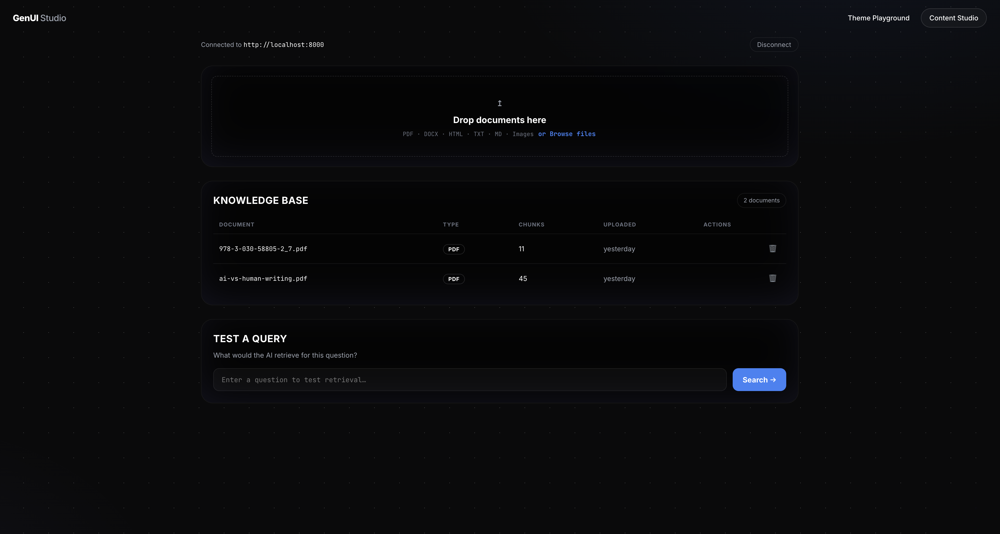

<div align="center">

# GenUI Framework

**Generative User Interfaces for Intelligent Web Applications**<br />
_A full-stack framework for building AI-powered, profile-aware, dynamically generated UI components_

[](LICENSE) [](https://www.typescriptlang.org/) [](https://www.python.org/downloads/) [](https://react.dev/)
[](https://doi.org/10.5281/zenodo.18237228)

<div align="center">
  <br />
  
  <br /><br /><br />
</div>

[Overview](#-overview) • [Quick Start](#-quick-start) • [Components](#-components) • [Custom Components](#-custom-components--your-design-system-as-llm-vocabulary) • [Theming](#-theming) • [Segment Cache](#-segment-cache--llm-as-an-offline-ranker) • [Guarantees](#️-output-guarantees) • [Auth & Profiles](#-auth-server-side-profiles--audit) • [Streaming](#️-streaming--ssr-safety) • [Uplift](#-measuring-uplift--impressions-clicks--holdout) • [API Reference](#-backend-api-reference) • [Architecture](#️-architecture)

</div>

---

## 🌟 Overview

GenUI System is a comprehensive framework for building **Generative User Interfaces:** dynamic, AI-driven UI components that adapt to user profiles, behavior, and context. The system combines a React frontend framework with a Python backend to deliver personalized content in real-time.

<div align="center">

#### **Profile-Aware** | **Real-Time Generation** | **RAG-Enhanced** | **Premium Components**

</div>

---

## Key Features

<table>
<tr>
<td width="50%" valign="top">

### 🎨 **Frontend Framework**

- **GenUIZone**: Declarative zones with 25+ configurable props
- **Custom Components**: register _your_ design system — the LLM generates it ([guide](#-custom-components--your-design-system-as-llm-vocabulary))
- **Premium Components**: Glassmorphism bento grids, 8 button variants, charts, styled text
- **Progressive Render**: components stream in as the model generates them (SSE)
- **Behavior Tracking & Events**: clicks, scrolls, impressions — uplift measured automatically
- **Theme System**: CSS-variable based customization
- **Pinned Content**: guaranteed display, enforced server-side
- **SSR-Safe**: importable in Next.js / Remix / Astro without crashes

</td>
<td width="50%" valign="top">

### 🧠 **Backend Intelligence**

- **Segment Cache**: the LLM runs once per user _segment_, not per request — orders of magnitude cheaper ([how](#-segment-cache--llm-as-an-offline-ranker))
- **Output Guarantees**: schema validation + URL whitelist — the system guarantees, not the prompt ([how](#️-output-guarantees))
- **Auth & Multi-tenancy**: API keys, per-tenant isolation, rate limiting
- **Server-Side Profiles**: source of truth with GDPR erasure; IndexedDB is just a cache
- **Holdout & Uplift**: control group + z-test significance — prove personalization works
- **Audit Log**: what was shown to whom, append-only
- **Provider-Agnostic LLM**: OpenAI, Anthropic, Gemini, any OpenAI-compatible API — by configuration
- **RAG Integration**: Qdrant vector store with semantic search
- **Observability**: OpenTelemetry tracing on renders and LLM calls

</td>
</tr>
</table>

---

## 🎛️ GenUI Studio

**GenUI Studio** is the companion web app for building with the framework — a single SPA (`studio/`, React + Vite) with two tools. Run it locally with `cd studio && npm run dev`.

<div align="center">
  <br />
  
  <br /><br />
</div>

### 🎨 Theme Playground

Configure the entire `--genui-*` token dictionary in real time and watch **every real framework component** (not mockups) update live: hero banners, tabs, pricing, stats, testimonials, bento, charts, and both `with-image` / `text-only` variants. Toggle light/dark, tune radius scale, blur, spacing, accent, brand surfaces, heading weight, and font. Export the result as a `GenUITheme` object, CSS variables, JSON, or copy a **shareable link** that encodes the theme in the URL.

<div align="center">
  <br />
  
  <br /><br />
</div>

### 📚 Content Studio

Manage the RAG knowledge base that feeds the AI: connect to your backend (URL + admin key, stored only in the browser session), **drag-and-drop documents** (PDF, DOCX, HTML, TXT, MD, images), browse the indexed knowledge base with chunk counts, and **test retrieval queries** to see exactly which passages the AI would surface, with similarity scores.

<div align="center">
  <br />
  
  <br /><br />
</div>

> **Note:** the Content Studio requires a reachable backend and an admin key, so for now it runs **locally only** (`npm run dev`). On the public GitHub Pages build it shows an "available locally" notice. A hosted version arrives with proper user auth on the roadmap.

---

# 📖 Usage Guide

## 🚀 Quick Start

Five steps from zero to a personalized zone on your page. **Prerequisites:** Python 3.10+, Node 18+, Docker (for Qdrant/Redis), and an OpenAI API key (or Anthropic/Gemini — see step 3).

### Step 1 — Clone and start the infrastructure

```bash
git clone https://github.com/thevladdo/genui-framework.git
cd genui-framework/backend

# Starts Qdrant (vector store for RAG) and Redis (render cache + profiles).
# Both are optional — without them the backend falls back to in-memory
# storage, fine for a first try, lost on restart.
docker-compose up -d
```

### Step 2 — Install the backend

```bash
# Still in genui-framework/backend
pip install -r requirements.txt

# For development (running the test suite):
pip install -r requirements-dev.txt
```

### Step 3 — Configure

```bash
cp .env.example .env
```

Open `.env` and set **one** thing to start — your LLM key:

```env
LLM_PROVIDER=openai            # openai | anthropic | gemini
OPENAI_API_KEY=sk-...          # the only required value
```

Everything else has sensible defaults. The values you'll likely touch later:

```env
# Cache shared across processes (docker-compose already runs Redis)
REDIS_URL=redis://localhost:6379/0

# Production: API keys ("key:tenant"). WITHOUT THESE THE API IS OPEN (dev only!)
CLIENT_API_KEYS=pk_live_abc:myapp     # browser-side key
ADMIN_API_KEYS=sk_live_xyz:myapp      # server-to-server key

# Measure personalization uplift (10% of users see the generic version)
HOLDOUT_PERCENT=10

# Other providers instead of OpenAI:
# LLM_PROVIDER=anthropic + ANTHROPIC_API_KEY=...   (pip install anthropic)
# LLM_PROVIDER=gemini    + GOOGLE_API_KEY=...      (no extra package)
```

### Step 4 — Start and verify the backend

```bash
uvicorn api.main:app --reload --port 8000
```

Verify it's alive:

```bash
curl http://localhost:8000/health
# -> {"status": "healthy", ..., "qdrant_connected": true}
# "degraded" just means Qdrant isn't running — zones still work, without RAG.
```

Optional sanity check — render a zone from the terminal:

```bash
curl -X POST http://localhost:8000/api/v1/zone/render \
  -H "Content-Type: application/json" \
  -d '{"zone_id": "test", "base_prompt": "Show three example cards about space exploration"}'
```

You should get JSON with `components` and a `meta.cache` block. Run it twice: the second call returns `"status": "fresh"` — that's the cache working (no LLM call, no cost).

### Step 5 — Frontend (React)

> ⚠️ The npm package is not yet published. Install locally via `npm link`:

```bash
cd ../frontend
npm install
npm run build
npm link

# In YOUR app's directory:
npm link genui-framework
```

In your app's entry file (e.g. `main.tsx`):

```tsx
import "genui-framework/dist/styles.css";
```

Then drop a zone anywhere:

```tsx
import { GenUIZone } from "genui-framework";

<GenUIZone
  apiUrl="http://localhost:8000"
  zoneId="homepage-recommendations"
  basePrompt="Show recommended articles"
  preferredComponentType="bento"
  maxItems={6}
  debug // shows reasoning, segment, cache status — remove in production
/>;
```

Open the page: you'll see a loading skeleton, then the generated cards. The `debug` panel underneath tells you _why_ you're seeing what you're seeing.

### Running the tests

```bash
cd backend
python3 -m unittest discover -s tests   # or: pytest tests/
```

---

## 🎯 Core Components

### GenUIZone — AI-Powered Content Zones

The `GenUIZone` component automatically fetches personalized content from the backend based on:

- **User Profile**: Stored preferences, interests, demographics
- **Behavior Data**: Click patterns, scroll depth, navigation history
- **Developer Prompts**: Base prompts + context prompts for fine control
- **Pinned Content**: Guaranteed content that always displays

#### Basic Usage

```tsx
import { GenUIZone } from "genui-framework";

<GenUIZone
  apiUrl="http://localhost:8000"
  zoneId="homepage-recommendations"
  basePrompt="Show recommended articles"
  preferredComponentType="bento"
  maxItems={6}
/>;
```

#### Full Props Reference

```tsx
interface GenUIZoneProps {
  // === Required ===
  apiUrl: string; // Backend API URL
  zoneId: string; // Unique zone identifier

  // === Auth ===
  apiKey?: string; // Client API key (X-API-Key); required when CLIENT_API_KEYS is configured

  // === Prompt Engineering ===
  basePrompt?: string; // What the zone should display
  contextPrompt?: string; // Additional context for AI (page location, user segment, etc.)

  // === Content Control ===
  pinnedContent?: PinnedContent[]; // Content that MUST be displayed (enforced server-side)
  customComponents?: GenUICustomComponentDef[]; // Your design-system components (name + JSON schema)
  preferredComponentType?: "bento" | "chart" | "text" | "buttons" | string; // built-in or custom name
  maxItems?: number; // Max items to generate (default: 6)

  // === User Context ===
  userId?: string; // Stable user ID: enables server-side profile, holdout & audit trail
  currentPage?: string; // Current page path
  pageMetadata?: Record<string, unknown>; // Custom page context (page-level, not per-user!)

  // === Behavior ===
  loadOnMount?: boolean; // Auto-load on mount (default: true)
  refreshInterval?: number; // Auto-refresh in ms (0 = disabled)
  cacheStrategy?: "segment" | "live"; // 'segment' (default): per-segment cached renders; 'live': always call the LLM
  streaming?: boolean; // Progressive render via SSE (components appear as generated)
  trackEvents?: boolean; // Auto impression/click events for uplift measurement (default: true)

  // === Theming ===
  theme?: GenUITheme; // Theme overrides
  className?: string; // CSS class
  style?: React.CSSProperties; // Inline styles

  // === Custom Render States ===
  loadingComponent?: React.ReactNode;
  errorComponent?: React.ReactNode | ((error: Error) => React.ReactNode);
  emptyComponent?: React.ReactNode; // Shown when AI returns empty
  showLoadingSkeleton?: boolean;

  // === Callbacks ===
  onRender?: (components: GenUIComponent[]) => void;
  onError?: (error: Error) => void;

  // === Debug ===
  debug?: boolean; // Shows reasoning, confidence, profile factors
}
```

---

### Pinned Content — Guaranteed Display

Pinned content ensures certain items **always** appear in the zone, regardless of what the AI generates. The AI will include these items alongside its personalized selections.

```tsx
interface PinnedContent {
  type: "link" | "article" | "document" | "custom";
  title: string;
  url?: string;
  description?: string;
  id?: string;
  metadata?: Record<string, unknown>;
}
```

#### Example: Pinned Sponsor Content

```tsx
<GenUIZone
  zoneId="news-feed"
  apiUrl="http://localhost:8000"
  pinnedContent={[
    {
      type: "article",
      title: "Sustainability Report 2024",
      url: "/reports/sustainability-2024",
      description: "Our commitment to the environment",
      metadata: { category: "sustainability", sponsor: true },
    },
    {
      type: "link",
      title: "Investor Relations",
      url: "/investors",
      description: "Financial information and reports",
    },
  ]}
  preferredComponentType="bento"
  maxItems={6} // AI will fill remaining slots with personalized content
/>
```

---

### Context Prompts — Fine-Grained AI Control

Use `contextPrompt` to give the AI detailed instructions about the zone's purpose, available content, and selection criteria.

#### Example: Article Selection with Available Content List

```tsx
const articlesContext = useMemo(() => {
  return articles
    .map(
      (a, i) =>
        `ID ${i}: "${a.title}" (Link: ${a.link}, Img: ${a.src}, Tag: ${a.tag[0]})`,
    )
    .join("; ");
}, [articles]);

const contextPrompt = `
  You are an intelligent content curator for a corporate website.
  
  AVAILABLE CONTENT (Use ONLY these items):
  [${articlesContext}]
  
  SELECTION RULES:
  1. Select ${maxItems} items that best match the user's profile and interests.
  2. If user has interest in "sustainability", prioritize content tagged with that topic.
  3. If user role is "investor", prioritize financial and business content.
  4. For new users with no profile, show a diverse mix.
  
  OUTPUT REQUIREMENTS:
  - Return a 'bento' component with cards.
  - Each card MUST use the exact image, title, badge, and link from the input list.
  - Do NOT invent new content.
`;

<GenUIZone
  zoneId="homepage-for-you"
  apiUrl="http://localhost:8000"
  basePrompt="Display personalized article recommendations"
  contextPrompt={contextPrompt}
  preferredComponentType="bento"
  maxItems={6}
/>;
```

---

### Page Metadata — Contextual Awareness

Pass `pageMetadata` to give the AI awareness of the current page context:

```tsx
<GenUIZone
  zoneId="related-content"
  apiUrl="http://localhost:8000"
  currentPage="/products/electric-cars"
  pageMetadata={{
    pageType: "product",
    productCategory: "transportation",
    productId: "ETR-500",
    userSegment: "business",
    region: "europe",
  }}
  basePrompt="Show related products and content"
/>
```

---

### Fallback Content — Client-Side Fallbacks

When the AI returns empty results (e.g., backend unavailable, no matching content), use `emptyComponent` and `errorComponent` to display fallback content:

```tsx
import { GenUIZone, BentoComponent, GenUISection } from "genui-framework";

const fallbackBentoData = {
  cards: articles.slice(0, 6).map((a) => ({
    title: a.title,
    description: a.tag?.[0] || "",
    link: a.link || "#",
    image: a.src,
    badge: a.tag?.[0],
  })),
  columns: 3,
};

const FallbackBento = () => (
  <GenUISection className="genui-layout-complex">
    <BentoComponent data={fallbackBentoData} />
  </GenUISection>
);

<GenUIZone
  zoneId="recommendations"
  apiUrl="http://localhost:8000"
  emptyComponent={<FallbackBento />}
  errorComponent={() => <FallbackBento />}
/>;
```

---

## 🪝 Hooks

### useGenUI — Conversational AI Interface

For chat-based interactions with automatic behavior tracking and profile learning:

```tsx
import { useGenUI } from "genui-framework";

function ChatBot() {
  const {
    query, // Send message to AI
    isLoading, // Loading state
    error, // Last error
    profile, // Current user profile
    updateProfile, // Manual profile update
    clearProfile, // Reset profile
    history, // Conversation history
    clearHistory, // Clear conversation
    behaviorTracker, // Access behavior tracker
    trackInteraction, // Track custom events
    trackNavigation, // Track page navigation
  } = useGenUI({
    apiUrl: "http://localhost:8000",
    userId: getUserId(),
    enablePersistence: true,
    enableBehaviorTracking: true,
    behaviorTrackingOptions: {
      trackClicks: true,
      trackScroll: true,
      trackPageVisits: true,
      trackHover: true,
      hoverThreshold: 500, // ms before hover counts
      scrollDebounce: 100, // ms debounce
      maxEventsPerType: 100, // Memory limit
      enableHeatmapZones: true,
    },
    onProfileUpdate: (profile) => console.log("Profile updated:", profile),
    onError: (error) => console.error("GenUI error:", error),
  });

  const handleSend = async (message: string) => {
    try {
      const response = await query(message);
      // response.text - AI text response
      // response.components - Generated UI components
      // response.sources - Source citations
      // response.suggestedActions - Follow-up suggestions
      // response.profileUpdates - Profile learning data
      // response.meta - Confidence, sentiment, interaction type
    } catch (err) {
      // Handle error
    }
  };

  return <ChatUI onSend={handleSend} history={history} loading={isLoading} />;
}
```

### useZone — Zone-Level Control

For low-level zone control when you need more customization:

```tsx
import { useZone } from "genui-framework";

const {
  components, // Rendered GenUI components
  isLoading, // Loading state
  error, // Error state
  meta, // Render metadata
  pinnedContentIncluded, // Which pinned items were included
  render, // Manually trigger render
  refresh, // Force re-render (clears first)
} = useZone({
  apiUrl: "http://localhost:8000",
  zoneId: "my-zone",
  basePrompt: "Show content",
  loadOnMount: true,
  refreshInterval: 30000, // Auto-refresh every 30s
});

// Access metadata
console.log(meta?.confidence); // 0.87
console.log(meta?.reasoning); // "Selected based on user interests..."
console.log(meta?.profileFactors); // ["interests.technology", "demographic.role"]
console.log(meta?.personalizationApplied); // true
console.log(meta?.renderId); // "a1b2c3d4e5f6" — identity of the generated variant
console.log(meta?.cache); // { status: "fresh", segment: "role=developer|eng=high", ageSeconds: 42 }
console.log(meta?.experiment); // { arm: "personalized", holdoutPercent: 10 } — when holdout is on
```

---

## 🎨 Components

### BentoComponent — Glassmorphism Grid

A premium card grid with hover animations and responsive layouts:

```tsx
import { BentoComponent } from "genui-framework";

<BentoComponent
  data={{
    cards: [
      {
        title: "Feature One",
        description: "Optional description text",
        image: "/images/feature1.jpg",
        badge: "New", // Top-left badge
        link: "/features/one",
        action: {
          // Optional action button
          label: "Learn More",
          url: "/features/one",
        },
      },
      // ... more cards
    ],
    columns: 3, // 2, 3, or 4
    gap: 16, // Gap in pixels
  }}
/>;
```

### ButtonsComponent — Animated Buttons

8 premium button variants with animated arrows:

```tsx
import { ButtonsComponent } from "genui-framework";

<ButtonsComponent
  data={{
    buttons: [
      {
        label: "Get Started",
        url: "/start",
        style: "shine", // Animated gradient sweep
        showArrow: true, // Arrow shows on all buttons by default
        arrowPlacement: "right", // "left" or "right"
        size: "lg", // "sm" | "md" | "lg"
        borderRadius: "8px", // Custom override
        backgroundColor: "#3b82f6", // Custom override
        textColor: "#ffffff", // Custom override
      },
      {
        label: "Learn More",
        style: "outline",
        showArrow: false, // Explicitly hide arrow
      },
      {
        label: "Contact",
        style: "gooey", // Blob morph on hover
      },
      {
        label: "Explore",
        style: "ringHover", // Ring outline on hover
      },
      {
        label: "Details",
        style: "expandIcon", // Arrow reveals on hover
      },
    ],
    direction: "horizontal", // or "vertical"
    align: "center", // "start" | "center" | "end"
    gap: 12, // Custom gap in pixels
  }}
/>;
```

#### Button Variants

| Variant      | Description                              |
| ------------ | ---------------------------------------- |
| `primary`    | Solid accent color with brightness hover |
| `secondary`  | Semi-transparent with backdrop blur      |
| `outline`    | Transparent with border, fills on hover  |
| `ghost`      | Minimal, text only                       |
| `shine`      | Animated gradient that sweeps across     |
| `gooey`      | Blob morphing effect on hover            |
| `expandIcon` | Arrow icon reveals on hover              |
| `ringHover`  | Ring outline appears on hover            |

### ChartComponent — Data Visualization

```tsx
import { ChartComponent } from "genui-framework";

<ChartComponent
  data={{
    chartType: "bar", // "bar" | "line" | "pie" | "area" | "donut"
    title: "Monthly Sales",
    data: [
      { label: "Jan", value: 100, color: "#3b82f6" },
      { label: "Feb", value: 150 },
      { label: "Mar", value: 200 },
    ],
    xAxis: "Month",
    yAxis: "Sales ($)",
    showLegend: true,
    showGrid: true,
    height: 300,
  }}
/>;
```

### TextComponent — Styled Text

```tsx
import { TextComponent } from "genui-framework";

<TextComponent
  data={{
    content: "This is **markdown** supported text with _emphasis_.",
    style: "normal", // "normal" | "emphasis" | "note" | "heading"
  }}
/>;
```

---

### Enterprise Section Components

Seven section-level components for editorial, e-commerce, insurance, SaaS and corporate portals — same token system, same validation pipeline, all **image-optional by design**: every image-bearing variant declares `layout: "with-image" | "text-only"` (or a hero `variant`), the backend schema enforces coherence (`with-image` without an `image_url` is rejected), and the text-only shape is a _designed_ alternative (accent gradients, emphasized typography), never a card with a hole.

| Type                   | Use case                                                      | Image-optional           |
| ---------------------- | ------------------------------------------------------------- | ------------------------ |
| `tabs_feature`         | plan comparison, SaaS highlights, product categories          | per-tab `content.layout` |
| `steps_section`        | onboarding, how-it-works, purchase flow (autoplay + progress) | section `layout`         |
| `stats_banner`         | numeric metrics ("10M users") — populate from RAG facts       | text-only by design      |
| `testimonial_carousel` | quotes with avatar → initials fallback                        | avatar optional          |
| `pricing_cards`        | plan grid; `variant: "detailed"` adds a comparison table      | text-only by design      |
| `content_grid`         | blog/news cards                                               | per-item `layout`        |
| `hero_banner`          | hero: `split` (requires image) · `centered` · `minimal`       | variant chain fallback   |

```json
{
  "type": "hero_banner",
  "data": {
    "variant": "centered",
    "headline": "Coverage that adapts",
    "subheadline": "Personalized in real time.",
    "primary_cta": { "label": "Get a quote", "url": "/quote" }
  }
}
```

### Semantic tokens & light mode

New components consume **level-2 semantic tokens** — rebrand by overriding just these: `--genui-surface-1/2/3`, `--genui-border-subtle/strong`, `--genui-text-primary/secondary/tertiary/on-accent`, `--genui-radius-sm/md/lg/full`, `--genui-shadow-sm/md/lg`. Dark is the default; switch any subtree with `[data-theme="light"]` (or re-assert `[data-theme="dark"]` when nesting).

---

## 🧩 Custom Components — Your Design System as LLM Vocabulary

The four built-in types cover generic zones, but the real power is letting the LLM generate **your** components. Registration has two halves:

```tsx
// 1. Render side: name -> React component
import { registerGenUIComponent } from "genui-framework";

registerGenUIComponent("hero_banner", ({ data }) => (
  <HeroBanner
    headline={data.headline}
    subtitle={data.subtitle}
    ctaLabel={data.cta_label}
    ctaUrl={data.cta_url}
  />
));

// 2. Generation side: name -> JSON Schema + description (per zone)
<GenUIZone
  zoneId="homepage-hero"
  apiUrl="..."
  preferredComponentType="hero_banner"
  customComponents={[
    {
      name: "hero_banner",
      description:
        "Full-width hero with headline, subtitle and one CTA. Use as the first component of landing zones.",
      dataSchema: {
        type: "object",
        required: ["headline"],
        properties: {
          headline: { type: "string", maxLength: 80 },
          subtitle: { type: "string" },
          cta_label: { type: "string" },
          cta_url: { type: "string" },
        },
      },
    },
  ]}
/>;
```

What the framework guarantees for custom components:

- The JSON Schema is shown to the LLM (name, description, schema, optional `example`), so the model knows when and how to use the component.
- Generated data is **validated against the schema** server-side (jsonschema); invalid components are dropped and reported in `meta.sanitization`.
- The **URL whitelist applies recursively**: URL-named fields (`url`, `link`, `href`, `src`, `image`, `*_url`, …), absolute URLs and markdown links anywhere in the payload are checked; dangerous schemes are always stripped.
- Custom definitions are part of the **zone cache key**: changing a schema invalidates cached renders automatically.
- The registered React component receives `data` exactly as validated (no key renaming).

Backend embedders can register types globally instead of per request:

```python
from schemas import register_component_type

register_component_type(
    "hero_banner",
    data_schema={...},
    description="Full-width hero with headline and CTA",
)
```

> Custom names: 2-32 chars, lowercase `[a-z0-9_-]`, starting with a letter. Built-in names cannot be overridden.

---

## 🎭 Theming

### GenUITheme Properties

```tsx
interface GenUITheme {
  borderRadius?: string; // Default: '30px'
  primaryColor?: string; // Default: '#fafafa'
  secondaryColor?: string; // Default: '#b2b2b2'
  backgroundColor?: string; // Default: 'transparent'
  textColor?: string;
  accentColor?: string; // Used for buttons, highlights
  fontFamily?: string;
  fontSize?: string;
}
```

### Applying Themes

Two equivalent ways — pass `theme` **directly to the zone**, or wrap a group of zones in a `GenUISection`:

```tsx
import { GenUISection, GenUIZone } from 'genui-framework';

const theme = {
  borderRadius: '16px',
  accentColor: '#3b82f6',
  primaryColor: '#1e1e1e',
  textColor: '#ffffff',
  fontFamily: "'Inter', sans-serif",
};

// Per zone:
<GenUIZone theme={theme} apiUrl="..." zoneId="..." />

// Or shared across several zones:
<GenUISection theme={theme}>
  <GenUIZone apiUrl="..." zoneId="hero" />
  <GenUIZone apiUrl="..." zoneId="footer" />
</GenUISection>
```

Only the properties you set are emitted; everything else inherits — from an enclosing `GenUISection`, then from the framework defaults in `genui.css` (a dark glassmorphism theme). Sections nest cleanly: an inner zone without a theme inherits the outer section's, it does not reset to defaults.

> **Dark by default.** Out of the box the components render on a dark glass theme (light text, dark cards). On a light page background, set `primaryColor`/`textColor` to suit — or override the CSS variables below globally.

### CSS Variables

The framework's defaults live in `:root` (override them globally to retheme everything):

```css
:root {
  --genui-border-radius: 24px;
  --genui-primary-color: #0a0a0c;
  --genui-secondary-color: #6b7280;
  --genui-accent-color: #3b82f6;
  --genui-text-primary: #ffffff;
  --genui-text-secondary: rgba(255, 255, 255, 0.8);
  --genui-glass-blur: 12px;
  --genui-glass-border: 1px solid rgba(255, 255, 255, 0.1);
}
```

---

## ⚡ Segment Cache — LLM as an Offline Ranker

By default, zone renders are **not** generated per user per request. Users are collapsed into a small number of deterministic **segments** (role, top interests, browsing style, engagement), and each `(zone config, segment)` pair is rendered once and cached with **stale-while-revalidate** semantics:

| Cache state                              | Behavior                                                               |
| ---------------------------------------- | ---------------------------------------------------------------------- |
| **fresh** (age ≤ `ZONE_CACHE_FRESH_TTL`) | Served from cache, no LLM call                                         |
| **stale** (age ≤ `ZONE_CACHE_STALE_TTL`) | Served instantly from cache, re-rendered in background (single-flight) |
| **miss**                                 | Rendered live (cold start), then cached for the whole segment          |

Anonymous users with no profile signals share a single `anon` segment — typically the most-hit cache entry. Changing any zone configuration (prompts, pinned content, constraints) automatically invalidates its cache entries.

Use Redis for a shared, persistent cache across processes (`REDIS_URL=redis://localhost:6379/0`, included in `docker-compose.yml`); without it, an in-memory fallback is used. The cache always fails open: a cache outage degrades to live rendering.

For genuinely dynamic zones, opt out per zone:

```tsx
<GenUIZone zoneId="live-dashboard" apiUrl="..." cacheStrategy="live" />
```

### Pre-warming segments

Render known archetypes offline (deploy hook, cron) so live traffic only sees cache hits:

```http
POST /api/v1/zone/warmup
Content-Type: application/json

{
  "zones": [
    { "zone_id": "homepage-for-you", "base_prompt": "...", "user_profile": null },
    {
      "zone_id": "homepage-for-you",
      "base_prompt": "...",
      "user_profile": {
        "preferences": { "role": { "value": "developer", "confidence": 1.0 } },
        "interests": { "ai": { "value": true, "confidence": 1.0 } }
      }
    }
  ]
}
```

Each response's `meta.cache` reports `status` (`fresh` | `stale` | `miss` | `bypass`), the `segment` key, and `age_seconds` — visible in the `debug` panel of `GenUIZone`. Cache stats are exposed at `GET /api/v1/zone/cache/stats`.

---

## 🛡️ Output Guarantees

What reaches the frontend is guaranteed by the system, not by prompt obedience:

1. **Provider-native structured output** — the ZoneAgent constrains generation with `response_format` (JSON schema derived from the component schemas, falling back to JSON mode).
2. **Schema validation** — every generated component is validated against Pydantic schemas (`backend/schemas/`) server-side. Invalid components are dropped individually and reported in `meta.sanitization.dropped_components`; one malformed component never breaks the zone.
3. **URL whitelist (hard rule)** — a generated URL survives **only if it existed in the input**: pinned content, developer prompts, RAG documents, or page context. Invented links/images are stripped (`meta.sanitization.removed_urls`), buttons left without a valid URL are dropped, markdown links collapse to plain text. Dangerous schemes (`javascript:`, `data:`, …) are always blocked, even with the whitelist disabled (`URL_WHITELIST_ENABLED=false`).
4. **Pinned content enforcement** — pinned items are verified on the _actual output_ (by URL/title) after generation; missing ones are appended automatically. `pinned_content_included` is computed, not model-claimed.
5. **Frontend defense in depth** — rendered `href`/`src` pass through `sanitizeUrl()` regardless of origin.

> Because URLs must exist in the input, enumerate your content in `contextPrompt` (or `pinnedContent` / RAG) — content the model cannot reference, it cannot link.

---

## 🔐 Auth, Server-Side Profiles & Audit

### API keys & multi-tenancy

Two key classes, configured as comma-separated `key` or `key:tenant` entries:

```env
CLIENT_API_KEYS=pk_live_abc123:acme,pk_live_def456:globex   # shipped to the browser
ADMIN_API_KEYS=sk_live_xyz789:acme                          # server-to-server only
```

- **Client keys** identify the calling app/tenant, gate rate limits, and scope cached renders and stored profiles per tenant. Pass them via the `apiKey` prop (sent as `X-API-Key`; `Authorization: Bearer` also works).
- **Admin keys** protect `/documents*`, `/zone/warmup`, and `/zone/cache/stats`.
- **No keys configured = open API** (dev mode, logged loudly). Always configure keys in production.
- Rate limiting: `RATE_LIMIT_PER_MINUTE` per client key (default 120, `0` disables).

```tsx
<GenUIZone
  apiUrl="..."
  apiKey="pk_live_abc123"
  userId={user.id}
  zoneId="home"
/>
```

### Server-side profiles (source of truth)

When `userId` is provided, the **server-side profile store** (Redis, or in-memory in dev) is authoritative:

- An existing server profile **overrides** the client-supplied one.
- With no server profile yet, the client (IndexedDB) copy seeds the store — IndexedDB is thereby demoted to a cache.
- Agent-extracted profile updates are merged server-side (higher confidence wins) on every `/query`.
- Endpoints: `GET /api/v1/profile/{user_id}`, `POST /api/v1/profile/sync`, and `DELETE /api/v1/profile/{user_id}` (GDPR erasure, audit-logged).
- Retention: `PROFILE_TTL_SECONDS` (e.g. `7776000` = auto-expire after 90 days of inactivity).

### Audit log — what was shown to whom

Every zone render, query, profile sync, and profile deletion emits an append-only JSON event (`AUDIT_LOG_PATH` file, or the `genui.audit` logger): tenant, user, zone, segment, cache state, and the exact titles/links displayed. In regulated sectors this answers "why did user X see content Y on date Z?". API keys appear only as fingerprints, never raw.

```json
{
  "ts": "2026-06-10T10:30:00+0000",
  "event": "zone_render",
  "tenant": "acme",
  "user_id": "u42",
  "zone_id": "homepage-for-you",
  "cache": { "status": "fresh", "segment": "role=developer|eng=high" },
  "shown_titles": ["API Docs", "Case Study"],
  "shown_links": ["/docs/api", "/cases/1"]
}
```

---

## ⚡️ Streaming & SSR-Safety

### Progressive render (SSE)

With `streaming` enabled, components appear one by one as the model generates them, instead of waiting for the full response:

```tsx
<GenUIZone zoneId="live-feed" apiUrl="..." cacheStrategy="live" streaming />
```

Under the hood the zone consumes `POST /api/v1/zone/render/stream` (Server-Sent Events): each `component` event is **already validated and URL-sanitized** before being emitted; the final `complete` event carries the authoritative response (including pinned-content enforcement) and replaces the streamed state. Cache hits stream their components in a single burst, so `streaming` is most useful for `cacheStrategy="live"` zones. Holdout, audit log, and caching behave exactly like the non-streaming endpoint.

### SSR-safety

The library can be imported and rendered in server environments (Next.js, Remix, Astro): CSS is shipped as a separate file (no style injection at import time), IndexedDB persistence degrades to a no-op without a browser, and the BehaviorTracker won't attach listeners without a DOM. Zone fetches run in effects, so server-rendered markup shows your `loadingComponent`/skeleton and hydrates normally. A first-class SSR adapter (zone data fetched server-side) is on the roadmap as a separate package.

---

## 📈 Measuring Uplift — Impressions, Clicks & Holdout

Personalization is only worth its cost if it beats your static page. The framework closes the loop natively:

### Automatic event tracking

With `trackEvents` (default `true`), every `GenUIZone`:

- emits an **impression** when the zone enters the viewport (once per generated variant), and
- captures **clicks** on any link inside the zone (title + URL),

sending them to `POST /api/v1/events` tagged with the variant identity (`render_id`), the experiment arm, and the segment. Custom events (e.g. conversions) can be sent with `sendGenUIEvents()`.

### Holdout (control group)

```env
HOLDOUT_PERCENT=10        # 10% of identified users get the generic render
HOLDOUT_SALT=genui-exp-1  # change to start a new experiment (reshuffles arms)
```

Assignment is a **sticky hash** of `user_id`: the same user always lands in the same arm, across sessions and servers. Control users are served the _non-personalized_ render (profile and behavior stripped — they share the generic cached variant); anonymous users are excluded (`arm: "none"`) since without a stable identity the comparison would be contaminated. The arm is exposed in `meta.experiment.arm`, so the frontend can also choose to render its own static fallback for control users.

### Reading the result

```http
GET /api/v1/events/stats?zone_id=homepage-for-you   (admin key)
```

```json
{
  "zone_id": "homepage-for-you",
  "arms": {
    "personalized": { "impression": 5400, "click": 540, "ctr": 0.1 },
    "control": { "impression": 600, "click": 30, "ctr": 0.05 }
  },
  "uplift_percent": 100.0,
  "significance": {
    "method": "two-proportion z-test (two-tailed)",
    "z_score": 3.94,
    "p_value": 0.00008,
    "significant_95": true,
    "sample_warning": false
  },
  "holdout_percent": 10
}
```

`uplift_percent` is the headline number; `significance` tells you whether to believe it — a two-proportion z-test between arms (`significant_95: true` means p < 0.05; `sample_warning` flags arms under 100 impressions, where any conclusion is preliminary). Raw events also land in the audit log for offline slicing (per segment, per item, per time window).

### Observability

Set `TRACING_ENABLED=true` for OpenTelemetry tracing: FastAPI requests, `genui.zone.render` spans (zone, tenant, segment, cache status, experiment arm) and `genui.llm.*` spans (provider, model). Point `OTLP_ENDPOINT` at a collector (Jaeger, Grafana Tempo, ...) or omit it for console output.

---

## 🔧 Behavior Tracking

The framework automatically tracks user behavior and sends it to the backend for personalization:

| Event Type     | What's Tracked                          |
| -------------- | --------------------------------------- |
| **Clicks**     | Element ID, type, page, coordinates     |
| **Scrolls**    | Depth percentage, direction, velocity   |
| **Hovers**     | Element ID, duration, timeout threshold |
| **Navigation** | Page path, title, timestamp             |
| **Zone Views** | When GenUI zones enter viewport         |

### Manual Tracking

```tsx
const { trackInteraction, trackNavigation } = useGenUI({ ... });

// Track custom element interaction
<button
  onClick={() => {
    trackInteraction('cta-signup', 'button', 'click', {
      source: 'header',
      campaign: 'summer-sale'
    });
  }}
>
  Sign Up
</button>

// Track SPA navigation
function navigateTo(path: string) {
  trackNavigation(path, document.title);
  router.push(path);
}
```

---

## 🌐 Backend API Reference

### Knowledge Base (RAG) — Tenant-Isolated

The knowledge base feeds the AI real content to curate (and its URLs feed the whitelist). **Every operation is scoped to the tenant of the API key**: tenant A can never retrieve, list, or delete tenant B's documents. Documents indexed before tenant isolation belong to the `default` tenant. All endpoints require an **admin key**.

| Endpoint                            | What it does                                                                                                                                                                                    |
| ----------------------------------- | ----------------------------------------------------------------------------------------------------------------------------------------------------------------------------------------------- |
| `POST /api/v1/documents/upload`     | Upload a **file** (PDF, DOCX, HTML, TXT, MD — max 10 MB, multipart): text extracted server-side, semantically chunked, indexed. Images (PNG/JPG/WEBP/TIFF) too with a capable extractor backend |
| `POST /api/v1/documents`            | Upload raw text (JSON: `content` + `metadata`)                                                                                                                                                  |
| `GET /api/v1/documents`             | List the tenant's documents with chunk counts                                                                                                                                                   |
| `POST /api/v1/documents/search`     | Preview what the AI would retrieve for a query (passages + similarity scores) — content debugging                                                                                               |
| `DELETE /api/v1/documents/{source}` | Delete a document (tenant-scoped, audit-logged)                                                                                                                                                 |
| `GET /api/v1/documents/stats`       | Collection stats incl. the tenant's chunk count                                                                                                                                                 |

```bash
# Upload a PDF (url becomes linkable by the AI via the whitelist)
curl -X POST http://localhost:8000/api/v1/documents/upload \
  -H "X-API-Key: sk_live_xyz789" \
  -F "file=@./sustainability-report.pdf" \
  -F "title=Sustainability Report 2026" \
  -F "url=/reports/sustainability-2026"

# What would the AI see for this query?
curl -X POST http://localhost:8000/api/v1/documents/search \
  -H "X-API-Key: sk_live_xyz789" -H "Content-Type: application/json" \
  -d '{"query": "renewable energy initiatives", "top_k": 5}'
```

#### Extraction backends — quality is configuration

```env
EXTRACTOR_BACKEND=local      # default: pypdf/docx/bs4 — zero dependencies, data stays in-house
# EXTRACTOR_BACKEND=docling  # local upgrade, no GPU: better tables/layout + images (pip install docling)
# EXTRACTOR_BACKEND=glmocr   # state-of-the-art incl. scanned docs (pip install glmocr)
# GLMOCR_BASE_URL=...        # self-hosted GLM-OCR (vLLM/Ollama, ~2-4GB VRAM): data stays in-house
# GLMOCR_API_KEY=...         # Z.ai cloud API: documents LEAVE your infra — opt-in consciously
```

Routing is per-format: plain text always decodes locally; a backend only handles the formats it excels at (Docling: PDF/DOCX/HTML/images; GLM-OCR: PDF/images) and everything else falls through to the local parsers. Runtime failures of a backend **fall back to local** with a warning; a configured backend with a missing package fails loudly (501) — that's a deployment mistake, not something to hide. The audit log records which extractor produced each document.

> Notes: embeddings always use OpenAI (`text-embedding-3-small`), so `OPENAI_API_KEY` is required for RAG even when `LLM_PROVIDER=anthropic`. Scanned PDFs need `docling` or `glmocr` — the local backend cannot OCR.

### POST /api/v1/query — Chat Interface

```http
POST /api/v1/query
Content-Type: application/json

{
  "query": "What products do you recommend?",
  "user_profile": {
    "preferences": { "role": { "value": "investor", "confidence": 0.9 } },
    "interests": { "sustainability": { "value": true, "confidence": 0.8 } },
    "demographic": { "region": { "value": "europe", "confidence": 0.7 } }
  },
  "conversation_history": [
    { "role": "user", "content": "Hello" },
    { "role": "assistant", "content": "Hi! How can I help?" }
  ],
  "behavior_data": {
    "clickCount": 15,
    "maxScrollDepth": 85,
    "userType": "deep_reader",
    "navigationPath": ["/", "/products", "/products/trains"]
  }
}
```

**Response:**

```json
{
  "text": "Based on your interest in sustainability, I recommend...",
  "components": [
    {
      "type": "bento",
      "data": { "cards": [...], "columns": 3 }
    }
  ],
  "sources": [
    { "title": "Sustainability Report", "url": "/reports/sustainability" }
  ],
  "suggested_actions": ["View all products", "Contact sales"],
  "profile_updates": {
    "should_update": true,
    "updates": [
      { "field": "interests.products", "value": "trains", "confidence": 0.75 }
    ]
  },
  "meta": {
    "confidence": 0.92,
    "interaction_type": "question",
    "topics": ["products", "recommendations"],
    "sentiment": "positive"
  }
}
```

### POST /api/v1/zone/render — Zone Rendering

```http
POST /api/v1/zone/render
Content-Type: application/json

{
  "zone_id": "homepage-recommendations",
  "base_prompt": "Show recommended articles for the user",
  "context_prompt": "User is on the homepage, interested in technology and sustainability",
  "pinned_content": [
    { "type": "article", "title": "Annual Report", "url": "/reports/annual" }
  ],
  "preferred_component_type": "bento",
  "max_items": 6,
  "user_profile": { ... },
  "behavior_data": { ... },
  "current_page": "/",
  "page_metadata": { "section": "hero", "campaign": "summer-2024" },
  "cache_strategy": "segment"
}
```

**Response:**

```json
{
  "zone_id": "homepage-recommendations",
  "components": [
    {
      "type": "bento",
      "data": {
        "cards": [
          { "title": "Annual Report", "link": "/reports/annual", ... },
          { "title": "Green Initiative", "link": "/sustainability", ... }
        ],
        "columns": 3
      }
    }
  ],
  "pinned_content_included": ["/reports/annual"],
  "personalization_applied": true,
  "meta": {
    "confidence": 0.87,
    "reasoning": "Selected sustainability and tech content based on user profile",
    "profile_factors": ["interests.sustainability", "interests.technology"],
    "cache": {
      "status": "fresh",
      "strategy": "segment",
      "segment": "int=sustainability+technology",
      "age_seconds": 42.3
    }
  },
  "rendered_at": "2024-01-15T10:30:00Z"
}
```

---

# 🏗️ Architecture

## Project Structure

```
genui-framework/
├── backend/                              # Python FastAPI backend
│   ├── agents/                           # AI agent implementations
│   │   ├── zone_agent.py                 # Zone rendering (validation, URL guard,
│   │   │                                 # pinned enforcement, streaming)
│   │   ├── response_agent.py             # Chat response generation (datapizza)
│   │   ├── profile_agent.py              # Profile learning & extraction
│   │   ├── behave_agent.py               # Behavior analysis
│   │   └── orchestrator.py               # Multi-agent coordination (chat)
│   ├── api/                              # REST API endpoints
│   │   ├── main.py                       # FastAPI app, query/documents/profile endpoints
│   │   ├── zone_router.py                # Zone render + stream + warmup + cache stats
│   │   ├── events_router.py              # UI event ingestion + uplift stats
│   │   └── deps.py                       # Shared service singletons
│   ├── auth/                             # API keys, tenants, FastAPI dependencies
│   ├── llm/                              # Provider abstraction (OpenAI / Anthropic / Gemini)
│   ├── schemas/                          # Component schemas (Pydantic) + custom type registry
│   ├── segmentation/                     # Deterministic profile -> segment mapping
│   ├── profiles/                         # Server-side profile store + merge logic
│   ├── experiments/                      # Holdout arm assignment
│   ├── metrics/                          # Impression/click counters + z-test significance
│   ├── rag/                              # Qdrant vector store + chunking
│   ├── utils/                            # zone_cache (SWR), url_guard, audit, rate_limit,
│   │                                     # json_stream (SSE parser), tracing
│   ├── config/settings.py                # All env-driven configuration
│   ├── tests/                            # 136 unit tests (unittest/pytest compatible)
│   └── docker-compose.yml                # Qdrant + Redis
│
└── frontend/                             # React component library (npm package)
    ├── src/
    │   ├── components/                   # GenUIZone, GenUISection, Bento/Buttons/Chart/Text,
    │   │                                 # ComponentRenderer (with custom-component fallback)
    │   ├── hooks/                        # useZone (cache/streaming/events), useGenUI (chat)
    │   ├── registry.ts                   # registerGenUIComponent (custom design systems)
    │   ├── styles/genui.css              # Glassmorphism theme, animations
    │   ├── types/                        # TypeScript definitions
    │   └── utils/                        # indexeddb (SSR-safe), behaviorTracker,
    │                                     # sanitizeUrl, genuiEvents, sse
    ├── dist/                             # Built output (+ styles.css)
    └── rollup.config.js
```

## Data Flow

```
┌─────────────────────────────────────────────────────────────────────────┐
│                              FRONTEND (React)                           │
├─────────────────────────────────────────────────────────────────────────┤
│                                                                         │
│  ┌─────────────┐    ┌─────────────┐    ┌─────────────────┐              │
│  │ GenUIZone   │    │  useGenUI   │    │ BehaviorTracker │              │
│  │ (zones)     │    │  (chat)     │    │ (analytics)     │              │
│  └──────┬──────┘    └──────┬──────┘    └────────┬────────┘              │
│         │                  │                    │                       │
│         │    ┌─────────────┴─────────────┐      │                       │
│         │    │      IndexedDB            │      │                       │
│         │    │  - User Profile           │◄─────┘                       │
│         │    │  - Conversation History   │                              │
│         │    └─────────────┬─────────────┘                              │
│         │                  │                                            │
│         └────────┬─────────┘                                            │
│                  │                                                      │
│                  ▼                                                      │
│   HTTP POST /api/v1/zone/render  or  /api/v1/query                      │
│   { zone_id, prompts, user_profile, behavior_data, pinned_content }     │
│                                                                         │
└─────────────────────────────────────────────────────────────────────────┘
                                       │
                                       ▼
┌─────────────────────────────────────────────────────────────────────────┐
│                              BACKEND (FastAPI)                          │
├─────────────────────────────────────────────────────────────────────────┤
│                                                                         │
│  ┌──────────────┐                                                       │
│  │    Router    │                                                       │
│  │  zone_router │                                                       │
│  └──────┬───────┘                                                       │
│         │                                                               │
│         ▼                                                               │
│  ┌─────────────────────────────────────────────────────────────┐        │
│  │                        AGENT SYSTEM                         │        │
│  │                                                             │        │
│  │  ┌──────────────┐  ┌──────────────┐  ┌──────────────┐       │        │
│  │  │ ZoneAgent    │  │ResponseAgent │  │ ProfileAgent │       │        │
│  │  │ (zone render)│  │ (chat)       │  │ (learning)   │       │        │
│  │  └──────┬───────┘  └──────────────┘  └──────────────┘       │        │
│  │         │                                                   │        │
│  │         ▼                                                   │        │
│  │  ┌──────────────┐  ┌──────────────┐                         │        │
│  │  │ RAG System   │  │   LLM API    │                         │        │
│  │  │ (Qdrant)     │  │  (OpenAI)    │                         │        │
│  │  └──────────────┘  └──────────────┘                         │        │
│  │                                                             │        │
│  └─────────────────────────────────────────────────────────────┘        │
│                                                                         │
└─────────────────────────────────────────────────────────────────────────┘
                                       │
                                       ▼
                    JSON Response: { components, meta, ... }
```

### Zone render pipeline (what actually happens on `/zone/render`)

1. **Auth & rate limit** — the API key resolves the tenant; client keys are rate-limited.
2. **Profile resolution** — with a `user_id`, the server-side profile overrides the client copy (or gets seeded by it).
3. **Holdout assignment** — with `HOLDOUT_PERCENT` set, a sticky hash sends X% of users to the control arm (signals stripped).
4. **Segmentation** — profile + behavior collapse into a deterministic segment key (`role=developer|int=ai|eng=high`).
5. **Cache lookup** — fresh hit: served, no LLM. Stale: served + refreshed in background. Miss: continue.
6. **Generation** — provider-agnostic LLM call with structured output (prompt includes profile, RAG content, pinned items, custom component schemas).
7. **Guarantees** — per-component schema validation, URL whitelist, pinned-content enforcement.
8. **Cache write + audit** — the render is cached for the whole segment and audit-logged (what was shown, to whom, why).

## Agent Responsibilities

| Agent             | File                | Purpose                                                                                                          |
| ----------------- | ------------------- | ---------------------------------------------------------------------------------------------------------------- |
| **ZoneAgent**     | `zone_agent.py`     | Zone rendering: prompts + profile + RAG → validated, sanitized components (provider-agnostic, streaming-capable) |
| **ResponseAgent** | `response_agent.py` | Chat responses with optional UI components (datapizza, RAG tools)                                                |
| **ProfileAgent**  | `profile_agent.py`  | Extracts user preferences from conversations                                                                     |
| **BehaveAgent**   | `behave_agent.py`   | Analyzes behavior patterns for UI adjustments                                                                    |
| **Orchestrator**  | `orchestrator.py`   | Runs Response/Profile/Behave agents in parallel for `/query`                                                     |

## Frontend Module Summary

| Module          | Purpose                     | Key Exports                                                                                                               |
| --------------- | --------------------------- | ------------------------------------------------------------------------------------------------------------------------- |
| **components/** | React UI components         | `GenUIZone`, `BentoComponent`, `ButtonsComponent`, `ChartComponent`, `TextComponent`, `ComponentRenderer`, `GenUISection` |
| **hooks/**      | React hooks for state & API | `useGenUI`, `useZone`                                                                                                     |
| **types/**      | TypeScript definitions      | `GenUITheme`, `BentoCard`, `ButtonDef`, `ButtonVariant`, `UserProfile`, `GenUIResponse`, etc.                             |
| **utils/**      | Utilities                   | `BehaviorTracker`, profile/history persistence functions                                                                  |
| **styles/**     | CSS                         | Glassmorphism theme, animations, responsive layouts                                                                       |

---

## 🍕 Powered by datapizza-ai

GenUI's **chat pipeline** (ResponseAgent, ProfileAgent, BehaveAgent) is built on top of **[datapizza-ai](https://github.com/datapizza-labs/datapizza-ai)**, a Python framework for building reliable Gen AI solutions without overhead. The ZoneAgent uses its own provider abstraction (`backend/llm/`) for structured output and streaming.

### Why datapizza-ai?

- **Integration with AI Providers**: Seamlessly connect with OpenAI, Google VertexAI, Anthropic, Mistral, and more
- **Complex workflows, minimal code**: Design, automate, and scale powerful agent workflows without boilerplate
- **Retrieval-Augmented Generation (RAG)**: Built-in support for Qdrant, Milvus vector stores
- **Up to 40% less debugging time**: Trace and log every LLM/tool call with inputs/outputs
- **MCP Support**: Model Context Protocol integration for advanced tool usage

---

## 📄 License

This project is licensed under the Apache 2.0 License.
See the [LICENSE](LICENSE) file for details.

---

<div align="center">

**GenUI System**
_Intelligent interfaces that adapt to every user_

Built with ❤️ for the personalized web

</div>
