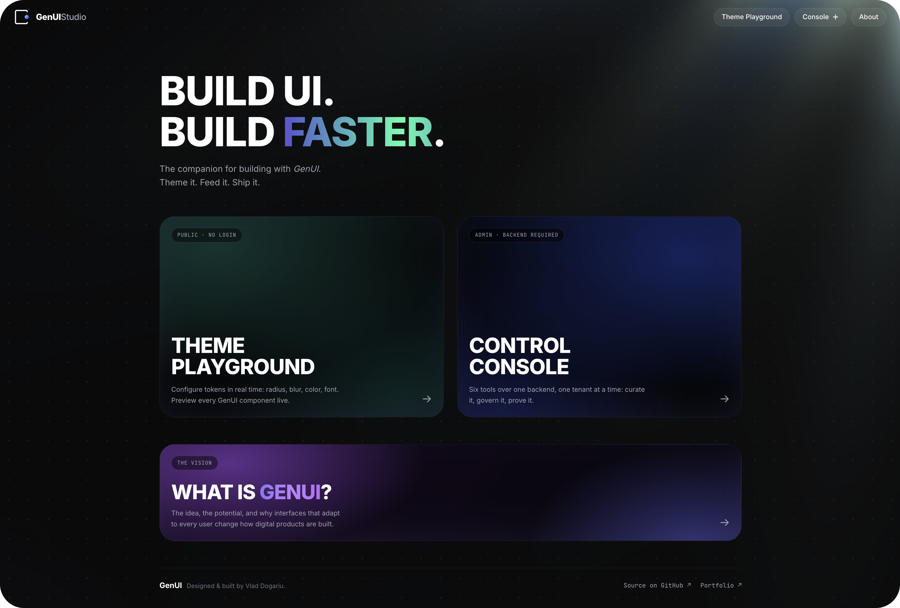
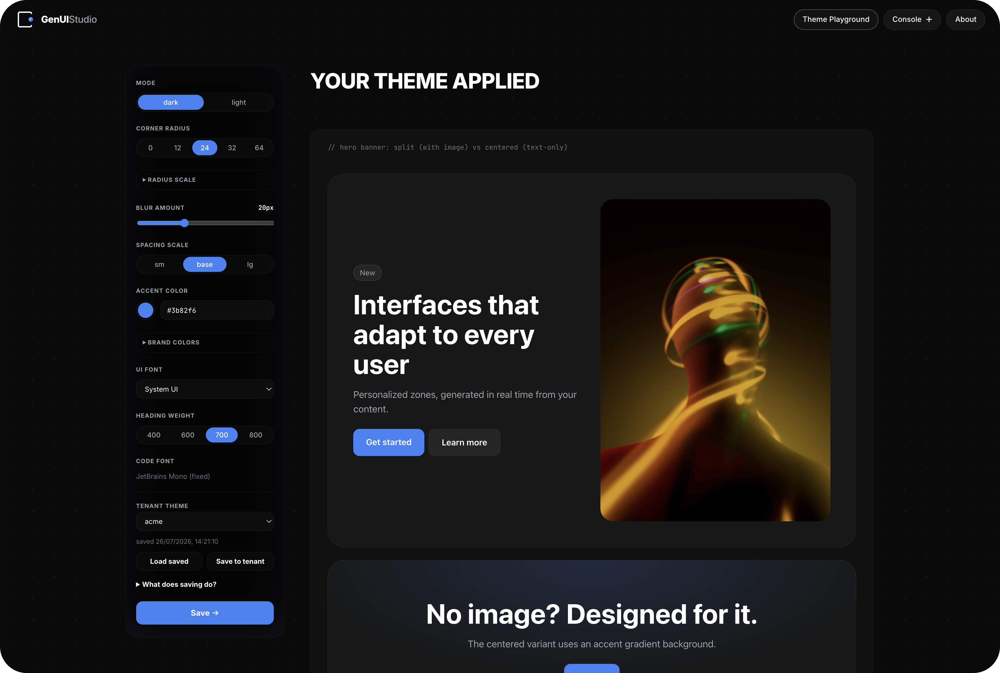
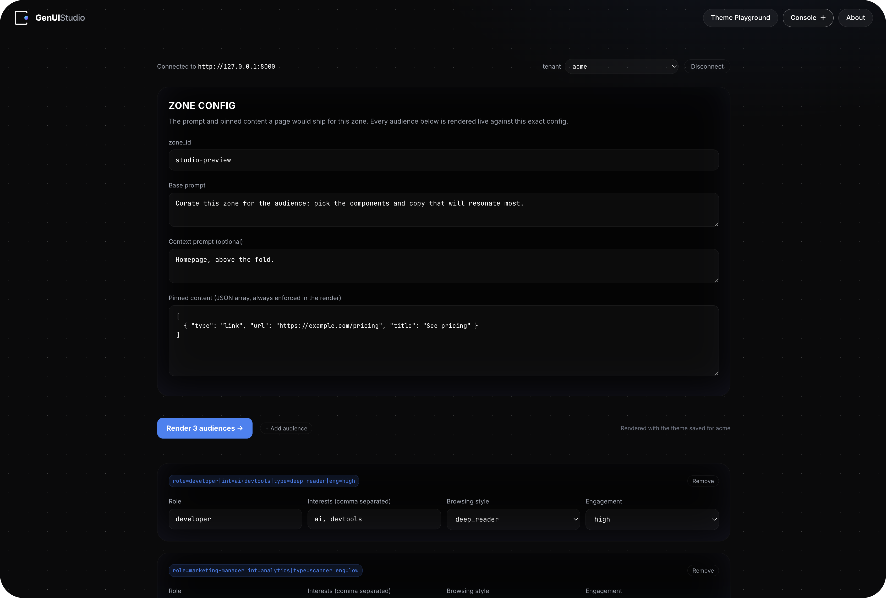
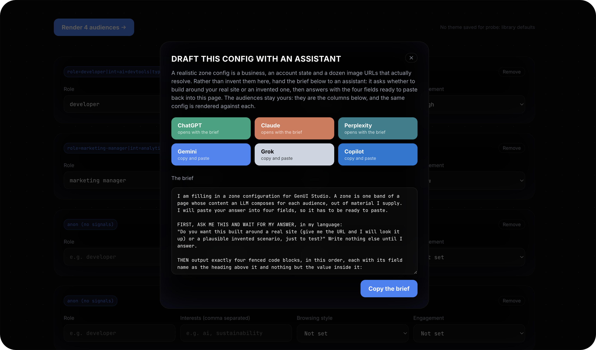
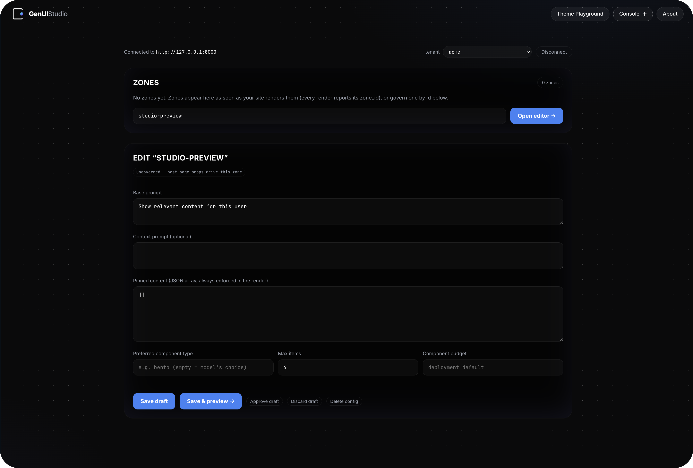
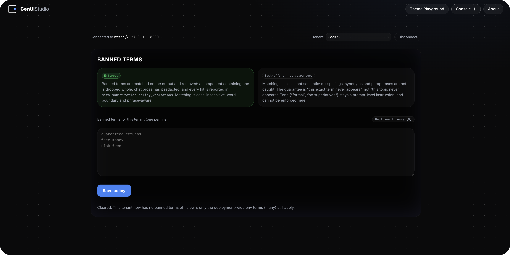
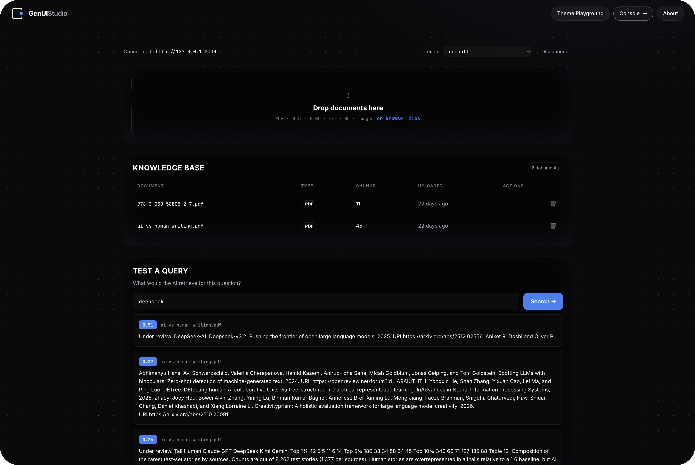
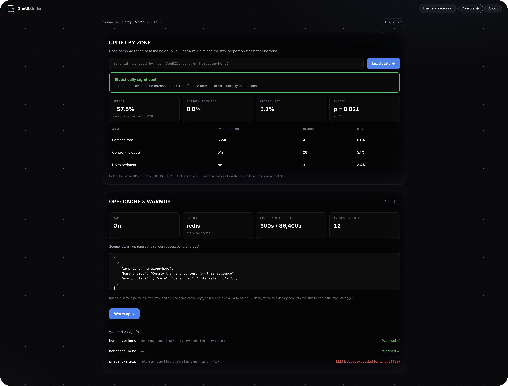

<div align="center">

# GenUI Framework

**Generative User Interfaces for Intelligent Web Applications**<br />
_Complete customization engine for building AI-powered, profile-aware, and dynamically generated UI components_

[](LICENSE) [](https://www.typescriptlang.org/) [](https://www.python.org/downloads/) [](https://react.dev/)
[](https://doi.org/10.5281/zenodo.18237228)

<div align="center">
  <br />
  
  <br /><br /><br />
</div>

[Overview](#-overview) • [Studio](#%EF%B8%8F-genui-studio) • [Quick Start](#-quick-start) • [Components](#-components) • [Custom Components](#-custom-components--your-design-system-as-llm-vocabulary) • [Theming](#-theming) • [Segment Cache](#-segment-cache--llm-as-an-offline-ranker) • [Guarantees](#️-output-guarantees) • [Zone Registry](#%EF%B8%8F-zone-config-registry--config-as-data) • [Auth & Profiles](#-auth-server-side-profiles--audit) • [Streaming](#️-streaming--ssr-safety) • [Uplift](#-measuring-uplift--impressions-clicks--holdout) • [API Reference](#-backend-api-reference) • [Architecture](#️-architecture)

</div>

---

## 🌟 Overview

GenUI System is a complete customization engine for building **Generative User Interfaces:** dynamic, AI-driven UI components that adapt to user profiles, behavior, and context. The system combines a React frontend framework with a Python backend to deliver personalized content in real-time.

<div align="center">

#### **Profile-Aware** | **Real-Time Generation** | **RAG-Enhanced** | **Premium Components**

</div>

---

## Key Features

<table>
<tr>
<td width="50%" valign="top">

### 🎨 **Frontend Framework**

- **GenUIZone**: Declarative zones with 25+ configurable props
- **Custom Components**: register _your_ design system — the LLM generates it ([guide](#-custom-components--your-design-system-as-llm-vocabulary))
- **Premium Components**: Bento grids whose cells follow the leading card, 8 button variants, charts, styled text
- **Progressive Render**: components stream in as the model generates them (SSE)
- **Behavior Tracking & Events**: clicks, scrolls, impressions, with uplift measured automatically, behind a consent gate, with a privacy filter (PII redaction, `data-genui-private`) on by default
- **Personalized without cookies**: with no consent the zone touches nothing on the device and is still curated, for an anonymous segment ([how](#consent-and-personalization-without-it))
- **Theme System**: CSS-variable based customization
- **Container-Responsive**: zones adapt to their own width via container queries — a sidebar embed lays out like a sidebar, not like the page
- **Pinned Content**: guaranteed display, enforced server-side
- **SSR-Safe**: importable in Next.js / Remix / Astro; the server renders the loading skeleton (no CLS)
- **Integration-Ready**: dual ESM/CJS packaging, reactive props with fetch abort, charts in a lazy chunk
- **Accessible**: keyboard-navigable tabs/carousel, `prefers-reduced-motion` respected

</td>
<td width="50%" valign="top">

### 🧠 **Backend Intelligence**

- **Segment Cache**: the LLM runs once per user _segment_, not per request — orders of magnitude cheaper ([how](#-segment-cache--llm-as-an-offline-ranker))
- **Output Guarantees**: schema validation + URL whitelist + numeric grounding + per-tenant content policy + no repeated content — the system guarantees, not the prompt ([how](#️-output-guarantees))
- **Config as Data**: zone prompts, pinned content and constraints live server-side with draft / preview / approve and versions, so marketing, legal or compliance can change what a zone says without a deploy ([how](#%EF%B8%8F-zone-config-registry--config-as-data))
- **Auth & Multi-tenancy**: API keys, per-tenant isolation, rate limiting
- **Server-Side Profiles**: source of truth with GDPR access export and erasure; IndexedDB is just a cache, and only with consent
- **Holdout & Uplift**: control group + z-test significance — prove personalization works
- **Audit Log**: what was shown to whom, append-only
- **Provider-Agnostic LLM**: OpenAI, Anthropic, Gemini, any OpenAI-compatible API — by configuration
- **RAG Integration**: Qdrant vector store with semantic search
- **Observability**: honest health/readiness, Prometheus `/metrics`, audit sink with rotation, OpenTelemetry tracing

</td>
</tr>
</table>

---

## 🎛️ GenUI Studio

**GenUI Studio** is the companion web app for building with the framework and operating it: a single SPA (`studio/`, React + Vite) with two public pages (Theme Playground, Compliance) plus six console tools (Segment Preview, Zones, Audit, Content Policy, Content Studio, Measurement). Run it locally with `cd studio && npm run dev`.

<div align="center">
  <br />
  
  <br /><br />
</div>

### 🎨 Theme Playground

Configure the entire `--genui-*` token dictionary in real time and watch **every real framework component** (not mockups) update live: hero banners, tabs, pricing, stats, testimonials, bento, charts, and both `with-image` / `text-only` variants. Toggle light/dark, tune radius scale, blur, spacing, accent, brand surfaces, heading weight, and font. Export the result as a `GenUITheme` object, CSS variables, JSON, or copy a **shareable link** that encodes the theme in the URL.

Running the studio locally, the sidebar also carries a **tenant bar**: pick one of the tenants connected in this browser session, load the theme already saved for it, or save the current one (`PUT /api/v1/theme`). See [Per-tenant theme](#per-tenant-theme-the-theme-as-stored-config) for exactly what saving does, and what it does not. The bar needs an admin key, so like the rest of the console it is local-only for now; the exports and the share link are the public path and are unchanged.

<div align="center">
  <br />
  
  <br /><br />
</div>

### 👥 Segment Preview

Watch GenUI do the thing it exists for: the LLM curating a zone per audience, live, **rendered with the theme saved for the active tenant** (so what you preview is what that tenant's page looks like, not the studio's default). Compose up to four audiences (role, interests, browsing style, engagement: the exact factors that form a segment key) and one ad-hoc zone config (prompts plus pinned content), then render them side by side against your real `/zone/render` with `cache_strategy: "live"` (admin only, never written to the cache real users are served). Each column shows the segment key the audience falls into, the cache state, and everything the guarantee chain removed before serving (`meta.sanitization`: stripped URLs, dropped components, ungrounded numbers, policy violations). A backend with no LLM engine configured degrades to a clearly labelled pinned-only fallback instead of a cryptic error.

<div align="center">
  <br />
  
  <br /><br />
</div>

Writing a realistic config by hand means inventing a business, an account state and a dozen image URLs that resolve. **Draft with an AI assistant** hands that job out. It opens with a brief that asks whether to build around your real site or an invented one, and the answer comes back as the four fields, ready to paste. The audiences stay yours: they are the columns.

<div align="center">
  <br />
  
  <br /><br />
</div>

### 🗂️ Zones

Zone governance for non-developers. The page lists every zone of the tenant (registry entries plus the zones your site actually rendered, each tagged `ungoverned` / `draft` / `approved`) and lets an operator edit the governed config (prompts, pinned content, component constraints) as a **draft**. A draft never touches production: you preview it with the same audience matrix as the Segment Preview (the backend resolves the saved draft via `preview_draft`, always a live bypass), and only an explicit **Approve** turns it into what every render of that zone serves. Every transition (draft saved, approved, discarded, deleted) lands in the audit log with the admin key fingerprint that did it. See [Zone Config Registry](#%EF%B8%8F-zone-config-registry--config-as-data) for the backend model.

<div align="center">
  <br />
  
  <br /><br />
</div>

### 🔍 Audit Viewer

The compliance question "what did user X see on day Z?" as a screen instead of a grep. The page queries the backend's audit read path (`GET /api/v1/audit`, admin key, always scoped to the key's tenant) with filters for user, zone, event type and date range, newest first with pagination. Clicking a row opens the full event: what was shown (component types, titles, every link), the segment served, the cache state, and what the guarantee chain removed before serving. One honest limit: with the production logger sink the events live in the host's log pipeline, and the page surfaces exactly that (the backend answers `queryable: false` with instructions) instead of a fake empty table. See [Audit in production](#audit-in-production).

### 🚧 Content Policy

The compliance guardrail with a face, for the person who owns it. An operator edits this tenant's **banned terms** (one per line) and they are enforced on the next render of every zone and every `/query`, with no redeploy and no developer: `GET` / `PUT /api/v1/content-policy` (admin key, tenant from the key, every change audit-logged as `content_policy_change`). The page states the split instead of implying more: terms are **enforced** by a lexical word-boundary match (a component containing one is dropped, chat text is redacted, hits are reported in `meta.sanitization.policy_violations`), while tone, semantics, synonyms and misspellings stay prompt-level **best-effort** and are labelled as such. A pill next to the editor opens the deployment-wide `CONTENT_POLICY` env terms read-only: an operator sees what infra enforces without being able to escalate a term to every tenant. See [Output Guarantees](#%EF%B8%8F-output-guarantees) point 5.

<div align="center">
  <br />
  
  <br /><br />
</div>

### 📚 Content Studio

Manage the RAG knowledge base that feeds the AI: connect to your backend (URL + admin key, stored only in the browser session), **drag-and-drop documents** (PDF, DOCX, HTML, TXT, MD, images), browse the indexed knowledge base with chunk counts, and **test retrieval queries** to see exactly which passages the AI would surface, with similarity scores.

<div align="center">
  <br />
  
  <br /><br />
</div>

### 📈 Measurement

The proof that personalization pays, on one page. Enter a `zone_id` and the dashboard reads `GET /events/stats`: CTR per experiment arm (personalized, control holdout, no experiment), the uplift percentage, and the outcome of the two proportion z-test. The verdict is deliberately honest: below 100 impressions per arm the page reports the result as **preliminary noise**, never as "significant", and with a single arm it says uplift is not measurable yet instead of inventing a number. An ops panel on the same page shows the segment cache state (`GET /zone/cache/stats`) and triggers segment warmup (`POST /zone/warmup`) with one zone render request per archetype, filling the same cache keys live traffic reads.

<div align="center">
  <br />
  
  <br /><br />
</div>

### ⚖️ Compliance

Public like the Playground: no key, no backend, and it ships in the GitHub Pages build at `#/compliance` ([see live](https://thevladdo.github.io/genui-framework/#/compliance)). It exists because the four statements in `deploy/` are written for a legal team and only ever get read by someone who already cloned the repository. The person deciding whether this project is worth an hour lands on the Studio instead, and used to leave without knowing any of it existed.

The page answers in order what gets generated and how the system says so, what is touched on a visitor's device and what happens when consent is refused, where the data goes plus the configuration where none of it leaves the perimeter, and which rights are endpoints rather than intentions. Then it does the half a compliance page usually skips: what stays with the operator. The lawful basis, the consent platform, the impact assessment, and the two claims easiest to fudge, that approving a zone config is not editorial review of generated text, and that the use boundaries are documentation with no code path enforcing them. Mechanism and responsibility are told apart by a label and by layout, never by colour alone.

The disclaimer sits at the top at reading size, because "engineering documentation, not legal advice" belongs in the argument rather than in a footnote. Nothing unimplemented is described as active: no signature claim, no human review claim, no claim of conformity anywhere. `studio/tests/compliance.test.cjs` goes red if one appears, or if one of the four linked documents gets renamed out from under the page. See [the documents your legal team will ask for](#the-documents-your-legal-team-will-ask-for).

### 🏢 Tenants in the console (and where auth begins)

Every console page is scoped to one tenant, and the header of every page says which one: `Connected to <url>` plus a **tenant picker**. The scoping is not a UI convention, it is the key: an admin key resolves to exactly one tenant on the backend (`ADMIN_API_KEYS=sk_live_xyz:acme`), and the tenant of a request always comes from that key, never from the request body. `GET /api/v1/whoami` is what the console asks to learn it.

So switching tenant is switching key. Connect the second tenant's key from the picker (`+ Connect another tenant`) and both stay connected in the browser session; the picker then moves the console between them, and every page remounts on the switch so one tenant's zones, audit trail or knowledge base never sit under another tenant's name. A call made with a session that is no longer the active one is refused client-side instead of quietly writing to the tenant you just left. Keys live in `sessionStorage` only, one per tenant.

What this deliberately is **not**: an operator login. There are no accounts, no roles and no SSO here, so "one person, one login, many tenants" is not simulated with a key list. That, plus API key issuing and rotation, arrives with user auth, and until then the console tools stay local-only and admin-gated.

> **Note:** the Segment Preview, the Zones editor, the Audit Viewer, the Content Policy editor, the Content Studio and the Measurement dashboard require a reachable backend and an admin key, so for now they run **locally only** (`npm run dev`). On the public GitHub Pages build they show an "available locally" notice and their code is tree shaken out of the bundle. The Theme Playground and the Compliance page need neither, so they are live on Pages. A hosted console arrives with proper user auth on the roadmap.

---

# 📖 Usage Guide

## 🚀 Quick Start

Five steps from zero to a personalized zone on your page. **Prerequisites:** Python 3.10+, Node 18+, Docker (for Qdrant/Redis), and an OpenAI API key (or Anthropic/Gemini — see step 3).

### Step 1 — Clone and start the infrastructure

```bash
git clone https://github.com/thevladdo/genui-framework.git
cd genui-framework/backend

# Starts Qdrant (vector store for RAG) and Redis (render cache + profiles).
# Both are optional — without them the backend falls back to in-memory
# storage, fine for a first try, lost on restart.
docker-compose up -d
```

### Step 2 — Install the backend

```bash
# Still in genui-framework/backend
pip install -r requirements.txt

# For development (running the test suite):
pip install -r requirements-dev.txt
```

### Step 3 — Configure

```bash
cp .env.example .env
```

Open `.env` and set **two** things to start — your LLM key and the dev flag:

```env
LLM_PROVIDER=openai            # openai | anthropic | gemini
OPENAI_API_KEY=sk-...          # required

# Local development without API keys. Without keys the API FAILS CLOSED
# (403 on every request) unless this is set. Never set it in production.
GENUI_DEV_OPEN=1
```

Everything else has sensible defaults. The values you'll likely touch later:

```env
# Cache shared across processes (docker-compose already runs Redis)
REDIS_URL=redis://localhost:6379/0

# Production: API keys ("key:tenant") — and remove GENUI_DEV_OPEN
CLIENT_API_KEYS=pk_live_abc:myapp     # browser-side key
ADMIN_API_KEYS=sk_live_xyz:myapp      # server-to-server key
# Per-tenant secret for signed user identity (X-User-Token, see Auth section)
USER_TOKEN_SECRETS=change-me-long-random:myapp

# Measure personalization uplift (10% of users see the generic version)
HOLDOUT_PERCENT=10

# How many components a single zone may render (see "Component budget" below)
ZONE_MAX_COMPONENTS=2

# Other providers instead of OpenAI:
# LLM_PROVIDER=anthropic + ANTHROPIC_API_KEY=...   (pip install anthropic)
# LLM_PROVIDER=gemini    + GOOGLE_API_KEY=...      (no extra package)
```

### Step 4 — Start and verify the backend

```bash
uvicorn api.main:app --reload --port 8000
```

Verify it's alive:

```bash
curl http://localhost:8000/health
# -> {"status": "healthy", ..., "qdrant_connected": true}
# "degraded" just means Qdrant isn't running — zones still work, without RAG.
```

Optional sanity check — render a zone from the terminal:

```bash
curl -X POST http://localhost:8000/api/v1/zone/render \
  -H "Content-Type: application/json" \
  -d '{"zone_id": "test", "base_prompt": "Show three example cards about space exploration"}'
```

You should get JSON with `components` and a `meta.cache` block. Run it twice: the second call returns `"status": "fresh"` — that's the cache working (no LLM call, no cost).

### Step 5 — Frontend (React)

> ⚠️ The npm package is not yet published. Install locally via `npm link`:

```bash
cd ../frontend
npm install
npm run build
npm link

# In YOUR app's directory:
npm link genui-framework
```

In your app's entry file (e.g. `main.tsx`):

```tsx
import "genui-framework/dist/styles.css";
```

The package ships dual **ESM + CJS** builds behind an `exports` map: both `import` and `require('genui-framework')` resolve correctly (Vite, webpack, Jest, Next.js pages router). The stylesheet is declared in `sideEffects`, so bundlers never tree-shake your CSS import away.

Then drop a zone anywhere:

```tsx
import { GenUIZone } from "genui-framework";

<GenUIZone
  apiUrl="http://localhost:8000"
  zoneId="homepage-recommendations"
  basePrompt="Show recommended articles"
  preferredComponentType="bento"
  maxItems={6}
  debug // shows reasoning, segment, cache status — remove in production
/>;
```

Open the page: you'll see a loading skeleton, then the generated cards. The `debug` panel underneath tells you _why_ you're seeing what you're seeing.

That zone is already in the anonymous mode: nothing is written to or read from the visitor's browser and no identifier is sent, so it needs no consent banner to run. Add `userId` and `consent={true}` (from your CMP) when you want personalization per person instead of per segment: see [Consent](#consent-and-personalization-without-it).

### Running the tests

```bash
cd backend
python3 -m unittest discover -s tests   # or: pytest tests/

cd frontend
npm test   # vitest: packaging (require/import), SSR skeleton, reactive props, privacy filter
```

#### Golden harness — regression signal for prompt/model/engine changes

Uplift measurement (see [Measuring Uplift](#-measuring-uplift--impressions-clicks--holdout)) tells you which variant earns more _after_ shipping. The golden harness answers the question that comes _before_ shipping: after changing a zone prompt, the model, or the BYOK engine, does the output still honor its structural contract on known inputs?

`backend/tests/test_golden_zone.py` replays recorded LLM responses through the full real pipeline (validation → URL whitelist → numeric grounding → content policy → pinned enforcement) and asserts the invariants of each fixture in `backend/tests/golden/`: only allowed component types, pinned content present, no URL outside the input whitelist, no displayed number outside the input grounding, layout coherence. It checks form and invariants, never exact prose. It runs in the default suite: deterministic, no key, no network, no cost. The recorded responses are deliberately adversarial (invented URLs, an invented price, a missing pinned item, an incoherent layout, an unknown type), so the suite goes red if any link of the guarantee chain stops working.

**Adding a fixture**: drop a JSON file in `backend/tests/golden/` with `request` (the `ZoneRenderRequest` fields), `retrieved` (recorded RAG results), `invariants.allowed_types` (optional, defaults to all built-in types) and `llm_response` (the recorded model envelope). No code changes needed; the harness picks it up automatically.

**Live mode (vet a BYOK engine)**: point the harness at the engine configured in your environment (`LLM_PROVIDER`, provider keys, `OPENAI_BASE_URL` for vLLM/local endpoints) and check the same invariants on fresh output before promoting a change:

```bash
cd backend
GENUI_GOLDEN_LIVE=1 ./venv/bin/python -m unittest tests.test_golden_zone -v
# add GENUI_GOLDEN_RECORD=1 to also regenerate each fixture's recorded llm_response
```

Live mode is optional and opt-in: the default suite never needs it.

---

## 🎯 Core Components

### GenUIZone — AI-Powered Content Zones

<p align="center">
  
</p>

The `GenUIZone` component automatically fetches personalized content from the backend based on:

- **User Profile**: Stored preferences, interests, demographics
- **Behavior Data**: Click patterns, scroll depth, navigation history
- **Developer Prompts**: Base prompts + context prompts for fine control
- **Pinned Content**: Guaranteed content that always displays

#### Basic Usage

```tsx
import { GenUIZone } from "genui-framework";

<GenUIZone
  apiUrl="http://localhost:8000"
  zoneId="homepage-recommendations"
  basePrompt="Show recommended articles"
  preferredComponentType="bento"
  maxItems={6}
/>;
```

#### Full Props Reference

```tsx
interface GenUIZoneProps {
  // === Required ===
  apiUrl: string; // Backend API URL
  zoneId: string; // Unique zone identifier

  // === Auth ===
  apiKey?: string; // Client API key (X-API-Key); required when CLIENT_API_KEYS is configured
  userToken?: string; // Signed user identity (X-User-Token); required with userId when USER_TOKEN_SECRETS is configured

  // === Prompt Engineering ===
  basePrompt?: string; // What the zone should display
  contextPrompt?: string; // Additional context for AI (page location, user segment, etc.)

  // === Content Control ===
  pinnedContent?: PinnedContent[]; // Content that MUST be displayed (enforced server-side)
  customComponents?: GenUICustomComponentDef[]; // Your design-system components (name + JSON schema)
  preferredComponentType?: "bento" | "chart" | "text" | "buttons" | string; // built-in or custom name
  maxItems?: number; // Max items to generate (default: 6)
  maxComponents?: number; // Component budget 1..10 (unset = backend default, see below)

  // === User Context ===
  userId?: string; // Stable user ID: enables server-side profile, holdout & audit trail (sent only with consent)
  consent?: boolean; // Consent from your CMP; without true the zone runs anonymous (no device access, no userId, no behavior)
  privacy?: "strict" | "balanced" | "off"; // Capture contract once consent is granted (default: 'balanced')
  currentPage?: string; // Current page path
  pageMetadata?: Record<string, unknown>; // Custom page context (page-level, not per-user!)

  // === Behavior ===
  loadOnMount?: boolean; // Auto-load on mount (default: true)
  refreshInterval?: number; // Auto-refresh in ms (0 = disabled)
  cacheStrategy?: "segment" | "live"; // 'segment' (default): per-segment cached renders; 'live': always call the LLM (admin keys only)
  streaming?: boolean; // Progressive render via SSE (components appear as generated)
  trackEvents?: boolean; // Auto impression/click events for uplift measurement (default: true)

  // === AI Disclosure ===
  disclosure?:
    | {
        text?: string;
        position?:
          | "above-left"
          | "above-center"
          | "above-right"
          | "below-left"
          | "below-center"
          | "below-right";
      }
    | false; // visible notice (on by default); false keeps the machine-readable markup only

  // === Theming ===
  theme?: GenUITheme; // Theme overrides
  className?: string; // CSS class
  style?: React.CSSProperties; // Inline styles

  // === Custom Render States ===
  loadingComponent?: React.ReactNode;
  errorComponent?: React.ReactNode | ((error: Error) => React.ReactNode);
  emptyComponent?: React.ReactNode; // Shown when AI returns empty
  showLoadingSkeleton?: boolean;

  // === Callbacks ===
  onRender?: (components: GenUIComponent[]) => void;
  onError?: (error: Error) => void;

  // === Debug ===
  debug?: boolean; // Shows reasoning, confidence, profile factors
}
```

**Props are reactive**: changing any request-shaping prop (`zoneId`, `userId`, `basePrompt`, `pinnedContent`, ...) on a mounted zone refetches automatically, aborting the inflight request (last issued wins) — a zone reused across SPA routes never shows the previous route's content. Props are compared **by value**, so passing fresh inline literals (`pinnedContent={[...]}`) on every render does not retrigger fetches.

---

### Component budget: a zone is one band, not a page

A zone renders **at most 2 components by default**. This is the single setting most likely to surprise you, so it is worth stating plainly: a zone is one band of a host page, and a model given no ceiling will happily stack a hero, a grid, a pricing block and a CTA into a sidebar slot. Extra components are cut after validation (first ones win) and reported in `meta.sanitization.dropped_components`, so nothing disappears silently.

Three places set it, most specific first:

| Where                                                                 | Scope                              | Notes                                                           |
| --------------------------------------------------------------------- | ---------------------------------- | --------------------------------------------------------------- |
| `maxComponents` prop (or `max_components` in the `/zone/render` body) | one zone / one request             | `1..10`. Omitted when unset, so the levels below still apply    |
| `max_components` in the zone's registry config                        | that zone, for every render        | The governed way: set it in the Studio Zones editor and approve |
| `ZONE_MAX_COMPONENTS`                                                 | the whole deployment (default `2`) | The fallback when neither of the above is set                   |

```tsx
// A wide homepage band that may carry a hero plus a supporting grid
<GenUIZone apiUrl="..." zoneId="homepage-hero" maxComponents={3} />
```

Pinned content is exempt: the pinned guarantee runs after the budget, so a pinned item is appended even when it exceeds the ceiling. And the budget is a ceiling, never a target: the model is told to emit fewer components when it has nothing new to say (see guarantee 6 in [Output Guarantees](#%EF%B8%8F-output-guarantees)).

---

### Pinned Content — Guaranteed Display

Pinned content ensures certain items **always** appear in the zone, regardless of what the AI generates. The AI will include these items alongside its personalized selections.

```tsx
interface PinnedContent {
  type: "link" | "article" | "document" | "custom";
  title: string;
  url?: string;
  description?: string;
  id?: string;
  metadata?: Record<string, unknown>;
}
```

#### Example: Pinned Sponsor Content

```tsx
<GenUIZone
  zoneId="news-feed"
  apiUrl="http://localhost:8000"
  pinnedContent={[
    {
      type: "article",
      title: "Sustainability Report 2024",
      url: "/reports/sustainability-2024",
      description: "Our commitment to the environment",
      metadata: { category: "sustainability", sponsor: true },
    },
    {
      type: "link",
      title: "Investor Relations",
      url: "/investors",
      description: "Financial information and reports",
    },
  ]}
  preferredComponentType="bento"
  maxItems={6} // AI will fill remaining slots with personalized content
/>
```

---

### Context Prompts — Fine-Grained AI Control

Use `contextPrompt` to give the AI detailed instructions about the zone's purpose, available content, and selection criteria.

#### Example: Article Selection with Available Content List

```tsx
const articlesContext = useMemo(() => {
  return articles
    .map(
      (a, i) =>
        `ID ${i}: "${a.title}" (Link: ${a.link}, Img: ${a.src}, Tag: ${a.tag[0]})`,
    )
    .join("; ");
}, [articles]);

const contextPrompt = `
  You are an intelligent content curator for a corporate website.
  
  AVAILABLE CONTENT (Use ONLY these items):
  [${articlesContext}]
  
  SELECTION RULES:
  1. Select ${maxItems} items that best match the user's profile and interests.
  2. If user has interest in "sustainability", prioritize content tagged with that topic.
  3. If user role is "investor", prioritize financial and business content.
  4. For new users with no profile, show a diverse mix.
  
  OUTPUT REQUIREMENTS:
  - Return a 'bento' component with cards.
  - Each card MUST use the exact image, title, badge, and link from the input list.
  - Do NOT invent new content.
`;

<GenUIZone
  zoneId="homepage-for-you"
  apiUrl="http://localhost:8000"
  basePrompt="Display personalized article recommendations"
  contextPrompt={contextPrompt}
  preferredComponentType="bento"
  maxItems={6}
/>;
```

---

### Page Metadata — Contextual Awareness

Pass `pageMetadata` to give the AI awareness of the current page context:

```tsx
<GenUIZone
  zoneId="related-content"
  apiUrl="http://localhost:8000"
  currentPage="/products/electric-cars"
  pageMetadata={{
    pageType: "product",
    productCategory: "transportation",
    productId: "ETR-500",
    userSegment: "business",
    region: "europe",
  }}
  basePrompt="Show related products and content"
/>
```

---

### Fallback Content — Client-Side Fallbacks

When the AI returns empty results (e.g., backend unavailable, no matching content), use `emptyComponent` and `errorComponent` to display fallback content:

```tsx
import { GenUIZone, BentoComponent, GenUISection } from "genui-framework";

const fallbackBentoData = {
  cards: articles.slice(0, 6).map((a) => ({
    title: a.title,
    description: a.tag?.[0] || "",
    link: a.link || "#",
    image: a.src,
    badge: a.tag?.[0],
  })),
  columns: 3,
};

const FallbackBento = () => (
  <GenUISection className="genui-layout-complex">
    <BentoComponent data={fallbackBentoData} />
  </GenUISection>
);

<GenUIZone
  zoneId="recommendations"
  apiUrl="http://localhost:8000"
  emptyComponent={<FallbackBento />}
  errorComponent={() => <FallbackBento />}
/>;
```

---

## 🪝 Hooks

### useGenUI — Conversational AI Interface

For chat-based interactions with automatic behavior tracking and profile learning:

```tsx
import { useGenUI } from "genui-framework";

function ChatBot() {
  const {
    query, // Send message to AI
    isLoading, // Loading state
    error, // Last error
    profile, // Current user profile
    updateProfile, // Manual profile update
    clearProfile, // Reset profile
    history, // Conversation history
    clearHistory, // Clear conversation
    disclosure, // AI interaction notice + marking of the last answer
    behaviorTracker, // Access behavior tracker
    trackInteraction, // Track custom events
    trackNavigation, // Track page navigation
  } = useGenUI({
    apiUrl: "http://localhost:8000",
    userId: getUserId(),
    enablePersistence: true,
    enableBehaviorTracking: true,
    privacy: "balanced", // capture contract — see "Behavior Tracking & Privacy"
    consent: cmpConsent, // CMP hook: without true, nothing is tracked or stored locally
    behaviorTrackingOptions: {
      trackClicks: true,
      trackScroll: true,
      trackPageVisits: true,
      trackHover: true,
      hoverThreshold: 500, // ms before hover counts
      scrollDebounce: 100, // ms debounce
      maxEventsPerType: 100, // Memory limit
      enableHeatmapZones: true,
    },
    onProfileUpdate: (profile) => console.log("Profile updated:", profile),
    onError: (error) => console.error("GenUI error:", error),
  });

  const handleSend = async (message: string) => {
    try {
      const response = await query(message);
      // response.text - AI text response
      // response.components - Generated UI components
      // response.sources - Source citations
      // response.suggestedActions - Follow-up suggestions
      // response.profileUpdates - Profile learning data
      // response.meta - Confidence, sentiment, interaction type,
      //   meta.sanitization (what the guarantee chain removed) and
      //   meta.behavior (see below)
    } catch (err) {
      // Handle error
    }
  };

  return <ChatUI onSend={handleSend} history={history} loading={isLoading} />;
}
```

**`meta.behavior`** carries what the BehaveAgent read from the session, camelCased like every other mapped field, so a host can react to it instead of re-deriving it:

```tsx
const { behavior } = response.meta ?? {};
// behavior?.engagementScore  0..1, the BehaveAgent's own estimate
// behavior?.userType         'explorer' | 'focused' | 'scanner' | 'deep_reader' | 'casual'
// behavior?.sessionSummary   short human-readable summary
// behavior?.insightsCount    how many signals it was derived from
// behavior?.uiAdjustments    [{ type, target, suggestion }] hints, advisory only
```

It appears only when the request carried behavior data: consent withheld, or `privacy: 'strict'`, means no analysis to report, by design. Note that `userType` **is** one of the factors of the segment key (`type=`), while `engagementScore` is **not**: the `eng=` bucket is computed deterministically from scroll depth (`>= 70` high, `>= 30` mid), never from this model-estimated score, so a segment stays reproducible.

### useZone — Zone-Level Control

For low-level zone control when you need more customization:

```tsx
import { useZone } from "genui-framework";

const {
  components, // Rendered GenUI components
  isLoading, // Loading state
  error, // Error state
  meta, // Render metadata
  pinnedContentIncluded, // Which pinned items were included
  render, // Manually trigger render
  refresh, // Force re-render (clears first)
} = useZone({
  apiUrl: "http://localhost:8000",
  zoneId: "my-zone",
  basePrompt: "Show content",
  loadOnMount: true,
  refreshInterval: 30000, // Auto-refresh every 30s
  consent: cmpConsent, // same gate as GenUIZone: without true, anonymous mode
  privacy: "balanced", // capture contract once consent is granted
});

// Access metadata
console.log(meta?.confidence); // 0.87
console.log(meta?.reasoning); // "Selected based on user interests..."
console.log(meta?.profileFactors); // ["interests.technology", "demographic.role"]
console.log(meta?.personalizationApplied); // true
console.log(meta?.renderId); // "a1b2c3d4e5f6" — identity of the generated variant
console.log(meta?.cache); // { status: "fresh", segment: "role=developer|eng=high", ageSeconds: 42 }
console.log(meta?.experiment); // { arm: "personalized", holdoutPercent: 10 } — when holdout is on
```

---

## 🎨 Components

### BentoComponent — Glassmorphism Grid

A premium card grid with hover animations and responsive layouts:

```tsx
import { BentoComponent } from "genui-framework";

<BentoComponent
  data={{
    cards: [
      {
        title: "Feature One",
        description: "Optional description text",
        image: "/images/feature1.jpg",
        badge: "New", // Top-left badge
        link: "/features/one",
        action: {
          // Optional action button. When present it becomes the card's
          // interactive element and the card-level link wrapper is skipped
          // (nested anchors are invalid HTML and break SSR).
          label: "Learn More",
          url: "/features/one",
        },
      },
      // ... more cards
    ],
    columns: 3, // 2, 3, or 4
    gap: 16, // Gap in pixels
  }}
/>;
```

### ButtonsComponent — Animated Buttons

8 premium button variants with animated arrows:

```tsx
import { ButtonsComponent } from "genui-framework";

<ButtonsComponent
  data={{
    buttons: [
      {
        label: "Get Started",
        url: "/start",
        style: "shine", // Animated gradient sweep
        showArrow: true, // Arrow shows on all buttons by default
        arrowPlacement: "right", // "left" or "right"
        size: "lg", // "sm" | "md" | "lg"
        borderRadius: "8px", // Custom override
        backgroundColor: "#3b82f6", // Custom override
        textColor: "#ffffff", // Custom override
      },
      {
        label: "Learn More",
        style: "outline",
        showArrow: false, // Explicitly hide arrow
      },
      {
        label: "Contact",
        style: "gooey", // Blob morph on hover
      },
      {
        label: "Explore",
        style: "ringHover", // Ring outline on hover
      },
      {
        label: "Details",
        style: "expandIcon", // Arrow reveals on hover
      },
    ],
    direction: "horizontal", // or "vertical"
    align: "center", // "start" | "center" | "end"
    gap: 12, // Custom gap in pixels
  }}
/>;
```

#### Button Variants

| Variant      | Description                              |
| ------------ | ---------------------------------------- |
| `primary`    | Solid accent color with brightness hover |
| `secondary`  | Semi-transparent with backdrop blur      |
| `outline`    | Transparent with border, fills on hover  |
| `ghost`      | Minimal, text only                       |
| `shine`      | Animated gradient that sweeps across     |
| `gooey`      | Blob morphing effect on hover            |
| `expandIcon` | Arrow icon reveals on hover              |
| `ringHover`  | Ring outline appears on hover            |

### ChartComponent — Data Visualization

```tsx
import { ChartComponent } from "genui-framework";

<ChartComponent
  data={{
    chartType: "bar", // "bar" | "line" | "pie" | "area" | "donut"
    title: "Monthly Sales",
    data: [
      { label: "Jan", value: 100, color: "#3b82f6" },
      { label: "Feb", value: 150 },
      { label: "Mar", value: 200 },
    ],
    xAxis: "Month",
    yAxis: "Sales ($)",
    showLegend: true,
    showGrid: true,
    height: 300,
  }}
/>;
```

> **Bundle note**: the chart engine (recharts, ~230 KB gzip) lives in a **lazy chunk** loaded the first time a chart actually renders — consumers that never show charts never download it. `<ChartComponent />` keeps working as before (the Suspense boundary is built in); a skeleton shows while the chunk loads.

### TextComponent — Styled Text

```tsx
import { TextComponent } from "genui-framework";

<TextComponent
  data={{
    content: "This is **markdown** supported text with _emphasis_.",
    style: "normal", // "normal" | "emphasis" | "note" | "heading"
  }}
/>;
```

---

### Enterprise Section Components

Fourteen section-level components for editorial, e-commerce, insurance, SaaS, agency/studio and corporate portals — same token system, same validation pipeline, all **image-optional by design**: every image-bearing variant declares `layout: "with-image" | "text-only"` (or a hero `variant`), the backend schema enforces coherence (`with-image` without an `image_url` is rejected), and the text-only shape is a _designed_ alternative (accent gradients, emphasized typography), never a card with a hole.

| Type                   | Use case                                                              | Image-optional           |
| ---------------------- | --------------------------------------------------------------------- | ------------------------ |
| `tabs_feature`         | plan comparison, SaaS highlights, product categories                  | per-tab `content.layout` |
| `steps_section`        | onboarding, how-it-works, purchase flow (autoplay + progress)         | section `layout`         |
| `stats_banner`         | numeric metrics, alone or beside a narration, with optional movement  | text-only by design      |
| `testimonial_carousel` | quotes with avatar → initials fallback                                | avatar optional          |
| `pricing_cards`        | plan grid; `variant: "detailed"` adds a comparison table              | text-only by design      |
| `content_grid`         | blog/news cards                                                       | per-item `layout`        |
| `hero_banner`          | hero: `split` (requires image) · `centered` · `minimal`               | variant chain fallback   |
| `case_studies`         | studio/agency projects: summary + grounded metrics (count-up)         | image + metrics optional |
| `quote`                | a single large editorial quote / manifesto                            | logo + avatar optional   |
| `logo_wall`            | clients / technologies / partners; hover reveal on overall cta        | logos drop if imageless  |
| `comparison_bars`      | 2-6 grounded figures side by side, at most one highlighted            | text + shape only        |
| `pros_cons`            | advantages and limits from the input; one side degrades to full width | text + icon shape only   |
| `metrics_trend`        | headline figures plus the curve behind them; the curve is optional    | text + hand drawn SVG    |
| `faq`                  | questions that open onto their answers, on native `details`           | text only                |

#### What each surface may generate

Both generating surfaces read the same dictionary, and each one declares what it exposes. A zone render can use every type. A chat answer uses all of them except `hero_banner`: a hero is the device that opens and frames a page, so inside a conversational answer it is a banner dropped mid-sentence, while every other type presents content, and content reads well on both surfaces.

The description the model reads sits next to the type declaration in `backend/schemas/registry.py` (`BUILTIN_TYPE_DOCS`), so a type is described once. What only holds on one surface stays with that surface: bento is preferred in zones and charts are used sparingly there, while a chat answer is told to leave autoplay off (a transcript scrolls while the reader reads) and to prefer compact shapes (the chat column can be narrow).

```json
{
  "type": "hero_banner",
  "data": {
    "variant": "centered",
    "headline": "Coverage that adapts",
    "subheadline": "Personalized in real time.",
    "primary_cta": { "label": "Get a quote", "url": "/quote" }
  }
}
```

### Semantic tokens & light mode

New components consume **level-2 semantic tokens** — rebrand by overriding just these: `--genui-surface-1/2/3`, `--genui-border-subtle/strong`, `--genui-text-primary/secondary/tertiary/on-accent`, `--genui-radius-sm/md/lg/full`, `--genui-shadow-sm/md/lg`. Dark is the default; switch any subtree with `[data-theme="light"]` (or re-assert `[data-theme="dark"]` when nesting).

`comparison_bars` adds no knobs of its own: the highlighted bar takes `--genui-accent-color`, the other bars `--genui-surface-3`, and every bar the corner radius (`--genui-radius-md`). Rebranding the tokens above rebrands the comparison with them.

Two tokens carry meaning rather than decoration: `--genui-success-color` and `--genui-error-color` (theme keys `successColor` and `errorColor`, both with a control in the Playground) color the positive and negative sides of `pros_cons`. Override them to bring the two sides into your palette. Nothing relies on color alone to say which side is which, so a palette that loses the green and red distinction still reads.

---

## 🧩 Custom Components — Your Design System as LLM Vocabulary

The 18 built-in types cover generic zones and the usual enterprise sections. The real value is letting the LLM generate **your** components, with your markup, your classes and your tokens.

The framework never sees your JSX. It learns a name and a JSON Schema, asks the model to generate data against that schema, validates what comes back, and hands the payload to the React component you registered under that name.

### Bring your own components

Say Acme already has a React site and a component library: `<OfferCard />`, `<CoverageTable />`, the usual. None of that changes. What follows is what Acme adds around those components so the model can pick them and fill them.

**One decision first: where the definition lives.** Both paths use the same schema and get the same guarantees.

|                   | Per zone (frontend)                                    | Global (backend)                                    |
| ----------------- | ------------------------------------------------------ | --------------------------------------------------- |
| Declared in       | `customComponents` prop                                | `register_component_type()` at startup              |
| Scope             | that zone, that page                                   | every zone, every tenant on the deployment          |
| Changing it costs | a frontend deploy                                      | a backend restart                                   |
| Fits              | one team owning one surface, or trying a component out | a design system that should be available everywhere |

Acme starts on the frontend path because it needs no backend change, then promotes the component to the global registry once it is stable. Steps 1, 2 and 4 are identical either way.

#### Step 1: register the component you already have

Map the generated payload onto the props your component already takes. That is the whole render side.

```tsx
// acme/genui-setup.tsx
import { registerGenUIComponent } from "genui-framework";
import { OfferCard } from "@acme/ui";

registerGenUIComponent("acme_offer_card", ({ data, layout }) => (
  <OfferCard
    title={data.title}
    body={data.body}
    price={data.price}
    href={data.cta_url}
    label={data.cta_label}
    compact={layout?.width === "half"}
  />
));
```

Three things to get right here.

**Import this file once, at module scope, before the first zone renders.** Put the import in your app entry (`main.tsx`, `_app.tsx`, the root layout). Registration happens on import, so there is no hook to call and no provider to mount.

**`data` arrives exactly as your schema declared it.** Custom components are deliberately left out of the snake_case to camelCase normalization the built-ins get, so `cta_url` in the schema stays `data.cta_url` in the component. What you wrote is what you read.

**Pick a name in your own namespace** for a genuinely new type: `acme_offer_card`, `acme_coverage_table`. Names are 2 to 32 characters, lowercase `[a-z0-9_-]`, starting with a letter. Registering one of the 18 built-in names is allowed and means something different, it replaces that type's rendering rather than adding a type. See [re-skinning a built-in](#re-skin-a-built-in-type-with-your-own-component).

`registerGenUIComponent` returns an unregister function, which is what a test uses to clean up after itself.

#### Step 2: write the schema the model reads

The schema is read twice: by the LLM as documentation, and by the backend as a validator. So write it tight. Every constraint you add is a class of bad output that gets dropped before a browser ever sees it.

```tsx
// acme/genui-setup.tsx (same file)
import type { GenUICustomComponentDef } from "genui-framework";

export const ACME_OFFER_CARD: GenUICustomComponentDef = {
  name: "acme_offer_card",
  description:
    "A single insurance offer with a price and one call to action. Use when the zone should push one specific product. Never more than one per zone.",
  dataSchema: {
    type: "object",
    required: ["title", "cta_label", "cta_url"],
    additionalProperties: false,
    properties: {
      title: { type: "string", maxLength: 60 },
      body: { type: "string", maxLength: 180 },
      price: { type: "string" },
      cta_label: { type: "string", maxLength: 24 },
      cta_url: { type: "string" },
    },
  },
  example: {
    title: "Home cover, adjusted to your postcode",
    body: "Same excess, recalculated monthly.",
    price: "from 12 EUR / month",
    cta_label: "See the quote",
    cta_url: "/quotes/home",
  },
};
```

`description` is the field people skip, and then they wonder why the model reaches for the component constantly. It goes into the prompt verbatim, so write when to use it and when to stop: "use when...", "never more than one per zone".

`example` is optional and worth the five lines. A filled example teaches shape faster than a schema does.

`maxLength` is your layout defence. It is the only thing standing between your design and a headline that wraps to four lines.

#### Step 3a: ship it from the frontend

Pass the definition to the zone. That is the whole generation side.

```tsx
import { ACME_OFFER_CARD } from "./genui-setup";

<GenUIZone
  zoneId="home-hero"
  apiUrl={process.env.NEXT_PUBLIC_GENUI_URL}
  apiKey={process.env.NEXT_PUBLIC_GENUI_KEY}
  consent={hasConsent}
  basePrompt="Show one relevant offer for this visitor"
  customComponents={[ACME_OFFER_CARD]}
  preferredComponentType="acme_offer_card"
/>;
```

`useZone` takes the same option for hosts that render the payload themselves. On the wire it becomes `custom_components: [{ name, data_schema, description, example }]` on `POST /zone/render`, which is also how a host that is not React declares its own vocabulary.

#### Step 3b: ship it from the backend

Once the component is stable, Acme moves the definition server-side so every zone and every page gets it without a frontend build. Same schema, written in Python.

```python
# acme_components.py, next to the backend
from schemas import register_component_type

register_component_type(
    "acme_offer_card",
    description=(
        "A single insurance offer with a price and one call to action. "
        "Use when the zone should push one specific product. Never more than one per zone."
    ),
    data_schema={
        "type": "object",
        "required": ["title", "cta_label", "cta_url"],
        "additionalProperties": False,
        "properties": {
            "title": {"type": "string", "maxLength": 60},
            "body": {"type": "string", "maxLength": 180},
            "price": {"type": "string"},
            "cta_label": {"type": "string", "maxLength": 24},
            "cta_url": {"type": "string"},
        },
    },
    example={
        "title": "Home cover, adjusted to your postcode",
        "cta_label": "See the quote",
        "cta_url": "/quotes/home",
    },
)
```

Registration has to happen before the app serves its first render, and it needs no fork. Import your module, then the app, from one thin entry point:

```python
# acme_app.py
import acme_components  # noqa: F401  (registers on import)
from api.main import app  # noqa: F401
```

```bash
uvicorn acme_app:app --host 0.0.0.0 --port 8000 --workers 4
```

Every worker imports the entry point, so every worker gets the registry. The frontend still needs step 1: the backend knows the schema, the browser knows the JSX, and neither one can supply the other's half.

Per-zone definitions are merged **over** the global registry for that single render, so one zone can override a global type by name without touching the deployment. Invalid entries are skipped with a log line instead of failing the render.

#### Step 4: check that it actually worked

```bash
curl -X POST http://localhost:8000/api/v1/zone/render \
  -H "X-API-Key: $ADMIN_KEY" -H "Content-Type: application/json" \
  -d '{"zone_id":"home-hero","base_prompt":"Show one relevant offer",
       "custom_components":[{"name":"acme_offer_card",
         "description":"A single insurance offer with a price and one CTA.",
         "data_schema":{"type":"object","required":["title"],
           "properties":{"title":{"type":"string"}}}}]}'
```

Read the answer in this order.

1. **A component of your type in `components[]`** means the model saw the schema and used it. Done.
2. **`meta.sanitization.dropped_components`** is where your component goes when its data failed your schema. A type that never appears anywhere else and always lands here means the description and the schema are telling the model two different stories.
3. **Nothing of your type anywhere** usually means the name was rejected before the prompt was built. Grep the backend log for `Skipping invalid custom component`. A reserved built-in name and a missing `data_schema` are the two causes.
4. **A console warning naming an unknown type** in the browser means the backend generated it and the frontend never registered it. Step 1 did not run, or it ran after the first render. In development you get a visible placeholder instead of a silent gap.

### Re-skin a built-in type with your own component

Steps 1 to 4 teach the model a word it did not have. There is a second case, and for a company like Acme it is usually the first one they want: the model already knows the word, and Acme just wants it drawn in their own markup.

`hero_banner` is a good example. The backend already has a schema for it, already grounds its numbers, already enforces the `with-image` / `text-only` coherence, already knows from the prompt when a hero belongs at the top of a zone. Acme does not want to re-invent any of that. Acme wants their `<AcmeHero />`.

Register under the built-in name and that is what happens.

```tsx
import { registerGenUIComponent } from "genui-framework";
import { AcmeHero } from "@acme/ui";

registerGenUIComponent("hero_banner", ({ data }) => (
  <AcmeHero
    title={data.headline}
    sub={data.subheadline}
    cta={data.primaryCta}
    kind={data.variant}
  />
));
```

No `customComponents` prop, no schema, no backend change. The zone keeps generating `hero_banner` exactly as before and your component draws it.

**A registration always wins over the framework's component of the same name.** The lookup runs before the built-in dispatch, so there is no ordering to get right and no way to end up with a registration that silently does nothing.

**An override receives the same camelCase payload as the component it replaces.** `primary_cta` on the wire reaches you as `data.primaryCta`, so an override is a drop-in for the built-in and you can read [the component reference](#-components) for the shape. Custom types keep receiving their payload exactly as their own schema declared it, in whatever casing you wrote. The rule is simple: replacing a framework component means inheriting its data shape, declaring your own means owning it.

**What you cannot do is redefine what the name means.** Sending `hero_banner` in `custom_components` is still refused by the backend, and that is deliberate: the schema is what the prompt teaches the model and what the guards validate against, so letting one page redefine it would make the guarantee chain depend on whoever is calling. You change the markup. The contract stays the framework's.

So the two halves split cleanly:

| You want                               | Register under    | Declare a schema          | Data shape you get             |
| -------------------------------------- | ----------------- | ------------------------- | ------------------------------ |
| A type the framework has no idea about | your own name     | yes, per zone or globally | your schema's keys, untouched  |
| The framework's type, your markup      | the built-in name | no                        | the built-in's camelCase shape |

One practical note. An override is global to the bundle, which is the point (register once, every zone gets it), so it is not the tool for making one page's hero look different. For that, use the theme tokens or `GenUISection`. Reach for an override when your design system, and not the framework, should own how a type looks everywhere.

### What the framework guarantees for custom components

- The name, description, schema and optional example go into the prompt, so the model knows when and how to use the component.
- Generated data is **validated against your JSON Schema** server-side (jsonschema). Components that fail are dropped and reported in `meta.sanitization`, never rendered.
- The **URL whitelist applies recursively** to your payload: URL-named fields (`url`, `link`, `href`, `src`, `image`, `*_url`, …), absolute URLs and markdown links at any depth are checked against the whitelist, and dangerous schemes are always stripped. Your component cannot receive a link the model invented.
- The **content policy scans the whole payload** at any depth, and a custom component containing a banned term is dropped like any other. Redundancy, the component budget and pinned enforcement apply to it too.
- **Numeric grounding is the exception, and it is worth knowing.** It reads the shapes it knows (`stats_banner` values and changes, `pricing_cards` prices, `chart` points, `case_studies` metrics, `comparison_bars` values, `metrics_trend` metrics and series points), so a number inside a custom payload is not traced back to the input. If your component displays a figure that must be real, put it in `pinned_content` or keep it in a grounded built-in type. [`deploy/OUTPUT-GUARANTEES.md`](deploy/OUTPUT-GUARANTEES.md) states the same limit.
- Custom definitions are **part of the zone cache key**, so editing a schema invalidates cached renders on its own.
- Names are checked on both sides: 2 to 32 characters, lowercase `[a-z0-9_-]`, starting with a letter. Built-in names are refused as _definitions_ (you cannot redefine what `hero_banner` means) and accepted as _registrations_ (you can draw it yourself).

---

## 🎭 Theming

### GenUITheme Properties

```tsx
interface GenUITheme {
  borderRadius?: string; // Default: '30px'
  primaryColor?: string; // Default: '#fafafa'
  secondaryColor?: string; // Default: '#b2b2b2'
  backgroundColor?: string; // Default: 'transparent'
  textColor?: string;
  accentColor?: string; // Used for buttons, highlights
  fontFamily?: string;
  fontSize?: string;
}
```

### Applying Themes

Two equivalent ways — pass `theme` **directly to the zone**, or wrap a group of zones in a `GenUISection`:

```tsx
import { GenUISection, GenUIZone } from 'genui-framework';

const theme = {
  borderRadius: '16px',
  accentColor: '#3b82f6',
  primaryColor: '#1e1e1e',
  textColor: '#ffffff',
  fontFamily: "'Inter', sans-serif",
};

// Per zone:
<GenUIZone theme={theme} apiUrl="..." zoneId="..." />

// Or shared across several zones:
<GenUISection theme={theme}>
  <GenUIZone apiUrl="..." zoneId="hero" />
  <GenUIZone apiUrl="..." zoneId="footer" />
</GenUISection>
```

Only the properties you set are emitted; everything else inherits — from an enclosing `GenUISection`, then from the framework defaults in `genui.css` (a dark glassmorphism theme). Sections nest cleanly: an inner zone without a theme inherits the outer section's, it does not reset to defaults.

> **Dark by default.** Out of the box the components render on a dark glass theme (light text, dark cards). On a light page background, set `primaryColor`/`textColor` to suit — or override the CSS variables below globally.

### CSS Variables

The framework's defaults live in `:root` (override them globally to retheme everything):

```css
:root {
  --genui-border-radius: 24px;
  --genui-primary-color: #0a0a0c;
  --genui-secondary-color: #6b7280;
  --genui-accent-color: #3b82f6;
  --genui-text-primary: #ffffff;
  --genui-text-secondary: rgba(255, 255, 255, 0.8);
  --genui-glass-blur: 12px;
  --genui-glass-border: 1px solid rgba(255, 255, 255, 0.1);
}
```

### Per-tenant theme (the theme as stored config)

A theme can also live on the backend, per tenant, instead of only in your code. The Studio's Theme Playground saves it there and loads it back from the sidebar tenant bar. The Segment Preview reads it again before every run, so a theme saved while the preview is open lands on the next render instead of the next navigation. A rebrand has a home that can be reviewed, revisited and seen in context.

| Method | Endpoint        | Key             | What it does                                                                                            |
| ------ | --------------- | --------------- | ------------------------------------------------------------------------------------------------------- |
| `GET`  | `/api/v1/theme` | client or admin | This tenant's saved theme (`{"theme": {...}, "updated_at": ...}`), or `theme: null` when none was saved |
| `PUT`  | `/api/v1/theme` | admin           | Replaces this tenant's theme. Audit-logged as `theme_change`                                            |

**What saving does, precisely.** It stores config that this endpoint serves. It does **not** make the library fetch or apply anything: `GenUIZone` / `GenUISection` still take the theme as a prop, exactly as above. A host that wants runtime theming reads the endpoint once at boot and passes the JSON straight through:

```tsx
const { theme } = await fetch(`${apiUrl}/api/v1/theme`, {
  headers: { "X-API-Key": process.env.GENUI_CLIENT_KEY },
}).then((r) => r.json());

// theme is null when nothing was saved: the library defaults apply
<GenUISection theme={theme ?? undefined}>...</GenUISection>;
```

A host that themes at build time keeps using the Playground's TS/CSS/JSON export and never calls this. Both are supported; neither is deprecated by the other.

Three properties worth knowing:

- **The tenant comes from the key**, never from the request, like every other tenant-scoped endpoint. `GET` accepts a client key because a theme is public branding that is already visible in the rendered page as CSS custom properties; only admin keys write.
- **A stored theme cannot inject CSS.** Accepted tokens are exactly the ones the Playground can produce, each bound to a closed shape (px sizes, 6-digit hex colors, a font stack charset that cannot close a declaration or reach `url()`). Anything else is refused on write, and re-checked on read since Redis is shared infrastructure.
- **Unset means unset.** Tokens you did not set are absent from the stored JSON, so the library defaults (or the `mode` block) still win. Saving is not a way to accidentally pin every token.

---

## ⚡ Segment Cache — LLM as an Offline Ranker

By default, zone renders are **not** generated per user per request. Users are collapsed into a small number of deterministic **segments** (role, top interests, browsing style, engagement), and each `(zone config, segment)` pair is rendered once and cached with **stale-while-revalidate** semantics:

| Cache state                              | Behavior                                                                                                                                                                                                     |
| ---------------------------------------- | ------------------------------------------------------------------------------------------------------------------------------------------------------------------------------------------------------------ |
| **fresh** (age ≤ `ZONE_CACHE_FRESH_TTL`) | Served from cache, no LLM call                                                                                                                                                                               |
| **stale** (age ≤ `ZONE_CACHE_STALE_TTL`) | Served instantly from cache, re-rendered in background (single-flight)                                                                                                                                       |
| **miss**                                 | Rendered live (cold start), then cached for the whole segment. Single-flight too: concurrent requests for the same key coalesce on one generation (`status: "coalesced"`) instead of each paying an LLM call |

Anonymous users with no profile signals share a single `anon` segment — typically the most-hit cache entry. Changing any zone configuration (prompts, pinned content, constraints) automatically invalidates its cache entries.

**Shared renders see the segment archetype, never the raw profile.** The LLM input of a cached render is derived from the cache key itself: role, top interests, browsing style and engagement as short validated tags (slugified, length- and count-capped). Free-length client fields — low-confidence guesses, navigation paths, arbitrary profile text — never reach a render that other users will be served, so the first requester of a segment cannot poison what the whole segment sees for the TTL window. Fine-grained individual personalization belongs to the non-shared path: `cacheStrategy="live"` renders per request from the full (server-authoritative) profile, and is reserved to admin keys (see [Cost controls](#-cost-controls)).

Use Redis for a shared, persistent cache across processes (`REDIS_URL=redis://localhost:6379/0`, included in `docker-compose.yml`); without it, an in-memory fallback is used. The cache always fails open: a cache outage degrades to live rendering. In production Redis is a required dependency — see [Production run](#-production-run--multiple-workers--redis).

For genuinely dynamic zones, opt out per zone. `cacheStrategy="live"` requires an **admin key** (server-side rendering proxy, internal dashboard): a public `pk_` key cannot select it, because "one LLM call per request" is a spending decision that belongs to the operator, not to whoever holds the key shipped with the page. Client keys sending `"live"` receive a 403.

```tsx
<GenUIZone zoneId="live-dashboard" apiUrl="..." cacheStrategy="live" />
```

### Pre-warming segments

Render known archetypes offline (deploy hook, cron) so live traffic only sees cache hits:

```http
POST /api/v1/zone/warmup
Content-Type: application/json

{
  "zones": [
    { "zone_id": "homepage-for-you", "base_prompt": "...", "user_profile": null },
    {
      "zone_id": "homepage-for-you",
      "base_prompt": "...",
      "user_profile": {
        "preferences": { "role": { "value": "developer", "confidence": 1.0 } },
        "interests": { "ai": { "value": true, "confidence": 1.0 } }
      }
    }
  ]
}
```

Each response's `meta.cache` reports `status` (`fresh` | `stale` | `miss` | `coalesced` | `bypass`), the `segment` key, and `age_seconds` — visible in the `debug` panel of `GenUIZone`. Cache stats are exposed at `GET /api/v1/zone/cache/stats`.

---

## 🗂️ Zone Config Registry — Config as Data

The principle: **anything that must be approved, versioned, or edited by non-developers — marketing editing prompts, legal sign-off, versioning, per-tenant overrides — must be data, not code.** A prompt legal has to sign off cannot live in a JSX prop.

By default the zone configuration (prompts, pinned content, rendering constraints) travels as props from the host page — fine for a developer-owned integration, but structurally invisible to any governance workflow: there is nothing server-side to approve, version, or edit. The **zone config registry** inverts that. It is a server-side store keyed by `(tenant, zone_id)` holding the governed config block:

```python
from api.deps import get_zone_config_store

await get_zone_config_store().upsert("acme", "homepage-hero", {
    "base_prompt": "Show our enterprise plans",
    "context_prompt": "Homepage hero for signed-in agents",
    "pinned_content": [{"type": "link", "url": "https://…", "title": "Compliance note"}],
    "preferred_component_type": "bento",
    "max_items": 4,
})  # -> {"version": 1, "status": "approved", "config": {...}, "updated_at": ...}
```

Resolution rules:

- **Registry wins, wholesale.** When an _approved_ entry exists, every render of that zone (sync, streaming, batch, warmup) serves exactly the registry config; host props for the governed fields are ignored, **not merged** — a field-level merge would let the page inject prompt text around what was approved.
- **Host props are the explicit fallback.** No entry (or a draft-only one) = props behave exactly as before. Existing integrations don't change; migration is per-zone: create an entry when a zone needs governance, delete it to hand control back to the host code.
- **Per-tenant.** Tenants under the same deployment (e.g. `agente` / `assicurato`) have fully independent entries; the tenant always comes from the API key, never from the body.
- **Versioned, with status.** Renders only ever serve `status: "approved"`. Each `(tenant, zone_id)` has two slots: the approved record production serves, and a **draft** slot beside it for edits. Saving a draft never changes what renders serve; one version counter spans both slots, so versions stay monotonic across edit and approve cycles.
- **Cache-coherent.** The resolved config feeds the cache key, so approving a new version invalidates cached renders exactly like a prop change does.

Page context (`current_page`, `page_metadata`) and `custom_components` stay request props: the former is per-request by nature, the latter are bound to React components that only exist in the host bundle.

### Governance workflow: draft, preview, approve

The registry has an admin HTTP surface (`/api/v1/zone/config`, admin key required, tenant always from the key) and a face in the Studio (the **Zones** page):

| Endpoint                                     | What it does                                                                                                                                            |
| -------------------------------------------- | ------------------------------------------------------------------------------------------------------------------------------------------------------- |
| `GET /api/v1/zone/config`                    | Lists the tenant's zones: registry entries plus every zone the render path actually served, tagged `ungoverned` / `draft` / `approved`                  |
| `GET /api/v1/zone/config/{zone_id}`          | Both slots of one zone: the approved record and the draft                                                                                               |
| `PUT /api/v1/zone/config/{zone_id}`          | Saves the config as a **draft**. Production is untouched. `expected_version` gives optimistic concurrency: 409 when someone else edited in the meantime |
| `POST /api/v1/zone/config/{zone_id}/approve` | Promotes the draft: from this response on, every render of the zone serves it                                                                           |
| `DELETE /api/v1/zone/config/{zone_id}/draft` | Discards the draft; the approved record keeps serving                                                                                                   |
| `DELETE /api/v1/zone/config/{zone_id}`       | Removes the whole entry: the zone goes back to host props                                                                                               |

Worth knowing:

- **Previewing a draft** is a normal render request with `preview_draft: true` (admin keys only): the backend resolves the draft slot instead of the approved one and forces a live bypass, so a draft can be seen but never cached or served to real traffic. Warmup ignores the flag: a draft can never be warmed into the cache real users read.
- **The observed catalog** is how the Studio knows which zones exist at all. The backend never scans host source code; a zone is just `<GenUIZone zoneId="hero" />` until it renders. So at every cached render the backend records `(tenant, zone_id)` in a per-tenant set (bounded, deduped: `zone_id` is logical identity, five mounts of `"hero"` are one zone). A new zone shows up as `ungoverned` the first time the site renders it, and the operator adopts it by saving a config.
- **Every state transition is audited**: `draft_saved`, `approved`, `draft_discarded`, `deleted` become `zone_config_change` events carrying the admin key fingerprint, on the same audit trail as renders.
- **Writes tell you where they landed**: responses carry `storage: "redis" | "memory"`. When Redis is down the write lives in one worker's memory and dies with it; the Studio shows a warning instead of losing an approval in silence.

---

## 🏭 Production Run — Multiple Workers + Redis

`uvicorn --reload` with no `REDIS_URL` is a **dev** setup. At production volume you run several worker processes, and everything that must be consistent _across_ processes lives in Redis:

```bash
REDIS_URL=redis://localhost:6379/0   # docker-compose already runs Redis
uvicorn api.main:app --host 0.0.0.0 --port 8000 --workers 4
```

**Why Redis is required with more than one worker.** Profiles, rate-limit counters, uplift metrics and the single-flight render lock are cross-process state. Without Redis each worker keeps a private in-memory copy: a user's profile flip-flops depending on which worker serves the request and vanishes on restart, the effective rate limit becomes `limit × workers`, impressions/clicks under-count (the uplift numbers become wrong), and every worker re-renders the same stale segment — the exact LLM cost the cache exists to avoid.

**Degradation semantics (what a Redis blip does).** Store operations never fail closed: on a Redis error the store serves from a bounded in-memory fallback and the process retries the connection with exponential backoff (1s doubling up to 30s), returning to Redis as soon as it answers. A blip degrades the process _briefly and visibly_ — never permanently and never with a 500:

- `GET /health` reports `"redis": "connected" | "reconnecting" | "disabled"` and the overall status turns `degraded` while Redis is unreachable — or not configured outside explicit dev mode (`GENUI_DEV_OPEN=1`).
- Socket timeouts are capped (~2s), so a hung Redis costs one slow operation, not a hung request.
- The in-memory fallbacks are bounded (2000 entries for renders and profiles, oldest evicted): a long outage on a multi-worker deployment means _reduced consistency_, not memory exhaustion — but it is a shock absorber for blips, **not an operating mode**. Fix the Redis, don't run on the fallback.

**What a slow Qdrant does.** The same rule, applied to the vector database. Search runs on the async client, and every remaining Qdrant call (health probe, document upload, listing, deletion, stats) runs in the worker's threadpool, so a slow answer never occupies the event loop that is serving renders next to it. The connection is opened once per process instead of once per request, but the health answer is still a live round-trip: a reused connection can report `qdrant_connected: false` and it will, because it asks. `QDRANT_TIMEOUT_SECONDS` (default `2`, matching the Redis socket cap) bounds every call, so an unresponsive Qdrant costs one slow operation. Raise it if you bulk-index large documents into a remote instance; the upload response reports `chunks_indexed`, so a cap set too tight shows up there instead of hiding.

| Knob                     | Default | Meaning                                                                |
| ------------------------ | ------- | ---------------------------------------------------------------------- |
| `QDRANT_TIMEOUT_SECONDS` | `2`     | Per-call timeout for every Qdrant request (probe, index, list, search) |

---

## 🚚 Deploying for a Customer

GenUI ships on-prem: **one deployment per customer** — backend, Redis and Qdrant on their VM, with their own LLM key (BYOK) and their own tenants (e.g. insurance: `agente` vs `assicurato`). The `deploy/` folder makes that reproducible:

```bash
cd deploy
cp customer.env.example customer.env   # their engine, their tenants, their limits
docker compose up -d --build
./smoke.sh                             # health, fail-closed auth, per-tenant scoping
```

- [`deploy/README.md`](deploy/README.md) — the bring-up, how tenants are declared (three env vars, everything per-tenant follows from the API key), the engine/embedding BYOK matrix, operating notes.
- [`deploy/TENANT-ISOLATION.md`](deploy/TENANT-ISOLATION.md) — what the tenant boundary guarantees inside one deployment, with the enforcing code reference for every data type. This is the document a customer's security team reviews.
- [`deploy/OUTPUT-GUARANTEES.md`](deploy/OUTPUT-GUARANTEES.md) — what the generated UI can never contain (invented links, invented numbers, banned terms, broken schemas), enforced vs best-effort stated honestly, with code references and tests. This is the document a customer's legal/compliance team attaches to the contract.

---

## 💸 Cost Controls

With BYOK the LLM bill is on **your** key, and the client `pk_` key is public (it ships with the page). The principle: **a public credential must never convert traffic into LLM spend without a limit.** Cost is controlled where it is born (cache misses and live renders), not downstream:

- **`cacheStrategy="live"` is admin-only.** A request body field must not let any visitor force one LLM call per page load. Client keys sending `"live"` get a 403; the segment cache serves them instead.
- **Cold misses are single-flight.** When a popular segment expires, concurrent requests coalesce on one generation (the same lock that guards stale refreshes). The extra requests wait briefly and are served the winner's render (`meta.cache.status: "coalesced"`).
- **Batches are capped and charged for what they spend.** `/zone/batch-render` accepts at most `ZONE_BATCH_MAX` zones (413 above) and a batch of N zones consumes N rate-limit slots, not 1.
- **Per-tenant LLM budget, on every surface that spends.** `LLM_BUDGET_PER_HOUR` caps how many LLM generations one tenant can trigger per hour, across all workers (same shared Redis store as the rate limit). It covers zone renders **and** chat: one `POST /query` is charged for the model calls it actually makes, two per message and three when the request carries behavior data, because the chat fans out to the response, profile and behavior agents. Over the cap: cached renders keep being served (stale entries simply stop refreshing), new generations return 429. Admin-triggered renders (warmup, admin `"live"`) and admin chat are exempt, so pre-warming after a deploy never competes with the abuse cap.
- **Over the cap, chat stops instead of degrading.** A zone render has a cached copy to fall back on, so its degradation is invisible. A chat answer has none: the answer itself is the expensive call, and serving it without the accessory analyses would save the small half of the cost while spending the large one. So the request returns 429 and says which knob to turn.
- **Provider timeout.** `LLM_TIMEOUT_SECONDS` bounds every LLM and embedding call; a slow or cold provider endpoint fails the request instead of holding it (and a worker slot) open for the SDK default of 10 minutes.

| Knob                    | Default   | Meaning                                                                                |
| ----------------------- | --------- | -------------------------------------------------------------------------------------- |
| `LLM_BUDGET_PER_HOUR`   | `0` (off) | Max LLM generations per tenant per hour, zones and chat together; set it in production |
| `ZONE_BATCH_MAX`        | `10`      | Max zones per batch-render request                                                     |
| `LLM_TIMEOUT_SECONDS`   | `60`      | Per-call provider timeout (LLM + embeddings); empty = SDK default                      |
| `RATE_LIMIT_PER_MINUTE` | `120`     | Requests per client key per minute (batches count as N)                                |

Sizing `LLM_BUDGET_PER_HOUR`: at steady state zone generations are rare (misses on new segments plus one refresh per cached key per `ZONE_CACHE_FRESH_TTL` window). Count your zones times your active segments, add headroom for a cold start, then add the chat: chat is not cached, so every message spends two or three generations of the same budget. Remember the budget is per tenant, not per key. The rate limit protects request volume; the budget protects the LLM wallet. They are independent caps and the stricter one wins.

> The quota exists because "no client `live`" alone is not enough: `page_metadata` is client-controlled and part of the cache key, so a hostile visitor can rotate a nonce to force a miss on every request. The budget caps what any such trick can spend, no matter how the generation was triggered.

---

## 🛡️ Output Guarantees

What reaches the frontend is guaranteed by the system, not by prompt obedience:

1. **Provider-native structured output** — the ZoneAgent constrains generation with `response_format` (JSON schema derived from the component schemas, falling back to JSON mode).
2. **Schema validation** — every generated component is validated against Pydantic schemas (`backend/schemas/`) server-side. Invalid components are dropped individually and reported in `meta.sanitization.dropped_components`; one malformed component never breaks the zone.
3. **URL whitelist (hard rule)** — a generated URL survives **only if it existed in the input**: pinned content, developer prompts, RAG documents, or page context. Invented links/images are stripped (`meta.sanitization.removed_urls`), buttons left without a valid URL are dropped, markdown links collapse to plain text — in components _and_ in the `/query` chat prose. Dangerous schemes (`javascript:`, `data:`, …) are always blocked, even with the whitelist disabled (`URL_WHITELIST_ENABLED=false`). **Links and images are whitelisted separately**: an input URL that arrived as a link can never be reused as an `` (that renders as a broken image, not as content), so only URLs that genuinely came from an image source can back one — and a `with-image` variant whose image was stripped degrades to its text-only shape instead of showing a hole.
4. **Numeric grounding (hard rule)** — a number displayed _as_ the content — a `stats_banner` value and its change, a `pricing_cards` price, a `chart` data point, a `case_studies` metric, a `comparison_bars` value, a `metrics_trend` metric or series point — survives **only if its digits trace to a number present in the input** (verbatim modulo formatting: `1,200`, `1200` and `1200.0` all match). Ungrounded stats, plans and case metrics are removed (`meta.sanitization.removed_numbers`); one ungrounded chart point drops the whole chart, and one ungrounded bar drops the whole comparison, because removing the competitor whose figure could not be verified would leave a comparison more flattering than the truth. `metrics_trend` carries both rules at once, one per half: an ungrounded metric leaves alone, an ungrounded series point takes the whole curve and the grid of metrics stays. Scope honesty: this guarantees the digits existed in your input, not the semantics of the sentence around them, and numbers inside prose are deliberately not touched. `NUMERIC_GROUNDING_ENABLED=false` opts out.
5. **Per-tenant content policy** — banned terms never reach the page: a component containing one is dropped, chat text is redacted, hits are reported in `meta.sanitization.policy_violations`. Terms merge two sources: the `CONTENT_POLICY` env (JSON, per tenant + `"*"`, the deployment-wide seed) and a per-tenant store an admin edits live from the Studio (Console -> Content Policy) with no redeploy. Term matching is lexical (word-boundary, case-insensitive) — tone constraints remain prompt-level best-effort, and we say so.
6. **No zone that says the same thing twice**: the components of a zone are read top to bottom as one band, but the model writes them in one shot, so it will spend its second component repeating the first one's link under the first one's wording (a hero with two CTAs to the same URL, then a full-width card echoing the primary CTA). Enforced deterministically: the same link target twice inside one component loses the repeat, an element with the same target _and_ the same wording as an earlier component is removed, and a component emptied that way is dropped whole (reported in `meta.sanitization.dropped_components`). Scope honesty: semantic redundancy is not judged, so the same link under genuinely different wording survives; that half stays prompt-level. `DEDUP_COMPONENTS_ENABLED=false` opts out.
7. **Pinned content enforcement** — pinned items are verified on the _actual output_ (by URL/title) after generation; missing ones are appended automatically. `pinned_content_included` is computed, not model-claimed. Presence is read from the whole component tree, so a pinned link the model used as a hero CTA or a plan button counts as shown and is not appended a second time. It runs after the steps above, so a pinned item is never deduplicated away. One exception, and it is the reason images work at all: an item of `type: "image"` is **material, not content**. An image URL can only reach a render by being pinned, since the whitelist refuses everything else, so pinning a photo means "you may use this". An unused one is not appended as a card, and one the model does use counts as included like any other item.
8. **Frontend defense in depth** — rendered `href`/`src` pass through `sanitizeUrl()` regardless of origin.
9. **Versioned contract, graceful skew** — every response carries `contract_version` (exposed as `meta.contractVersion`). When an already-deployed frontend bundle meets a newer backend, unknown component types are **skipped silently in production** (a `console.warn` for developers, an inline error box only in dev builds) — a backend deploy never prints internal errors into the end user's page.

> Because URLs and numbers must exist in the input, enumerate your content in `contextPrompt` (or `pinnedContent` / RAG) — content the model cannot reference, it cannot link or claim.

The full chain (`validate → URL guard → numeric grounding → content policy → redundancy → pinned`) runs on **every** serving path — sync, SSE streaming, and `/query` — and always _before_ a render is cached. On the React side, `useZone` and `useGenUI` expose the report as `meta.sanitization` (`removedUrls`, `droppedComponents`, `removedNumbers`, `policyViolations`), so a host can observe enforcement without parsing wire data. [`deploy/OUTPUT-GUARANTEES.md`](deploy/OUTPUT-GUARANTEES.md) states each guarantee with its enforcing code reference, its test, and its honest limits — written to be attached to a contract.

---

## ⚖️ AI Act & GDPR

This is engineering documentation, not legal advice. GenUI marks what a model wrote, keeps its hands off the visitor's device until you say otherwise, and gives you the mechanics for access and erasure requests. The declarations are yours, on your own deployment.

### Disclosure of generated content

Whoever puts GenUI into service under their own name is the provider of the AI system. The transparency obligations land there, and an open source licence does not move them: the exception in Art. 2(12) leaves Art. 50 out. So the marking ships switched on, and switching it off takes a deliberate act.

Every served payload carries `meta.disclosure`:

```json
{
  "ai_generated": true,
  "provenance": "generated",
  "generated_at": "2026-07-27T09:14:03+00:00",
  "system": "genui"
}
```

- `ai_generated` answers one question: did a model write this? A fallback render, assembled from your own pinned content after a generation failure, says `false`. Marking your own content as AI-written is a lie in exactly the direction the marking exists to prevent.
- `generated_at` is when the content was produced. Never when it was handed out. A cached render goes to a whole segment for as long as the stale window lasts, so the block is computed into the cached payload, and every later hit repeats the generation timestamp instead of dating itself by the moment it left the cache.
- `provenance` is `generated` (the model wrote original text), `verbatim-from-input` (a model ran, but every visible string appears word for word in your input) or `not-generated` (no model output at all).

It travels on every path that serves content: sync render, SSE `complete`, batch, warmup, every cache hit, and the `/query` chat answer.

**`verbatim-from-input` is evidence. It exempts nothing.** The URL whitelist and numeric grounding already know which links and numbers came from your input, so the provenance is computed from that same corpus and handed to you. Deciding what it means is your call.

A zone can take every URL and every number from your input and still be pure synthetic prose. "Carbon neutral since 2019, and not slowing down" invents no fact, and a model still wrote that sentence. The exemption in Art. 50(2) covers a system that does not substantially alter the input or its semantics, and new copy alters it. So `generated` is the default, `verbatim-from-input` needs every displayed string to match, and anything unprovable falls back to `generated`. Never the other way around.

**What a machine reads.** `GenUIZone` writes the marking straight into the served HTML: JSON-LD with `digitalSourceType` from the IPTC vocabulary (the one C2PA uses), plus `data-ai-generated` and `data-ai-provenance` on the zone root. No effect involved, so it is in `renderToString` output and in the first paint of a streamed render. A zone that has not answered yet is a zone about to show generated content.

**What a person reads.** Where a human has to be informed, machine-readable markup does not count. The zone renders a visible line of text, on by default, styled with the `--genui-*` tokens and readable in both color modes:

```tsx
<GenUIZone
  apiUrl={API}
  zoneId="homepage-hero"
  disclosure={{ text: "AI-generated content", position: "below-right" }}
/>
```

The wording is a legal choice, so it is yours: `text` sets it, `position` moves it, `disclosure={false}` drops the visible line and keeps the machine-readable markup. It removes itself when a render turns out not to be generated.

`GenUIZone` is not the only way generated content reaches a page, so the notice ships as its own component too. A host driving `useZone` and rendering the components itself owes the visitor the same line, and gets it from the same place, with the same class and the same tokens:

```tsx
import { GenUIDisclosureNotice, ComponentRenderer } from "genui-framework";

{
  meta?.disclosure?.aiGenerated && <GenUIDisclosureNotice />;
}
<ComponentRenderer components={components} />;
```

**Decided once, for a whole tenant.** Wording, placement and look are the same decision on every page, so they travel with the theme and are saved per tenant like the rest of the brand (Studio: Theme Playground, section AI Act & GDPR, then save for the tenant):

```ts
const theme: GenUITheme = {
  disclosureEnabled: "on", // default; "off" hides the notice
  disclosurePosition: "bottom", // 'top' (default) | 'bottom'
  disclosureText: "Contenuto generato con AI",
  disclosureFontSize: "13px", // 11px to 24px
  disclosureOpacity: "0.8", // 0.6 to 1
};
```

The six placements are the sides crossed with the alignments: `above-left`, `above-center`, `above-right`, `below-left`, `below-center`, `below-right`. A `disclosure` prop on a zone is the more specific statement and wins over the theme. The two size knobs stop at a floor on both ends, in the library and in the store that persists them: the notice can be made discreet, never unreadable, because one nobody can read is not a notice. Its color follows `--genui-text-secondary`, which already carries a value per color mode, so it stays legible in light and dark without a knob of its own. Wording is rendered as text and never as a CSS value.

For the chat, the information that you are talking to an AI is due at the latest at the first interaction, which comes before there is any answer to label. `useGenUI` returns it up front:

```tsx
const { disclosure, query } = useGenUI({ apiUrl: API, disclosureText: "..." });
// disclosure.notice        ready to render next to the input, from the first paint
// disclosure.aiInteraction  true whenever answers come from a model
// disclosure.lastResponse   marking of the answer just received (null before the first one)
```

Two settings govern all of it:

| Setting                   | Default               | What it does                                                                                                                                                                                             |
| ------------------------- | --------------------- | -------------------------------------------------------------------------------------------------------------------------------------------------------------------------------------------------------- |
| `GENUI_DISCLOSURE_OFF`    | unset (disclosure ON) | Removes the block from every payload and, with it, the library's markup and notice. Setting it declares that you inform users elsewhere. Logged as a warning at every startup.                           |
| `DISCLOSURE_EXPOSE_MODEL` | `false`               | Adds the model name to the block. Off by default: the reader has to know the content is AI-generated, not which model wrote it, and naming it publishes an attack target and your vendor choice at once. |

**Honest limits.**

- **Nothing here is signed.** C2PA 2.4 carries manifests in HTML and defines a `c2pa.ai-disclosure` assertion, and it would be the stronger answer. It is left out on purpose. A manifest is worth exactly what its certificate chain is worth, which means a signing identity, key custody and a revocation story, and those live in your infrastructure rather than in a package that ships as source. What GenUI emits is a declaration that whoever controls the response can strip. The block and the JSON-LD are shaped so a signature can be bolted on later without moving them.
- **The verbatim check is textual.** Matching is substring-based on lowercased, whitespace-collapsed text. A string the model reflowed or re-punctuated reads as generated. That is the safe direction, and the only one this check is allowed to be wrong in.
- **This marks content, not consent.** Behavior capture, the profile in IndexedDB and the lawful basis for personalization are the next subsection, and the capture contract itself is in [Behavior Tracking & Privacy](#-behavior-tracking--privacy).

### Consent, and personalization without it

The ePrivacy rule about storing or reading information on someone's terminal equipment is written about the terminal, not about cookies, so writing a profile into IndexedDB is inside it. Consent has to be given, and a library that a third party integrates without reading every line of it must not touch a visitor's browser because that integrator was busy.

So the whole library runs off one switch:

```tsx
<GenUIZone apiUrl={API} zoneId="home" userId={user.id} consent={cmpConsent} />
```

| Without `consent={true}`                               | With `consent={true}`                         |
| ------------------------------------------------------ | --------------------------------------------- |
| Nothing written to or read from IndexedDB              | Profile and chat history cached on the device |
| No `userId` in the render, chat or event requests      | `userId` sent, server-side profile applies    |
| Behavior tracker never starts, no behavior in the body | Tracker runs at the `privacy` level you chose |
| Content served from the anonymous segment              | Content served from the visitor's own segment |
| The zone renders                                       | The zone renders                              |

**The degraded mode is a product level, not a failure.** Anonymous requests take the path the framework already runs for every visitor nobody logged in and for the control arm of a holdout: the segment key collapses to `anon`, and the render is generated from the segment archetype rather than from an individual. The result is personalization that stores nothing on the device, uses no persistent identifier, and computes its segment from the request in front of it. That is a page that can be personalized before anyone clicks a banner. The step up from it, once your CMP has an answer, is one prop.

**This is a behavior change** for anyone already using the library, and a deliberate one: the previous default read the IndexedDB profile and started the tracker on its own. See the [CHANGELOG](./CHANGELOG.md) for the migration line. The rollback is explicit rather than accidental: pass `consent={true}` where your own lawful basis says you may.

Consent settles the ambient browser signals too. Nothing runs without an explicit grant, so Do Not Track and Global Privacy Control have nothing left to block, and a visitor who answered your consent prompt has made a more specific statement than a browser-wide default.

`privacy` and `consent` are available on `GenUIZone`, `useZone` and `useGenUI` with the same meaning. A zone starts the page's behavior tracker itself once consent is granted, so a page built out of zones alone is no longer silently collecting nothing; a page that also uses `useGenUI` keeps a single tracker, the first one started.

### Access and erasure

```bash
# Everything held about one person (Art. 15)
curl -H "X-API-Key: pk_live_abc" -H "X-User-Token: $TOKEN" \
  http://localhost:8000/api/v1/profile/u-42/export

# Erasure (Art. 17)
curl -X DELETE -H "X-API-Key: pk_live_abc" -H "X-User-Token: $TOKEN" \
  http://localhost:8000/api/v1/profile/u-42
```

The export returns the stored profile plus the audit entries that name that user, which is all of it: renders served, chat queries, impressions and clicks, profile syncs, updates and erasures. Nothing else in the system is keyed by a person. Cached renders belong to a segment, event counters to a zone and an arm, themes and zone configs to the operator. Both routes carry the same identity guard as the rest of the per-user surface: a signed `X-User-Token` whose subject matches the id, or an admin key. An export endpoint with a weak guard is a data breach with a compliance label on it.

When the audit trail is going to your log pipeline (the production default), the export says `"queryable": false` with a note pointing there, rather than returning an empty history that would read as "nothing ever happened".

**Erasure, honestly.** The profile is deleted. The audit entries naming that user are not, and the response says so:

```json
{
  "status": "deleted",
  "existed": true,
  "profile_erased": true,
  "audit_retained": true,
  "note": "..."
}
```

A record of what was shown to whom is worth nothing if the party who showed it can edit it afterwards, and in a regulated deployment that record is also the operator's own evidence. On top of that, in the production configuration those lines have already left this process for your log pipeline, so the backend could not rewrite them if it wanted to. The trail is bounded instead of edited: rotation on the file sink, your pipeline's retention policy otherwise. And the erasure is itself recorded in it, so a later export shows when the right was exercised. Whether that balance holds for your deployment is a call for your DPO, on your retention numbers, and the numbers are below.

### Retention

Storage limitation is configuration here, and this is the only place the defaults are written down:

| Data                          | Knob                                             | Default         | Notes                                                                          |
| ----------------------------- | ------------------------------------------------ | --------------- | ------------------------------------------------------------------------------ |
| Server-side profile           | `PROFILE_TTL_SECONDS`                            | 90 days         | Refreshed on every write, so it expires after inactivity. `0` = keep forever   |
| Audit trail (file sink)       | `AUDIT_LOG_MAX_BYTES` · `AUDIT_LOG_BACKUP_COUNT` | 50 MB × 5 files | Size-bounded, not time-bounded: rotation drops the oldest file                 |
| Audit trail (production sink) | your log pipeline                                | your policy     | The lines are emitted on the `genui.audit` logger and retained where they land |
| Cached renders                | `ZONE_CACHE_STALE_TTL`                           | 24 h            | Per segment, never per person                                                  |
| Event counters                | none                                             | kept            | Aggregate per zone and arm, no identifiers                                     |
| IndexedDB profile and history | the visitor                                      | until cleared   | Only written with consent; `clearProfile()` / `clearHistory()` erase it        |

`PROFILE_TTL_SECONDS` applies to the Redis store; the in-memory fallback is bounded by size and lost on restart.

### The documents your legal team will ask for

The first thing a regulated buyer wants is not a demo. It is a document saying what the system does about the AI Act and about data protection, and most projects hand them a codebase instead. That turns a six-week evaluation into a six-month one.

Two statements live in `deploy/`, written in the same shape as the isolation and output ones: a claim, a table where every row names the code that implements it and the test that proves it, and a section on what the mechanism does not cover.

- [`deploy/AI-ACT.md`](deploy/AI-ACT.md), for the legal team. Who is provider and who is deployer once you put GenUI into service, why the open source exception in Art. 2(12) leaves Art. 50 exactly where it is, and one row per obligation with the symbol behind it. Then the two sections that are easy to get wrong on purpose: what the `verbatim-from-input` evidence is worth for the Art. 50(2) exemption, which is a fact to hand your counsel and never a self-granted exemption, and what the zone registry's approve actually approves, which is a configuration and not a line of generated text. It closes with the use boundaries: Annex III 4(a), 5(b), 5(c) and Art. 5, where the system helps, and where it has nothing and says so.
- [`deploy/GDPR.md`](deploy/GDPR.md), for the DPO. A pre-filled records-of-processing table, the lawful basis mapped to what actually gets touched with the ePrivacy and CJEU reasoning attached, a data subject request runbook with the real endpoints and real curl commands, the retention numbers, a transfers table reading every relevant env var, and a DPIA input sheet that lists the risks this system genuinely carries next to the measures already in the code.

There is also the configuration where nothing leaves at all, written out in full: a local OpenAI-compatible engine, embeddings inheriting it, local extraction, tracing off or pointed inside, and the audit lines going to a pipeline you host. It is a `customer.env`, not a fork.

Neither document says you are compliant. They say what the code does and who still has to decide what.

```bash
cd deploy && ./posture.sh
```

That reads your `customer.env` and answers whether the deployment is configured the way those two documents describe: disclosure on, dev-open off, keys declared, retention set, audit going somewhere. Then it prints every data flow that leaves the perimeter with your configuration, and it is blunt when the answer is unwelcome, because a posture check that only reports good news is decoration. It exits non-zero on a mismatch.

The references inside all four documents are held in place by `backend/tests/test_deploy_docs.py`. Rename a symbol a table cites and the suite goes red, which is the point: a compliance statement that quietly stops matching the code is worse than no statement, and it is attached to a contract.

All four are also summarised for a human being at `#/compliance` in the Studio, public and with no backend behind it, so an evaluator can read the argument before deciding to clone anything. See [Compliance](#%EF%B8%8F-compliance).

---

## 🔐 Auth, Server-Side Profiles & Audit

### API keys & multi-tenancy

Two key classes, configured as comma-separated `key` or `key:tenant` entries:

```env
CLIENT_API_KEYS=pk_live_abc123:acme,pk_live_def456:globex   # shipped to the browser
ADMIN_API_KEYS=sk_live_xyz789:acme                          # server-to-server only
```

- **Client keys** identify the calling app/tenant, gate rate limits, and scope cached renders and stored profiles per tenant. Pass them via the `apiKey` prop (sent as `X-API-Key`; `Authorization: Bearer` also works). They live in the browser: they identify the _app_, never the _person_.
- **Admin keys** protect `/documents*`, `/zone/warmup`, `/zone/cache/stats`, and the whole control plane (`/zone/config*`, `/audit`, `/content-policy`, `/whoami`). One key, one tenant: that is what scopes the Studio console, see [Tenants in the console](#-tenants-in-the-console-and-where-auth-begins).
- **Fail-closed by default**: with no keys configured the API **refuses every request (403)** and the error explains what to configure. The only way to run open is the explicit dev flag `GENUI_DEV_OPEN=1` — never set it in production.
- Rate limiting: `RATE_LIMIT_PER_MINUTE` per client key (default 120, `0` disables). A batch-render of N zones counts as N requests, and per-tenant LLM spend has its own cap: see [Cost controls](#-cost-controls).

```tsx
<GenUIZone
  apiUrl="..."
  apiKey="pk_live_abc123"
  userId={user.id}
  userToken={user.genuiToken} // signed identity, see next section
  zoneId="home"
/>
```

### Signed user identity (X-User-Token)

A client key alone must never authorize access to a _specific user's_ data — anyone can read it from the browser and swap the `user_id`. Every route that binds a request to a `user_id` (`GET/DELETE /profile/{user_id}`, `POST /profile/sync`, `/zone/render*` and `/query` when they carry a `user_id`) requires proof of identity:

- the caller presents a **signed user token** in the `X-User-Token` header whose subject matches the requested `user_id`, **or**
- the caller uses an **admin key** (server-to-server).

The token is an HMAC-SHA256 assertion over `{user_id, tenant, exp}`, minted by **your backend** — the party that actually knows who is logged in — with a per-tenant secret:

```env
# "secret:tenant" entries, same format as the API keys.
# Multiple entries per tenant are allowed (secret rotation).
USER_TOKEN_SECRETS=change-me-long-random:acme
```

```python
# In YOUR backend, after your own session/login check:
from auth.identity import sign_user_token
token = sign_user_token("change-me-long-random", user_id, "acme")  # default TTL 1h
# hand `token` to the browser; the frontend sends it as X-User-Token
```

On the React side, pass it as the `userToken` prop (on `GenUIZone`, `useZone`, or `useGenUI`) next to `userId` — the library adds the `X-User-Token` header to every render/stream/query call; omit it and no header is sent.

The identity contract, in one table:

| Configuration                                | Per-user routes                                                                                                      |
| -------------------------------------------- | -------------------------------------------------------------------------------------------------------------------- |
| `USER_TOKEN_SECRETS` set for the tenant      | Enforced: valid token with matching subject, or admin key (`GENUI_DEV_OPEN` does **not** bypass a configured secret) |
| No secret for the tenant, `GENUI_DEV_OPEN=1` | Open (explicit dev mode — old behavior)                                                                              |
| No secret for the tenant, no dev flag        | **403, fail-closed** — the error names the env var to set                                                            |

Shared-secret HMAC is deliberate: for a self-hosted OSS deployment the same operator controls both the host app and the GenUI backend, so asymmetric signing adds key-distribution complexity without adding trust. If your identities come from a third-party IdP, verifying its **JWTs (JWKS)** instead of the HMAC token is the documented upgrade path — the guard (`auth/identity.py:authorize_user_access`) is the single place to swap the verifier.

Anonymous personalization is unaffected: requests without a `user_id` never need a token. Tenant isolation is also unchanged — the tenant always comes from the API key, never from the request body.

### Server-side profiles (source of truth)

When a `userId` identifies someone, the **server-side profile store** (Redis, or in-memory in dev) is authoritative. A request without one, and that includes the client-side placeholders like `anonymous`, creates no per-user state at all: no profile is read, seeded or written, and the render comes from the anonymous segment. The store refuses such a write at the one place per-user state is born, so no path can create a profile everyone would share.

- An existing server profile **overrides** the client-supplied one.
- With no server profile yet, the client (IndexedDB) copy seeds the store — IndexedDB is thereby demoted to a cache.
- Agent-extracted profile updates are merged server-side (higher confidence wins) on every `/query`.
- Endpoints: `GET /api/v1/profile/{user_id}`, `POST /api/v1/profile/sync`, `GET /api/v1/profile/{user_id}/export` (GDPR access) and `DELETE /api/v1/profile/{user_id}` (GDPR erasure, audit-logged). All require the signed `X-User-Token` matching the `user_id` (or an admin key): see [Signed user identity](#signed-user-identity-x-user-token) and [Access and erasure](#access-and-erasure).
- Retention: `PROFILE_TTL_SECONDS`, 90 days of inactivity by default, refreshed on every write. All the retention defaults are in one table: [Retention](#retention).

### Audit log — what was shown to whom

Every zone render, query, profile sync, and profile deletion emits an append-only JSON event (`AUDIT_LOG_PATH` file, or the `genui.audit` logger): tenant, user, zone, segment, cache state, the exact titles/links displayed, and what the guarantee chain removed before serving (`sanitization`). In regulated sectors this answers "why did user X see content Y on date Z?". API keys appear only as fingerprints, never raw. The trail is queryable via `GET /api/v1/audit` (admin, tenant-scoped, filters for user/zone/event/date, paginated) and through the Studio's Audit Viewer; see [Audit in production](#audit-in-production) for the read path's limit with an external log sink.

```json
{
  "ts": "2026-06-10T10:30:00+0000",
  "event": "zone_render",
  "tenant": "acme",
  "user_id": "u42",
  "zone_id": "homepage-for-you",
  "cache": { "status": "fresh", "segment": "role=developer|eng=high" },
  "shown_titles": ["API Docs", "Case Study"],
  "shown_links": ["/docs/api", "/cases/1"]
}
```

---

## ⚡️ Streaming & SSR-Safety

### Progressive render (SSE)

With `streaming` enabled, components appear one by one as the model generates them, instead of waiting for the full response:

```tsx
<GenUIZone zoneId="live-feed" apiUrl="..." cacheStrategy="live" streaming />
```

Under the hood the zone consumes `POST /api/v1/zone/render/stream` (Server-Sent Events): each `component` event is **already validated and URL-sanitized** before being emitted; the final `complete` event carries the authoritative response (including pinned-content enforcement) and replaces the streamed state. Cache hits stream their components in a single burst, so `streaming` is most useful for `cacheStrategy="live"` zones (admin keys only, see [Cost controls](#-cost-controls)). Holdout, audit log, caching, single-flight and the LLM budget behave exactly like the non-streaming endpoint.

### SSR-safety

The library can be imported and rendered in server environments (Next.js, Remix, Astro): CSS is shipped as a separate file (no style injection at import time), IndexedDB persistence degrades to a no-op without a browser, and the BehaviorTracker won't attach listeners without a DOM.

**What the server actually renders**: zone data is fetched client-side (in effects), so `renderToString` emits the **loading skeleton** — stable markup with the zone's real footprint, no layout shift, and the client's first paint matches it exactly (no hydration mismatch). With `loadOnMount={false}` the server renders nothing. This is the client-boundary contract: personalized content never appears in server HTML by design (it depends on the visitor); in the React App Router, put the zone in a `'use client'` component.

---

## 📈 Measuring Uplift — Impressions, Clicks & Holdout

Personalization is only worth its cost if it beats your static page. The framework closes the loop natively:

### Automatic event tracking

With `trackEvents` (default `true`), every `GenUIZone`:

- emits an **impression** when the zone enters the viewport (once per generated variant), and
- captures **clicks** on any link inside the zone (title + URL),

sending them to `POST /api/v1/events` tagged with the variant identity (`render_id`), the experiment arm, and the segment. Custom events (e.g. conversions) can be sent with `sendGenUIEvents()`.

### Holdout (control group)

```env
HOLDOUT_PERCENT=10        # 10% of identified users get the generic render
HOLDOUT_SALT=genui-exp-1  # change to start a new experiment (reshuffles arms)
```

Assignment is a **sticky hash** of `user_id`: the same user always lands in the same arm, across sessions and servers. Control users are served the _non-personalized_ render (profile and behavior stripped — they share the generic cached variant); anonymous users are excluded (`arm: "none"`) since without a stable identity the comparison would be contaminated. The arm is exposed in `meta.experiment.arm`, so the frontend can also choose to render its own static fallback for control users.

### Reading the result

```http
GET /api/v1/events/stats?zone_id=homepage-for-you   (admin key)
```

```json
{
  "zone_id": "homepage-for-you",
  "arms": {
    "personalized": { "impression": 5400, "click": 540, "ctr": 0.1 },
    "control": { "impression": 600, "click": 30, "ctr": 0.05 }
  },
  "uplift_percent": 100.0,
  "significance": {
    "method": "two-proportion z-test (two-tailed)",
    "z_score": 3.94,
    "p_value": 0.00008,
    "significant_95": true,
    "sample_warning": false
  },
  "holdout_percent": 10
}
```

`uplift_percent` is the headline number; `significance` tells you whether to believe it — a two-proportion z-test between arms (`significant_95: true` means p < 0.05; `sample_warning` flags arms under 100 impressions, where any conclusion is preliminary). Raw events also land in the audit log for offline slicing (per segment, per item, per time window).

### Observability

Everything a regulated operator must observe (service health, traffic, LLM spend, "who saw what") is queryable through four surfaces: health endpoints, `/metrics`, the audit sink and OpenTelemetry tracing. This section is the production configuration reference for the SRE and the DPO.

#### Health endpoints

| Endpoint      | Auth | Purpose                                                                                                                                                                                                                                                 |
| ------------- | ---- | ------------------------------------------------------------------------------------------------------------------------------------------------------------------------------------------------------------------------------------------------------- |
| `GET /health` | none | Aggregate dependency health for dashboards and uptime monitors. Always `200`; the body says `healthy` or `degraded`.                                                                                                                                    |
| `GET /ready`  | none | Readiness for load balancers. `503` only when the process cannot serve at all (LLM provider unconfigured). A degraded dependency keeps `200`: pulling every replica out of rotation for a shared dependency blip would turn degradation into an outage. |
| `GET /live`   | none | Process liveness: `200` while the event loop answers. Restart the process if this stops responding.                                                                                                                                                     |

```json
{
  "status": "degraded",
  "version": "1.0.0",
  "qdrant_connected": true,
  "redis": "reconnecting",
  "llm": "configured"
}
```

The checks are real: `redis` is probed on the same connection handle the stores use (`connected` | `reconnecting` | `disabled`, see [Production run](#-production-run--multiple-workers--redis)), `qdrant_connected` requires the collection to actually answer, and `llm` verifies that the configured provider has a key or a usable endpoint (config check, no network call: provider reachability shows up as error counters in `/metrics`). Health responses carry statuses only. Collection internals (point counts, index state) moved behind the admin key: `GET /api/v1/documents/stats`.

Alert on `status: "degraded"` (scrape `/health` with the blackbox exporter or your uptime monitor); route traffic on `/ready`; restart on `/live`.

#### Metrics (`GET /metrics`, admin key)

Prometheus text format. Requires an admin key because tenant names and traffic volumes are operator data:

```yaml
scrape_configs:
  - job_name: genui
    metrics_path: /metrics
    authorization: { credentials: "sk_your_admin_key" }
    static_configs: [{ targets: ["genui-backend:8000"] }]
```

| Metric                                          | Labels                 | Meaning                                                                                                                  |
| ----------------------------------------------- | ---------------------- | ------------------------------------------------------------------------------------------------------------------------ |
| `genui_http_requests_total`                     | `method, path, status` | Requests per route template (unmatched paths collapse into `path="unmatched"`)                                           |
| `genui_http_request_seconds_sum/_count`         | `method, path`         | Request latency (average via `rate(sum)/rate(count)`)                                                                    |
| `genui_zone_renders_total`                      | `tenant, cache`        | Served renders per cache outcome: `fresh`, `stale`, `miss`, `coalesced`, `bypass`                                        |
| `genui_llm_generations_total`                   | `tenant, op, outcome`  | LLM generations (`op`: `zone` or `query`; `outcome`: `ok` or `error`). This is the spend meter for the tenant's BYOK key |
| `genui_llm_generation_seconds_sum/_count`       | `tenant, op`           | Generation latency                                                                                                       |
| `genui_redis_connected`, `genui_llm_configured` |                        | Dependency gauges computed at scrape time                                                                                |

The counters live in Redis (same shared handle as the stores), so every worker increments the same values and any worker serves a truthful scrape; during a Redis blip counts fall back to process memory and merge into the next scrape. The queries an SRE actually runs:

```promql
# Cache hit rate (the economic promise of the segment cache)
sum(rate(genui_zone_renders_total{cache=~"fresh|stale"}[5m]))
  / sum(rate(genui_zone_renders_total[5m]))

# LLM error rate per tenant
sum by (tenant) (rate(genui_llm_generations_total{outcome="error"}[5m]))
  / sum by (tenant) (rate(genui_llm_generations_total[5m]))

# HTTP 5xx ratio
sum(rate(genui_http_requests_total{status=~"5.."}[5m]))
  / sum(rate(genui_http_requests_total[5m]))
```

#### Audit in production

The audit trail answers the DPO question: "what did user X see on day Z?". Every line is JSON with `ts`, `event`, `tenant`, `user_id`, the API key fingerprint (never the raw key) and what was shown (`render_id`, component types, titles, links). Two sinks:

- **Logger sink (production default, `AUDIT_LOG_PATH` unset)**: lines are emitted on the `genui.audit` logger. Ship them with the host's log pipeline (journald, promtail/Loki, Filebeat, CloudWatch agent) by filtering on the logger name. This is the multi-worker configuration: every replica feeds the same pipeline, lines survive redeploys, and retention/indexing is the pipeline's job. A local JSONL file on N replicas cannot answer the DPO question: it fragments across ephemeral disks and disappears on redeploy.
- **File sink (`AUDIT_LOG_PATH=./audit.jsonl`)**: single-process runs only. Rotation is built in: `AUDIT_LOG_MAX_BYTES` (default 50 MB) and `AUDIT_LOG_BACKUP_COUNT` (default 5), so the file can no longer grow until the disk fills. Rotation is per-process: with multiple workers, use the logger sink or one file per worker.

Answering the DPO from the file sink (from a log pipeline, the same filters apply to the indexed fields):

```bash
jq -c 'select(.user_id == "user-42" and (.ts | startswith("2026-07-14")))
       | {ts, event, zone_id, render_id, shown_titles, shown_links}' audit.jsonl*
```

#### Querying the audit

`GET /api/v1/audit` (admin key) is the read path over the trail: always scoped to the key's tenant, filterable by `user_id`, `zone_id`, `event` and `date_from`/`date_to` (YYYY-MM-DD, matched on the local-time date of each line), newest first, paginated with `limit` (max 200) and `offset`. The Studio's Audit Viewer is a UI over exactly this endpoint.

```bash
curl "http://localhost:8000/api/v1/audit?user_id=user-42&date_from=2026-07-14&date_to=2026-07-14" \
  -H "X-API-Key: sk_live_xyz789"
```

The source is reported in every response and the endpoint is honest about its limit:

- **File sink**: `queryable: true`, the query scans the JSONL file and its rotated backups. It is a full scan per query, fine at rotation-cap sizes; if you need more, ship the lines to a real store.
- **Logger sink (production default)**: the lines live in the host's log pipeline, which this API cannot query. The endpoint answers `queryable: false` with a `note` telling you to query the pipeline (the `jq` filters above map 1:1 to indexed log fields), instead of returning an empty result that would read as "no events". A deployment whose pipeline exposes a query API can implement the same read interface against it (`utils/audit.AuditReader`).

#### Tracing

Set `TRACING_ENABLED=true` for OpenTelemetry tracing: FastAPI request spans, `genui.zone.render` (zone, tenant, segment, cache status, experiment arm), `genui.query` (tenant) and `genui.llm.*` client spans (provider, model) on every agent call, zones and chat alike. Point `OTLP_ENDPOINT` at a collector (Jaeger, Grafana Tempo, ...) or omit it for console output. The `opentelemetry-*` packages are optional: without them every span is a no-op.

---

## 🔧 Behavior Tracking & Privacy

The framework can track user behavior and send it to the backend for personalization. It does that only once `consent` is granted (see [Consent](#consent-and-personalization-without-it)), and even then an integrator cannot audit every DOM node of their pages, so the tracker ships with a **safe default**: `privacy: 'balanced'`. The full capture contract per level, written so your DPO can sign off on it:

| Signal                                                    | `strict`     | `balanced` (default) | `off`      |
| --------------------------------------------------------- | ------------ | -------------------- | ---------- |
| Click coordinates, element tag/id/class, heatmap zones    | ✅           | ✅                   | ✅         |
| Scroll depth & direction                                  | ✅           | ✅                   | ✅         |
| Hover (tag, id, duration)                                 | ✅           | ✅                   | ✅         |
| Navigation paths                                          | PII-redacted | PII-redacted         | raw        |
| Page titles & referrer                                    | ❌           | PII-redacted         | raw        |
| Clicked element text (max 50 chars)                       | ❌           | PII-redacted         | raw        |
| Link `href`s                                              | ❌           | PII-redacted         | raw        |
| `trackInteraction` metadata strings (any nesting)         | ❌           | PII-redacted         | raw        |
| `<input>`/`<textarea>`/`<select>`/contenteditable content | ❌ never     | ❌ never             | ❌ never   |
| Elements under `data-genui-private`                       | ❌ never     | ❌ never             | ❌ never   |
| Elements under `data-genui-redact`                        | shape only   | shape only           | shape only |
| Runs at all without `consent={true}`                      | ❌ never     | ❌ never             | ❌ never   |

**PII redaction** replaces emails, IBANs, Italian codici fiscali and runs of 8+ digits (cards, phone numbers, account numbers, birth dates) with `[redacted]` — _before_ truncation, so a cut-off token can never leak. Free-text street addresses are **not** reliably detectable by regex: wrap address blocks in `data-genui-private` instead.

> **Behavior change (2026-07)**: the tracker previously captured clicked text, titles and paths raw, and started without being asked. It now captures at the `balanced` level, and starts only on an explicit `consent={true}`. Raw capture requires `privacy: 'off'` on top of that consent. See [CHANGELOG](./CHANGELOG.md).

### Marking sensitive DOM

```html
<!-- never recorded at all: no click, no hover, no text, subtree included -->
<section data-genui-private>… quote details, medical history …</section>

<!-- recorded as shape (element id + click happened), never its content -->
<div data-genui-redact id="quote-summary">…</div>
```

### Privacy level & consent

```tsx
useGenUI({
  apiUrl: "http://localhost:8000",
  privacy: "strict", // 'strict' | 'balanced' (default) | 'off'
  consent: cmpConsent, // your CMP hook
});
```

- `consent: true`: explicit grant from your consent flow. Capture starts, at the level you chose, and the profile is cached on the device.
- `consent: false` or unset: nothing is captured, at any level, and nothing is stored on the device. Personalization continues from the anonymous segment.

`privacy` picks what is captured; `consent` decides whether anything is. Fine-grained tracker overrides live in `behaviorTrackingOptions` (they win over the top-level shortcuts). Zone impression/click events (`/events`, uplift measurement) capture only the framework's own generated content, never host page data, and carry a `userId` only under the same consent. The auto-captured `current_page` sent by zones follows the same privacy level; an explicit `currentPage` prop is your own choice and is sent as-is.

### Manual Tracking

```tsx
const { trackInteraction, trackNavigation } = useGenUI({ ... });

// Track custom element interaction
<button
  onClick={() => {
    trackInteraction('cta-signup', 'button', 'click', {
      source: 'header',
      campaign: 'summer-sale'
    });
  }}
>
  Sign Up
</button>

// Track SPA navigation
function navigateTo(path: string) {
  trackNavigation(path, document.title);
  router.push(path);
}
```

---

## 🌐 Backend API Reference

### Knowledge Base (RAG) — Tenant-Isolated

The knowledge base feeds the AI real content to curate (and its URLs feed the whitelist). **Every operation is scoped to the tenant of the API key**: tenant A can never retrieve, list, or delete tenant B's documents. Documents indexed before tenant isolation belong to the `default` tenant. All endpoints require an **admin key**.

| Endpoint                                 | What it does                                                                                                                                                                                    |
| ---------------------------------------- | ----------------------------------------------------------------------------------------------------------------------------------------------------------------------------------------------- |
| `POST /api/v1/documents/upload`          | Upload a **file** (PDF, DOCX, HTML, TXT, MD — max 10 MB, multipart): text extracted server-side, semantically chunked, indexed. Images (PNG/JPG/WEBP/TIFF) too with a capable extractor backend |
| `POST /api/v1/documents`                 | Upload raw text (JSON: `content` + `metadata`)                                                                                                                                                  |
| `GET /api/v1/documents`                  | List the tenant's documents with chunk counts                                                                                                                                                   |
| `POST /api/v1/documents/search`          | Preview what the AI would retrieve for a query (passages + similarity scores) — content debugging                                                                                               |
| `DELETE /api/v1/documents/{source_name}` | Delete a document (tenant-scoped, audit-logged)                                                                                                                                                 |
| `GET /api/v1/documents/stats`            | Collection stats incl. the tenant's chunk count                                                                                                                                                 |

```bash
# Upload a PDF (url becomes linkable by the AI via the whitelist)
curl -X POST http://localhost:8000/api/v1/documents/upload \
  -H "X-API-Key: sk_live_xyz789" \
  -F "file=@./sustainability-report.pdf" \
  -F "title=Sustainability Report 2026" \
  -F "url=/reports/sustainability-2026"

# What would the AI see for this query?
curl -X POST http://localhost:8000/api/v1/documents/search \
  -H "X-API-Key: sk_live_xyz789" -H "Content-Type: application/json" \
  -d '{"query": "renewable energy initiatives", "top_k": 5}'
```

#### Extraction backends — quality is configuration

```env
EXTRACTOR_BACKEND=local      # default: pypdf/docx/bs4 — zero dependencies, data stays in-house
# EXTRACTOR_BACKEND=docling  # local upgrade, no GPU: better tables/layout + images (pip install docling)
# EXTRACTOR_BACKEND=glmocr   # state-of-the-art incl. scanned docs (pip install glmocr)
# GLMOCR_BASE_URL=...        # self-hosted GLM-OCR (vLLM/Ollama, ~2-4GB VRAM): data stays in-house
# GLMOCR_API_KEY=...         # Z.ai cloud API: documents LEAVE your infra — opt-in consciously
```

Routing is per-format: plain text always decodes locally; a backend only handles the formats it excels at (Docling: PDF/DOCX/HTML/images; GLM-OCR: PDF/images) and everything else falls through to the local parsers. Runtime failures of a backend **fall back to local** with a warning; a configured backend with a missing package fails loudly (501) — that's a deployment mistake, not something to hide. The audit log records which extractor produced each document.

> Note: scanned PDFs need `docling` or `glmocr` — the local backend cannot OCR.

#### Bring your own embedding — your documents embed where you choose

Extraction keeping data in-house would mean little if every chunk then left for a third-party embedding API. Embeddings are pluggable exactly like the LLM client — and by default they **follow the LLM's OpenAI settings**, so a deployment pointing `OPENAI_BASE_URL` at an in-house endpoint keeps embeddings in-house too:

```env
EMBEDDING_MODEL=text-embedding-3-small
# EMBEDDING_PROVIDER=openai   # openai (any OpenAI-compatible endpoint) | gemini
# EMBEDDING_API_KEY=          # defaults to OPENAI_API_KEY (GOOGLE_API_KEY for gemini)
# EMBEDDING_BASE_URL=         # vLLM / Ollama / TEI / RunPod; defaults to OPENAI_BASE_URL
# EMBEDDING_DIMENSIONS=       # vector size; unset = derived from the model
```

Where your data lives, in three rules:

1. **Everything local stays local.** `EMBEDDING_BASE_URL` (or the inherited `OPENAI_BASE_URL`) pointed at your own OpenAI-compatible endpoint means no chunk and no search query ever leaves your infrastructure — the same promise as the self-hosted extraction backends, kept end-to-end.
2. **Misconfiguration fails loudly.** No embedding config → an operator-readable error (HTTP 503) telling you exactly what to set. There is **no silent fallback** to `api.openai.com`, and no mute "render without RAG" hiding a dead knowledge base.
3. **The vector size follows the model.** The Qdrant collection dimension derives from the embedding model (known models resolve instantly; unknown ones are probed once, or declare `EMBEDDING_DIMENSIONS`). Switching models over an existing collection raises a clear mismatch error instead of corrupting the index — re-index into a new `QDRANT_COLLECTION` to migrate.

### POST /api/v1/query — Chat Interface

```http
POST /api/v1/query
Content-Type: application/json

{
  "query": "What products do you recommend?",
  "user_profile": {
    "preferences": { "role": { "value": "investor", "confidence": 0.9 } },
    "interests": { "sustainability": { "value": true, "confidence": 0.8 } },
    "demographic": { "region": { "value": "europe", "confidence": 0.7 } }
  },
  "conversation_history": [
    { "role": "user", "content": "Hello" },
    { "role": "assistant", "content": "Hi! How can I help?" }
  ],
  "behavior_data": {
    "clickCount": 15,
    "maxScrollDepth": 85,
    "userType": "deep_reader",
    "navigationPath": ["/", "/products", "/products/trains"]
  }
}
```

**Response:**

```json
{
  "text": "Based on your interest in sustainability, I recommend...",
  "components": [
    {
      "type": "bento",
      "data": { "cards": [...], "columns": 3 }
    }
  ],
  "sources": [
    { "title": "Sustainability Report", "url": "/reports/sustainability" }
  ],
  "suggested_actions": ["View all products", "Contact sales"],
  "profile_updates": {
    "should_update": true,
    "updates": [
      { "field": "interests.products", "value": "trains", "confidence": 0.75 }
    ]
  },
  "meta": {
    "confidence": 0.92,
    "interaction_type": "question",
    "topics": ["products", "recommendations"],
    "sentiment": "positive"
  }
}
```

### POST /api/v1/zone/render — Zone Rendering

```http
POST /api/v1/zone/render
Content-Type: application/json

{
  "zone_id": "homepage-recommendations",
  "base_prompt": "Show recommended articles for the user",
  "context_prompt": "User is on the homepage, interested in technology and sustainability",
  "pinned_content": [
    { "type": "article", "title": "Annual Report", "url": "/reports/annual" }
  ],
  "preferred_component_type": "bento",
  "max_items": 6,
  "max_components": 2,
  "user_profile": { ... },
  "behavior_data": { ... },
  "current_page": "/",
  "page_metadata": { "section": "hero", "campaign": "summer-2024" },
  "cache_strategy": "segment"
}
```

**Response:**

```json
{
  "zone_id": "homepage-recommendations",
  "components": [
    {
      "type": "bento",
      "data": {
        "cards": [
          { "title": "Annual Report", "link": "/reports/annual", "featured": true, ... },
          { "title": "Green Initiative", "link": "/sustainability", ... }
        ],
        "columns": 3
      }
    }
  ],
  "pinned_content_included": ["/reports/annual"],
  "personalization_applied": true,
  "meta": {
    "confidence": 0.87,
    "reasoning": "Selected sustainability and tech content based on user profile",
    "profile_factors": ["interests.sustainability", "interests.technology"],
    "cache": {
      "status": "fresh",
      "strategy": "segment",
      "segment": "int=sustainability+technology",
      "age_seconds": 42.3
    }
  },
  "rendered_at": "2024-01-15T10:30:00Z"
}
```

### Every endpoint, and where it is documented

Serving endpoints take a client key; control-plane endpoints take an admin key and are always scoped to the tenant that key resolves to.

| Endpoint                                                                       | Key                 | What it is                                          | Section                                                                  |
| ------------------------------------------------------------------------------ | ------------------- | --------------------------------------------------- | ------------------------------------------------------------------------ |
| `POST /api/v1/zone/render`                                                     | client              | Render a zone                                       | above                                                                    |
| `POST /api/v1/zone/render/stream`                                              | client              | Same render, progressive (SSE)                      | [Streaming](#️-streaming--ssr-safety)                                     |
| `POST /api/v1/zone/batch-render`                                               | client              | Several zones in one request (capped, counted as N) | [Cost Controls](#-cost-controls)                                         |
| `POST /api/v1/query`                                                           | client              | Chat with optional UI components                    | above                                                                    |
| `POST /api/v1/events`                                                          | client              | Impression / click ingestion                        | [Uplift](#-measuring-uplift--impressions-clicks--holdout)                |
| `GET /api/v1/events/stats`                                                     | admin               | CTR per arm, uplift, z-test                         | [Uplift](#-measuring-uplift--impressions-clicks--holdout)                |
| `GET /api/v1/profile/{user_id}` · `DELETE` · `POST /profile/sync`              | client + user token | Server-side profile, GDPR erasure                   | [Auth & Profiles](#-auth-server-side-profiles--audit)                    |
| `GET /api/v1/profile/{user_id}/export`                                         | client + user token | Everything held about one person (GDPR access)      | [Access and erasure](#access-and-erasure)                                |
| `POST /api/v1/documents` · `/upload` · `/search` · `GET` · `DELETE` · `/stats` | admin               | RAG knowledge base                                  | [Knowledge Base](#knowledge-base-rag--tenant-isolated)                   |
| `GET/PUT/POST/DELETE /api/v1/zone/config[...]`                                 | admin               | Zone config as data: draft, approve, discard        | [Zone Registry](#%EF%B8%8F-zone-config-registry--config-as-data)         |
| `GET /api/v1/audit`                                                            | admin               | What was shown to whom                              | [Querying the audit](#querying-the-audit)                                |
| `GET/PUT /api/v1/content-policy`                                               | admin               | Per-tenant banned terms                             | [Output Guarantees](#%EF%B8%8F-output-guarantees) point 5                |
| `GET /api/v1/theme` (client) · `PUT` (admin)                                   | both                | Per-tenant theme                                    | [Per-tenant theme](#per-tenant-theme-the-theme-as-stored-config)         |
| `POST /api/v1/zone/warmup` · `GET /api/v1/zone/cache/stats`                    | admin               | Pre-warm segments, inspect the cache                | [Segment Cache](#-segment-cache--llm-as-an-offline-ranker)               |
| `GET /api/v1/whoami`                                                           | admin               | Which tenant this key resolves to                   | [Tenants in the console](#-tenants-in-the-console-and-where-auth-begins) |
| `GET /health` · `/ready` · `/live` · `/metrics`                                | open / admin        | Health, probes, Prometheus metrics                  | [Observability](#observability)                                          |

---

# 🏗️ Architecture

## Project Structure

```
genui-framework/
├── backend/                              # Python FastAPI backend
│   ├── agents/                           # AI agent implementations
│   │   ├── zone_agent.py                 # Zone rendering (validation, URL + numeric guard,
│   │   │                                 # content policy, redundancy, pinned, streaming)
│   │   ├── response_agent.py             # Chat responses (model-invoked RAG tool, isolated)
│   │   ├── profile_agent.py              # Profile learning & extraction
│   │   ├── behave_agent.py               # Behavior analysis
│   │   └── orchestrator.py               # Multi-agent coordination (chat)
│   ├── api/                              # REST API endpoints
│   │   ├── main.py                       # FastAPI app, query/documents/profile, whoami,
│   │   │                                 # health/ready/live, metrics
│   │   ├── zone_router.py                # Zone render + stream + batch + warmup + cache stats
│   │   ├── zone_config_router.py         # Zone config CRUD: draft / approve / discard (admin)
│   │   ├── events_router.py              # UI event ingestion + uplift stats
│   │   ├── audit_router.py               # Audit read path: what was shown to whom (admin)
│   │   ├── content_policy_router.py      # Per-tenant banned terms (admin)
│   │   ├── theme_router.py               # Per-tenant theme: read (client) / write (admin)
│   │   └── deps.py                       # Shared service singletons
│   ├── auth/                             # API keys, tenants, dependencies
│   │   └── identity.py                   # Signed user identity (HMAC X-User-Token), fail-closed
│   ├── llm/                              # Provider abstraction (BYOK) + tool-calling loop
│   │   └── embeddings.py                 # Pluggable embeddings (EMBEDDING_PROVIDER / BASE_URL)
│   ├── zones/registry.py                 # Zone config as DATA: draft/approved slots,
│   │                                     # versions, observed catalog (governance)
│   ├── schemas/                          # Component schemas (Pydantic) + custom type registry
│   ├── segmentation/                     # Deterministic profile -> segment + archetype
│   ├── profiles/                         # Server-side profile store + merge logic
│   ├── experiments/                      # Holdout arm assignment
│   ├── metrics/                          # Impression/click counters, z-test, ops.py (HTTP metrics)
│   ├── rag/                              # Qdrant vector store + chunking
│   ├── utils/                            # zone_cache (SWR), redis_conn (reconnect), url_guard,
│   │                                     # numeric_guard, redundancy_guard, content_policy,
│   │                                     # content_policy_store, theme_store, tenant_json_store,
│   │                                     # audit (write + read), rate_limit, json_stream, tracing
│   ├── config/settings.py                # All env-driven configuration
│   ├── tests/                            # 526 unit tests (unittest-compatible; opt-in live LLM)
│   ├── Dockerfile                        # Container image
│   └── docker-compose.yml                # Qdrant + Redis
│
├── frontend/                             # React component library (npm package)
│   ├── src/
│   │   ├── components/                   # GenUIZone, GenUISection, ComponentRenderer +
│   │   │                                 # Bento/Buttons/Chart/Text + 10 section components
│   │   │                                 # (Tabs, Steps, Stats, Testimonial, Pricing, Grid,
│   │   │                                 # Hero, CaseStudies, Quote, LogoWall)
│   │   ├── hooks/                        # useZone (cache/streaming/events), useGenUI (chat)
│   │   ├── registry.ts                   # registerGenUIComponent (custom design systems)
│   │   ├── styles/genui.css              # Themeable tokens, light/dark, reduced-motion
│   │   ├── types/                        # TypeScript definitions
│   │   └── utils/                        # indexeddb (SSR-safe), behaviorTracker, privacy,
│   │                                     # sanitizeUrl, genuiEvents, sse
│   ├── tests/                            # vitest (packaging, SSR, reactivity, privacy)
│   ├── dist/                             # Dual ESM/CJS output (+ styles.css)
│   └── rollup.config.js
│
├── deploy/                               # docker-compose, customer.env, OUTPUT-GUARANTEES.md,
│                                         # TENANT-ISOLATION.md, AI-ACT.md, GDPR.md,
│                                         # smoke.sh, posture.sh
├── studio/                               # Vite SPA control plane: Theme Playground and
│                                         # Compliance (public) + six local-only tools
│                                         # (Segment Preview, Zones, Audit, Content Policy,
│                                         # Content Studio, Measure)
└── CHANGELOG.md
```

## Data Flow

```
┌─────────────────────────────────────────────────────────────────────────┐
│                              FRONTEND (React)                           │
├─────────────────────────────────────────────────────────────────────────┤
│                                                                         │
│  ┌─────────────┐    ┌─────────────┐    ┌─────────────────┐              │
│  │ GenUIZone   │    │  useGenUI   │    │ BehaviorTracker │              │
│  │ (zones)     │    │  (chat)     │    │ (analytics)     │              │
│  └──────┬──────┘    └──────┬──────┘    └────────┬────────┘              │
│         │                  │                    │                       │
│         │    ┌─────────────┴─────────────┐      │                       │
│         │    │      IndexedDB            │      │                       │
│         │    │  - User Profile           │◄─────┘                       │
│         │    │  - Conversation History   │                              │
│         │    └─────────────┬─────────────┘                              │
│         │                  │                                            │
│         └────────┬─────────┘                                            │
│                  │                                                      │
│                  ▼                                                      │
│   HTTP POST /api/v1/zone/render  or  /api/v1/query                      │
│   { zone_id, prompts, user_profile, behavior_data, pinned_content }     │
│                                                                         │
└─────────────────────────────────────────────────────────────────────────┘
                                       │
                                       ▼
┌─────────────────────────────────────────────────────────────────────────┐
│                              BACKEND (FastAPI)                          │
├─────────────────────────────────────────────────────────────────────────┤
│                                                                         │
│  ┌──────────────┐                                                       │
│  │    Router    │                                                       │
│  │  zone_router │                                                       │
│  └──────┬───────┘                                                       │
│         │                                                               │
│         ▼                                                               │
│  ┌────────────────────────┐   ┌──────────────────────────┐              │
│  │ Zone config registry   │──►│ Segment cache (SWR)      │              │
│  │ approved config = DATA │   │ fresh hit: no LLM at all │              │
│  └────────────────────────┘   └────────────┬─────────────┘              │
│                                     miss / stale                        │
│                                            ▼                            │
│  ┌─────────────────────────────────────────────────────────────┐        │
│  │                        AGENT SYSTEM                         │        │
│  │                                                             │        │
│  │  ┌──────────────┐  ┌──────────────┐  ┌──────────────┐       │        │
│  │  │ ZoneAgent    │  │ResponseAgent │  │ ProfileAgent │       │        │
│  │  │ (zone render)│  │ (chat)       │  │ (learning)   │       │        │
│  │  └──────┬───────┘  └──────────────┘  └──────────────┘       │        │
│  │         │                                                   │        │
│  │         ▼                                                   │        │
│  │  ┌──────────────┐  ┌──────────────┐                         │        │
│  │  │ RAG System   │  │   LLM API    │                         │        │
│  │  │ (Qdrant)     │  │   (BYOK)     │                         │        │
│  │  └──────────────┘  └──────────────┘                         │        │
│  │                                                             │        │
│  └─────────────────────────────────────────────────────────────┘        │
│                                                                         │
│  Guarantee chain (before cache and response):                           │
│  validate → URLs → numbers → policy → redundancy → pinned               │
│                                                                         │
└─────────────────────────────────────────────────────────────────────────┘
                                       │
                                       ▼
                    JSON Response: { components, meta, ... }
```

### Zone render pipeline (what actually happens on `/zone/render`)

1. **Auth, identity & rate limit** — the API key resolves the tenant and applies the rate limit. On routes carrying a `user_id`, when `USER_TOKEN_SECRETS` is set for the tenant a signed `X-User-Token` is required (fail-closed; open dev mode only under `GENUI_DEV_OPEN=1`).
2. **Zone config resolution**: if the registry holds an **approved** config for this `(tenant, zone_id)`, it replaces the governed block (prompts, pinned content, constraints) wholesale; otherwise host props stand. The zone id is also recorded in the tenant's observed catalog, so the Studio can list zones the site really renders. Admin-only `preview_draft` resolves the draft instead, and forces a live render that is never cached.
3. **Profile resolution** — with a `user_id`, the server-side profile overrides the client copy (or gets seeded by it).
4. **Holdout assignment** — with `HOLDOUT_PERCENT` set, a sticky hash sends X% of users to the control arm (signals stripped).
5. **Segmentation** — profile + behavior collapse into a deterministic segment key (`role=developer|int=ai|eng=high`).
6. **Cache lookup** — fresh hit: served, no LLM. Stale: served + refreshed in background (single-flight). Miss: continue under a cold-miss single-flight lock, subject to the per-tenant LLM budget. The resolved config is part of the cache key, so approving an edit invalidates what it changed.
7. **Generation** — provider-agnostic LLM call (BYOK) with structured output and a timeout. Cached (segment) renders see the segment **archetype**, never the raw profile, so no single user can poison a segment; only admin-forced `live` renders see the full profile.
8. **Guarantees** — per-component schema validation, URL whitelist, numeric grounding, per-tenant content policy, redundancy removal, pinned-content enforcement (identical on the sync and SSE paths).
9. **Cache write, audit & metrics** — the render is cached for the whole segment, audit-logged (what was shown, to whom, why, and what the chain removed), and counted by the `/metrics` middleware.

The **chat pipeline** (`/query`) is separate and isolated: Response/Profile/Behave agents run in parallel per request with no state shared across users or tenants; the model can invoke a tenant-scoped `search_documents` RAG tool; the same guarantee chain applies to its output.

## Agent Responsibilities

| Agent             | File                | Purpose                                                                                                          |
| ----------------- | ------------------- | ---------------------------------------------------------------------------------------------------------------- |
| **ZoneAgent**     | `zone_agent.py`     | Zone rendering: prompts + profile + RAG → validated, sanitized components (provider-agnostic, streaming-capable) |
| **ResponseAgent** | `response_agent.py` | Chat responses with optional UI components (provider-agnostic, model-invoked RAG search tool)                    |
| **ProfileAgent**  | `profile_agent.py`  | Extracts user preferences from conversations                                                                     |
| **BehaveAgent**   | `behave_agent.py`   | Analyzes behavior patterns for UI adjustments                                                                    |
| **Orchestrator**  | `orchestrator.py`   | Runs Response/Profile/Behave agents in parallel for `/query`                                                     |

## Frontend Module Summary

| Module          | Purpose                     | Key Exports                                                                                                                                                                                                                             |
| --------------- | --------------------------- | --------------------------------------------------------------------------------------------------------------------------------------------------------------------------------------------------------------------------------------- |
| **components/** | React UI components         | `GenUIZone`, `GenUISection`, `ComponentRenderer`, `BentoComponent`, `ButtonsComponent`, `ChartComponent`, `TextComponent`, + 10 section components (Tabs, Steps, Stats, Testimonial, Pricing, Grid, Hero, CaseStudies, Quote, LogoWall) |
| **hooks/**      | React hooks for state & API | `useGenUI`, `useZone`                                                                                                                                                                                                                   |
| **types/**      | TypeScript definitions      | `GenUITheme`, `BentoCard`, `ButtonDef`, `ButtonVariant`, `UserProfile`, `GenUIResponse`, etc.                                                                                                                                           |
| **utils/**      | Utilities                   | `BehaviorTracker` (with privacy filter), `sanitizeUrl`, impression/click events, profile/history persistence                                                                                                                            |
| **styles/**     | CSS                         | Glassmorphism theme, animations, responsive layouts                                                                                                                                                                                     |

---

## 🔌 One provider abstraction for every agent

All agents — ZoneAgent and the chat pipeline (ResponseAgent, ProfileAgent, BehaveAgent) — talk to the internal provider abstraction (`backend/llm/`), never to a vendor SDK directly. `LLM_PROVIDER` selects OpenAI, Anthropic, or any OpenAI-compatible endpoint (Gemini, Azure, vLLM, RunPod, local) — bring your own key and engine.

The same holds for **embeddings**: the RAG pipeline (chunker, vector store) talks to an `EmbeddingClient` selected by `EMBEDDING_PROVIDER` / `EMBEDDING_BASE_URL` (see [Bring your own embedding](#bring-your-own-embedding--your-documents-embed-where-you-choose)). Generation and embedding are both plugs, not wiring: an operator who says "everything runs in my infrastructure" gets exactly that.

Chat isolation guarantees:

- **Stateless by construction**: no conversational state lives on the agents; everything the model sees (profile, history, retrieved context) belongs to the single request. Two sequential `/query` calls can never share context — across users or tenants.
- **Tenant-scoped retrieval**: the model can invoke a `search_documents` tool; each invocation is an async call carrying the requesting tenant, and every URL it surfaces joins the same whitelist that strips invented links.

---

## 📄 License

This project is licensed under the Apache 2.0 License.
See the [LICENSE](LICENSE) file for details.

---

<div align="center">

**GenUI System**
_Intelligent interfaces that adapt to every user_

Built with ❤️ for the personalized web

</div>
